# Resilience context

The `ResilienceContext` class in Polly provides an execution-scoped instance that accompanies each execution through a Polly resilience pipeline and across all strategies in the pipeline. This class serves to share context and facilitate information exchange between the pre-execution, mid-execution, and post-execution phases.

The resilience context exposes several properties:

- `OperationKey`: A user-defined identifier for the operation.
- `CancellationToken`: The cancellation token linked to the operation.
- `Properties`: An instance of `ResilienceProperties` for attaching custom data to the context.
- `ContinueOnCapturedContext`: Specifies whether the asynchronous execution should continue on the captured context.

> [!IMPORTANT]
> When using a custom `ResilienceContext`, ensure that your usage is correct to avoid the context being treated as custom
> _state_ for the execution instead of as the _context_ for the execution. Otherwise, the delegate invoked by the resilience
> pipeline will be a different instance obtained from the shared pool, rather than the value specified for your execution.

## Usage

Below is an example demonstrating how to work with `ResilienceContext`:

<!-- snippet: resilience-context -->
```cs
// Retrieve a context with a cancellation token
ResilienceContext context = ResilienceContextPool.Shared.Get(cancellationToken);

// Attach custom data to the context
context.Properties.Set(MyResilienceKeys.Key1, "my-data");
context.Properties.Set(MyResilienceKeys.Key2, 123);

// Utilize the context in a resilience pipeline
ResiliencePipeline pipeline = new ResiliencePipelineBuilder()
    .AddRetry(new()
    {
        OnRetry = static args =>
        {
            // Retrieve custom data from the context, if available
            if (args.Context.Properties.TryGetValue(MyResilienceKeys.Key1, out var data))
            {
                Console.WriteLine("OnRetry, Custom Data: {0}", data);
            }

            return default;
        }
    })
    .Build();

// Execute the resilience pipeline asynchronously
await pipeline.ExecuteAsync(
    static async context =>
    {
        // Insert your execution logic here
    },
    context);

// Return the context to the pool
ResilienceContextPool.Shared.Return(context);
```
<!-- endSnippet -->

Where `ResilienceKeys` is defined as:

<!-- snippet: resilience-keys -->
```cs
public static class MyResilienceKeys
{
    public static readonly ResiliencePropertyKey<string> Key1 = new("my-key-1");

    public static readonly ResiliencePropertyKey<int> Key2 = new("my-key-2");
}
```
<!-- endSnippet -->

> [!NOTE]
> We recommend defining a static class to hold the resilience property keys used in your project. This approach makes these keys easier to discover and maintain. For simpler scenarios, you can directly use the creation of `ResiliencePropertyKey<string>` since it's a cheap, struct-based API.

### Sequence diagram

```mermaid
sequenceDiagram
    autonumber
    actor C as Caller
    participant CP as ResilienceContextPool
    participant P as Pipeline
    participant R as Retry
    participant D as DecoratedUserCallback
    participant O as OnRetryUserCallback

    C->>CP: Rents a context
    CP->>C: Gives a context
    C->>P: Calls ExecuteAsync<br/>with context
    P->>R: Calls ExecuteCore<br/>with context
    Note over R,D: Initial attempt
    R->>+D: Invokes<br/>with context
    D->>-R: Fails
    R->>+O: Invokes<br/>with context
    O->>-R: Completes
    R-->>R: Sleeps
    Note over R,D: 1st retry attempt
    R->>+D: Invokes<br/>with context
    D->>-R: Returns result
    R->>P: Returns result
    P->>C: Returns result
    C-->>C: Accesses context
    C->>CP: Returns the context
```



## Resilient context pooling

<!-- Overview -->
The `ResilienceContext` object is resource-intensive to create, and recreating it for each execution would negatively impact performance. To address this issue, Polly provides a `ResilienceContextPool`. This pool allows you to obtain and reuse `ResilienceContext` instances. Once you've finished using a context instance, you can return it to the pool. This action will reset the context to its initial state, making it available for reuse.

<!-- Methods -->
The `ResilienceContextPool` offers several `Get` methods. These methods not only allow you to retrieve a `ResilienceContext` instance, but also enable you to initialize some of its properties at the time of retrieval.

<!-- snippet: resilience-context-pool -->
```cs
// Retrieve a context with a cancellation token
ResilienceContext context = ResilienceContextPool.Shared.Get(cancellationToken);

try
{
    // Retrieve a context with a specific operation key
    context = ResilienceContextPool.Shared.Get("my-operation-key", cancellationToken);

    // Retrieve a context with multiple properties
    context = ResilienceContextPool.Shared.Get(
        operationKey: "my-operation-key",
        continueOnCapturedContext: true,
        cancellationToken: cancellationToken);

    // Use the pool here
}
finally
{
    // Returning the context back to the pool is recommended, but not required as it reduces the allocations.
    // It is also OK to not return the context in case of exceptions, if you want to avoid try-catch blocks.
    ResilienceContextPool.Shared.Return(context);
}
```
<!-- endSnippet -->

> [!NOTE]
> The `OperationKey` values are reported in [telemetry](telemetry.md#metrics). Beware of using very large or unbounded combinations for the operation key. See [best practices](https://learn.microsoft.com/dotnet/core/diagnostics/metrics-instrumentation#best-practices-3) for more details.
