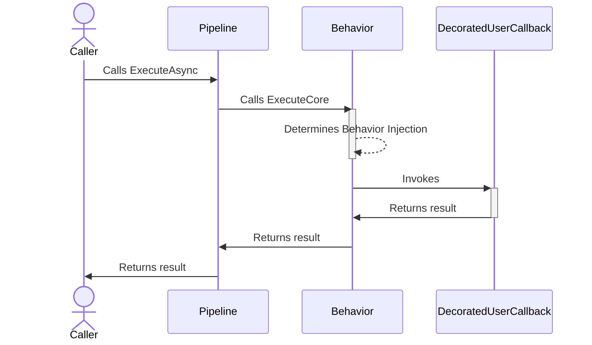
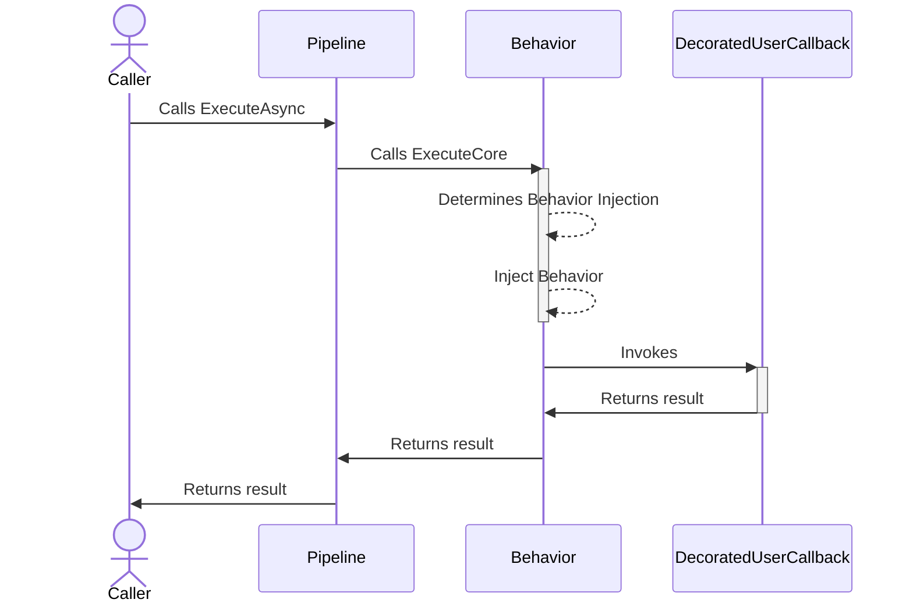

# Behavior monkey strategy

## About

- **Options**: [`BehaviorStrategyOptions`](xref:Polly.Simmy.Behavior.BehaviorStrategyOptions)
- **Extensions**: `AddChaosBehavior`
- **Strategy Type**: Proactive

---

The behavior chaos strategy is designed to inject custom behaviors into system operations right before such an operation is invoked. This strategy is flexible, allowing users to define specific behaviors such as altering the input, simulating resource exhaustion, putting the system in a given state before the actual operation is called, or other operational variations to simulate real-world scenarios.

## Usage

<!-- snippet: Behavior -->
```cs
// Behavior using the default options.
// See https://www.pollydocs.org/chaos/behavior#defaults for defaults.
var optionsDefault = new BehaviorStrategyOptions();

// To use a custom function to generate the behavior to inject.
var optionsWithBehaviorGenerator = new BehaviorStrategyOptions
{
    BehaviorAction = (_) => RestartRedisVM(),
    Enabled = true,
    InjectionRate = 0.6
};

// To get notifications when a behavior is injected
var optionsOnBehaviorInjected = new BehaviorStrategyOptions
{
    BehaviorAction = (_) => RestartRedisVM(),
    Enabled = true,
    InjectionRate = 0.6,
    OnBehaviorInjected = static args =>
    {
        Console.WriteLine("OnBehaviorInjected, Operation: {0}.", args.Context.OperationKey);
        return default;
    }
};

// Add a behavior strategy with a BehaviorStrategyOptions{<TResult>} instance to the pipeline
new ResiliencePipelineBuilder().AddChaosBehavior(optionsDefault);
new ResiliencePipelineBuilder<HttpStatusCode>().AddChaosBehavior(optionsWithBehaviorGenerator);

// There are also a handy overload to inject the chaos easily.
new ResiliencePipelineBuilder().AddChaosBehavior(0.6, RestartRedisVM);
```
<!-- endSnippet -->

Example execution:

<!-- snippet: behavior-execution -->
```cs
var pipeline = new ResiliencePipelineBuilder()
    .AddChaosBehavior(new BehaviorStrategyOptions // monkey strategies are usually placed innermost in the pipelines
    {
        BehaviorAction = (_) => RestartRedisVM(),
        Enabled = true,
        InjectionRate = 0.6
    })
    .AddRetry(new RetryStrategyOptions
    {
        ShouldHandle = new PredicateBuilder().Handle<RedisConnectionException>(),
        BackoffType = DelayBackoffType.Exponential,
        UseJitter = true,  // Adds a random factor to the delay
        MaxRetryAttempts = 4,
        Delay = TimeSpan.FromSeconds(3),
    })
    .Build();
```
<!-- endSnippet -->

## Defaults

| Property              | Default Value | Description                                  |
| --------------------- | ------------- | -------------------------------------------- |
| `OnBehaviorInjected`  | `null`        | Action executed when the behavior is injected.|
| `BehaviorAction`      | `null`        | Custom behavior to be injected.               |

## Diagrams

### Happy path sequence diagram



### Unhappy path sequence diagram



## Anti-patterns
❌ Do not use it to inject delays, use the latency monkey instead as the [LatencyChaosStrategy](latency.md) already correctly handles synchronous/asynchronous delay executions, cancellations, etc.
