# Behavior chaos strategy

> [!IMPORTANT]
> This documentation page describes an upcoming feature of Polly.

## About

- **Options**: [`ChaosBehaviorStrategyOptions`](xref:Polly.Simmy.Behavior.ChaosBehaviorStrategyOptions)
- **Extensions**: `AddChaosBehavior`
- **Strategy Type**: Proactive

---

The behavior chaos strategy is designed to inject custom behaviors into system operations right before such an operation is invoked. This strategy is flexible, allowing users to define specific behaviors such as altering the input, simulating resource exhaustion, putting the system in a given state before the actual operation is called, or other operational variations to simulate real-world scenarios.

## Usage

<!-- snippet: chaos-behavior-usage -->
```cs
// To use a custom delegated for injected behavior
var optionsWithBehaviorGenerator = new ChaosBehaviorStrategyOptions
{
    BehaviorGenerator = static args => RestartRedisAsync(args.Context.CancellationToken),
    Enabled = true,
    InjectionRate = 0.05
};

// To get notifications when a behavior is injected
var optionsOnBehaviorInjected = new ChaosBehaviorStrategyOptions
{
    BehaviorGenerator = static args => RestartRedisAsync(args.Context.CancellationToken),
    Enabled = true,
    InjectionRate = 0.05,
    OnBehaviorInjected = static args =>
    {
        Console.WriteLine("OnBehaviorInjected, Operation: {0}.", args.Context.OperationKey);
        return default;
    }
};

// Add a behavior strategy with a ChaosBehaviorStrategyOptions instance to the pipeline
new ResiliencePipelineBuilder().AddChaosBehavior(optionsWithBehaviorGenerator);
new ResiliencePipelineBuilder<HttpResponseMessage>().AddChaosBehavior(optionsOnBehaviorInjected);

// There are also a handy overload to inject the chaos easily
new ResiliencePipelineBuilder().AddChaosBehavior(0.05, RestartRedisAsync);
```
<!-- endSnippet -->

Example execution:

<!-- snippet: chaos-behavior-execution -->
```cs
var pipeline = new ResiliencePipelineBuilder()
    .AddRetry(new RetryStrategyOptions
    {
        ShouldHandle = new PredicateBuilder().Handle<RedisConnectionException>(),
        BackoffType = DelayBackoffType.Exponential,
        UseJitter = true,  // Adds a random factor to the delay
        MaxRetryAttempts = 4,
        Delay = TimeSpan.FromSeconds(3),
    })
    .AddChaosBehavior(new ChaosBehaviorStrategyOptions // Chaos strategies are usually placed as the last ones in the pipeline
    {
        BehaviorGenerator = static args => RestartRedisAsync(args.Context.CancellationToken),
        Enabled = true,
        InjectionRate = 0.05
    })
    .Build();
```
<!-- endSnippet -->

## Defaults

| Property             | Default Value | Description                                    |
|----------------------|---------------|------------------------------------------------|
| `OnBehaviorInjected` | `null`        | Action executed when the behavior is injected. |
| `BehaviorGenerator`  | `null`        | Custom behavior to be injected.                |

## Diagrams

### Normal 🐵 sequence diagram

```mermaid
sequenceDiagram
    actor C as Caller
    participant P as Pipeline
    participant B as Behavior
    participant D as DecoratedUserCallback

    C->>P: Calls ExecuteAsync
    P->>B: Calls ExecuteCore
    activate B
    B-->>B: Determines Injection<br/>Decision: 🐵
    deactivate B
    B->>+D: Invokes
    D->>-B: Returns result
    B->>P: Returns result
    P->>C: Returns result
```



### Chaos 🙈 sequence diagram

```mermaid
sequenceDiagram
    actor C as Caller
    participant P as Pipeline
    participant B as Behavior
    participant D as DecoratedUserCallback

    C->>P: Calls ExecuteAsync
    P->>B: Calls ExecuteCore
    activate B
    B-->>B: Determines Injection<br/>Decision: 🙈
    B-->>B: Injects Behavior
    deactivate B
    B->>+D: Invokes
    D->>-B: Returns result
    B->>P: Returns result
    P->>C: Returns result
```



## Anti-patterns

### Injecting delay

❌ DON'T

Use behavior strategies to inject delays.

✅ DO

Use the latency chaos instead as the [`ChaosLatencyStrategy`](latency.md) already correctly handles synchronous/asynchronous delay executions, cancellations, etc.
