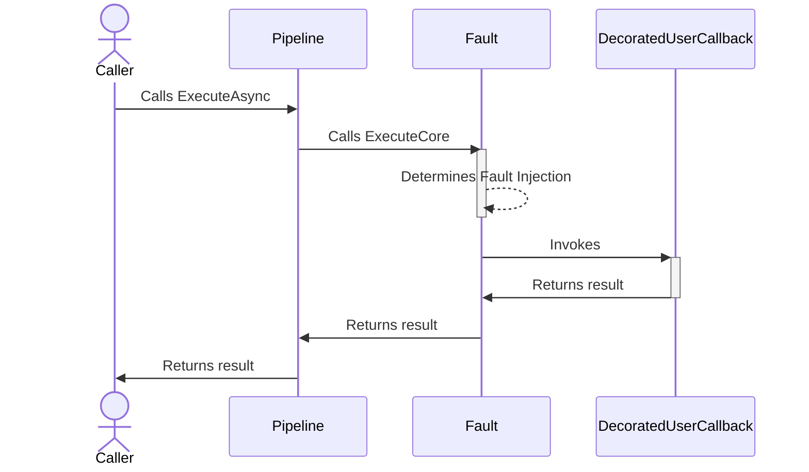
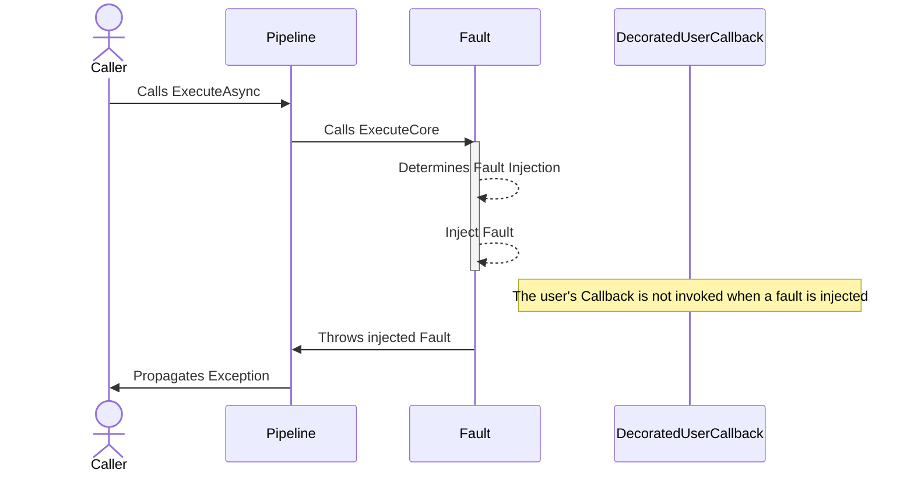

# Fault monkey strategy

## About

- **Options**: [`FaultStrategyOptions`](xref:Polly.Simmy.Fault.FaultStrategyOptions)
- **Extensions**: `AddChaosFault`
- **Strategy Type**: Proactive

---

The fault chaos strategy is designed to introduce faults (exceptions) into the system, simulating real-world scenarios where operations might fail unexpectedly. It is configurable to inject specific types of exceptions or use custom logic to generate faults dynamically.

## Usage

<!-- snippet: Fault -->
```cs
// Fault using the default options.
// See https://www.pollydocs.org/chaos/fault#defaults for defaults.
var optionsDefault = new FaultStrategyOptions();

// The 60% of calls will be randomly affected.
var basicOptions = new FaultStrategyOptions
{
    Fault = new InvalidOperationException("Dummy exception"),
    Enabled = true,
    InjectionRate = 0.6
};

// To use a custom function to generate the fault to inject.
var optionsWithFaultGenerator = new FaultStrategyOptions
{
    FaultGenerator = static args =>
    {
        Exception? exception = args.Context.OperationKey switch
        {
            "DataLayer" => new TimeoutException(),
            "ApplicationLayer" => new InvalidOperationException(),
            _ => null // when the fault generator returns null the strategy won't inject any fault and it will just invoke the user's callback
        };

        return new ValueTask<Exception?>(exception);
    },
    Enabled = true,
    InjectionRate = 0.6
};

// To get notifications when a fault is injected
var optionsOnFaultInjected = new FaultStrategyOptions
{
    Fault = new InvalidOperationException("Dummy exception"),
    Enabled = true,
    InjectionRate = 0.6,
    OnFaultInjected = static args =>
    {
        Console.WriteLine("OnFaultInjected, Exception: {0}, Operation: {1}.", args.Fault.Message, args.Context.OperationKey);
        return default;
    }
};

// Add a fault strategy with a FaultStrategyOptions{<TResult>} instance to the pipeline
new ResiliencePipelineBuilder().AddChaosFault(optionsDefault);
new ResiliencePipelineBuilder<HttpStatusCode>().AddChaosFault(optionsWithFaultGenerator);

// There are also a couple of handy overloads to inject the chaos easily.
new ResiliencePipelineBuilder().AddChaosFault(0.6, new InvalidOperationException("Dummy exception"));
```
<!-- endSnippet -->

Example execution:

<!-- snippet: fault-execution -->
```cs
var pipeline = new ResiliencePipelineBuilder()
    .AddChaosFault(new FaultStrategyOptions // monkey strategies are usually placed innermost in the pipelines
    {
        Fault = new InvalidOperationException("Dummy exception"),
        Enabled = true,
        InjectionRate = 0.6
    })
    .AddRetry(new RetryStrategyOptions
    {
        ShouldHandle = new PredicateBuilder().Handle<InvalidOperationException>(),
        BackoffType = DelayBackoffType.Exponential,
        UseJitter = true,  // Adds a random factor to the delay
        MaxRetryAttempts = 4,
        Delay = TimeSpan.FromSeconds(3),
    })
    .Build();
```
<!-- endSnippet -->

## Defaults

| Property           | Default Value | Description                                  |
| ------------------ | ------------- | -------------------------------------------- |
| `OnFaultInjected`  | `null`        | Action executed when the fault is injected.     |
| `FaultGenerator`   | `null`        | Generates the fault to inject for a given execution. |
| `Fault`            | `null`        | The fault to inject.                                 |

## Diagrams

### Happy path sequence diagram



### Unhappy path sequence diagram


