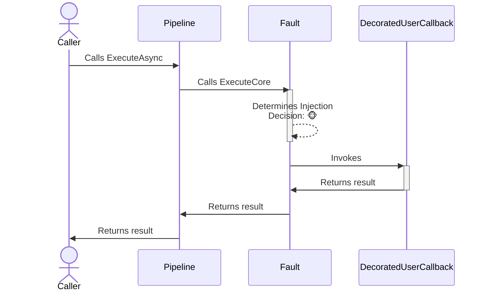
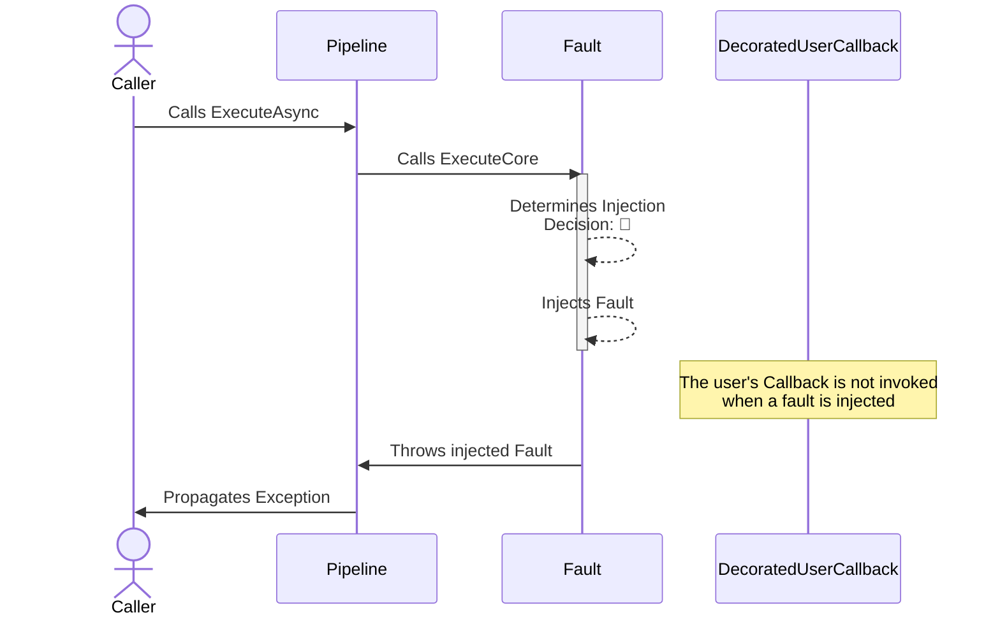

# Fault chaos strategy

> [!IMPORTANT]
> This documentation page describes an upcoming feature of Polly.

## About

- **Options**: [`ChaosFaultStrategyOptions`](xref:Polly.Simmy.Fault.ChaosFaultStrategyOptions)
- **Extensions**: `AddChaosFault`
- **Strategy Type**: Proactive

---

The fault chaos strategy is designed to introduce faults (exceptions) into the system, simulating real-world scenarios where operations might fail unexpectedly. It is configurable to inject specific types of exceptions or use custom logic to generate faults dynamically.

## Usage

<!-- snippet: chaos-fault-usage -->
```cs
// 10% of invocations will be randomly affected and one of the exceptions will be thrown (equal probability).
var optionsBasic = new ChaosFaultStrategyOptions
{
    FaultGenerator = new FaultGenerator()
        .AddException<InvalidOperationException>() // Uses default constructor
        .AddException(() => new TimeoutException("Chaos timeout injected.")), // Custom exception generator
    InjectionRate = 0.1
};

// To use a custom delegate to generate the fault to be injected
var optionsWithFaultGenerator = new ChaosFaultStrategyOptions
{
    FaultGenerator = static args =>
    {
        Exception? exception = args.Context.OperationKey switch
        {
            "DataLayer" => new TimeoutException(),
            "ApplicationLayer" => new InvalidOperationException(),
            // When the fault generator returns null, the strategy won't inject
            // any fault and just invokes the user's callback.
            _ => null
        };

        return new ValueTask<Exception?>(exception);
    },
    InjectionRate = 0.1
};

// To get notifications when a fault is injected
var optionsOnFaultInjected = new ChaosFaultStrategyOptions
{
    FaultGenerator = new FaultGenerator().AddException<InvalidOperationException>(),
    InjectionRate = 0.1,
    OnFaultInjected = static args =>
    {
        Console.WriteLine("OnFaultInjected, Exception: {0}, Operation: {1}.", args.Fault.Message, args.Context.OperationKey);
        return default;
    }
};

// Add a fault strategy with a ChaosFaultStrategyOptions instance to the pipeline
new ResiliencePipelineBuilder().AddChaosFault(optionsBasic);
new ResiliencePipelineBuilder<HttpResponseMessage>().AddChaosFault(optionsWithFaultGenerator);

// There are also a couple of handy overloads to inject the chaos easily
new ResiliencePipelineBuilder().AddChaosFault(0.1, () => new InvalidOperationException("Dummy exception"));
```
<!-- endSnippet -->

Example execution:

<!-- snippet: chaos-fault-execution -->
```cs
var pipeline = new ResiliencePipelineBuilder()
    .AddRetry(new RetryStrategyOptions
    {
        ShouldHandle = new PredicateBuilder().Handle<InvalidOperationException>(),
        BackoffType = DelayBackoffType.Exponential,
        UseJitter = true,  // Adds a random factor to the delay
        MaxRetryAttempts = 4,
        Delay = TimeSpan.FromSeconds(3),
    })
    .AddChaosFault(new ChaosFaultStrategyOptions // Chaos strategies are usually placed as the last ones in the pipeline
    {
        FaultGenerator = static args => new ValueTask<Exception?>(new InvalidOperationException("Dummy exception")),
        InjectionRate = 0.1
    })
    .Build();
```
<!-- endSnippet -->

## Defaults

| Property          | Default Value | Description                                          |
|-------------------|---------------|------------------------------------------------------|
| `OnFaultInjected` | `null`        | Action executed when the fault is injected.          |
| `FaultGenerator`  | `null`        | Generates the fault to inject for a given execution. |

## Diagrams

### Normal 🐵 sequence diagram



### Chaos 🙈 sequence diagram



## Generating faults

To generate a fault, you need to specify a `FaultGenerator` delegate. You have the following options as to how you customize this delegate:

### Use `FaultGenerator` class to generate faults

The `FaultGenerator` is convenience API that allows you to specify what faults (exceptions) are to be injected. Additionally, it also allows assigning weight to each registered fault.

<!-- snippet: chaos-fault-generator-class -->
```cs
new ResiliencePipelineBuilder()
    .AddChaosFault(new ChaosFaultStrategyOptions
    {
        // Use FaultGenerator to register exceptions to be injected
        FaultGenerator = new FaultGenerator()
            .AddException<InvalidOperationException>() // Uses default constructor
            .AddException(() => new TimeoutException("Chaos timeout injected.")) // Custom exception generator
            .AddException(context => CreateExceptionFromContext(context)) // Access the ResilienceContext
            .AddException<TimeoutException>(weight: 50), // Assign weight to the exception, default is 100
    });
```
<!-- endSnippet -->

### Use delegates to generate faults

Delegates give you the most flexibility at the expense of slightly more complicated syntax. Delegates also support asynchronous fault generation, if you ever need that possibility.

<!-- snippet: chaos-fault-generator-delegate -->
```cs
new ResiliencePipelineBuilder()
    .AddChaosFault(new ChaosFaultStrategyOptions
    {
        // The same behavior can be achieved with delegates
        FaultGenerator = args =>
        {
            Exception? exception = Random.Shared.Next(350) switch
            {
                < 100 => new InvalidOperationException(),
                < 200 => new TimeoutException("Chaos timeout injected."),
                < 300 => CreateExceptionFromContext(args.Context),
                < 350 => new TimeoutException(),
                _ => null
            };

            return new ValueTask<Exception?>(exception);
        }
    });
```
<!-- endSnippet -->
