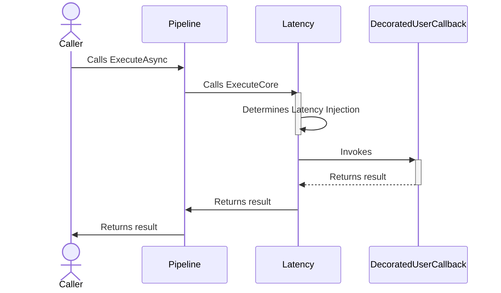
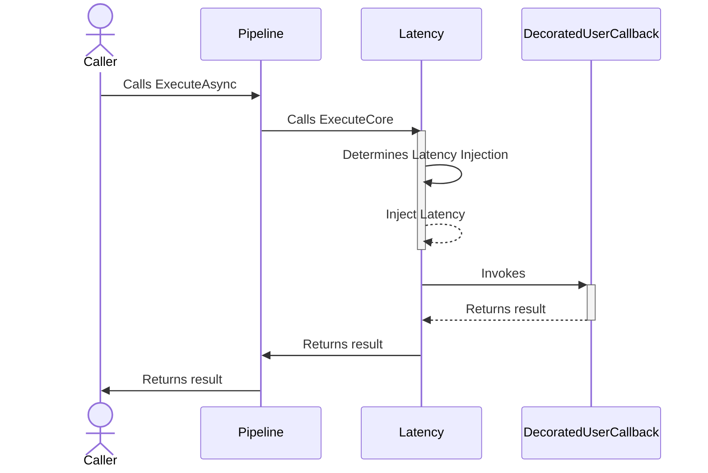

# Latency monkey strategy

## About

- **Options**: [`LatencyStrategyOptions`](xref:Polly.Simmy.Latency.LatencyStrategyOptions)
- **Extensions**: `AddChaosLatency`
- **Strategy Type**: Proactive

---

The latency chaos strategy is designed to introduce controlled delays into system operations, simulating network latency or slow processing times. This strategy helps in assessing and improving the resilience of applications against increased response times.

## Usage

<!-- snippet: chaos-latency-usage -->
```cs
// Latency using the default options.
// See https://www.pollydocs.org/chaos/latency#defaults for defaults.
var optionsDefault = new LatencyStrategyOptions();

// The 60% of calls will be randomly affected.
var basicOptions = new LatencyStrategyOptions
{
    Latency = TimeSpan.FromSeconds(30),
    Enabled = true,
    InjectionRate = 0.6
};

// To use a custom function to generate the latency to inject.
var optionsWithLatencyGenerator = new LatencyStrategyOptions
{
    LatencyGenerator = static args =>
    {
        TimeSpan latency = args.Context.OperationKey switch
        {
            "DataLayer" => TimeSpan.FromMilliseconds(500),
            "ApplicationLayer" => TimeSpan.FromSeconds(2),
            _ => TimeSpan.Zero // when the latency generator returns Zero the strategy won't inject any delay and it will just invoke the user's callback
        };

        return new ValueTask<TimeSpan>(latency);
    },
    Enabled = true,
    InjectionRate = 0.6
};

// To get notifications when a delay is injected
var optionsOnBehaviorInjected = new LatencyStrategyOptions
{
    Latency = TimeSpan.FromSeconds(30),
    Enabled = true,
    InjectionRate = 0.6,
    OnLatency = static args =>
    {
        Console.WriteLine($"OnLatency, Latency: {args.Latency}, Operation: {args.Context.OperationKey}.");
        return default;
    }
};

// Add a latency strategy with a LatencyStrategyOptions{<TResult>} instance to the pipeline
new ResiliencePipelineBuilder().AddChaosLatency(optionsDefault);
new ResiliencePipelineBuilder<HttpStatusCode>().AddChaosLatency(optionsWithLatencyGenerator);

// There are also a handy overload to inject the chaos easily.
new ResiliencePipelineBuilder().AddChaosLatency(0.6, TimeSpan.FromSeconds(30));
```
<!-- endSnippet -->

Example execution:

<!-- snippet: chaos-latency-execution -->
```cs
var pipeline = new ResiliencePipelineBuilder()
    .AddChaosLatency(new LatencyStrategyOptions // monkey strategies are usually placed innermost in the pipelines
    {
        Latency = TimeSpan.FromSeconds(10),
        Enabled = true,
        InjectionRate = 0.6
    })
    .AddTimeout(TimeSpan.FromSeconds(5))
    .AddRetry(new RetryStrategyOptions
    {
        ShouldHandle = new PredicateBuilder().Handle<TimeoutRejectedException>(),
        BackoffType = DelayBackoffType.Exponential,
        UseJitter = true,  // Adds a random factor to the delay
        MaxRetryAttempts = 4,
        Delay = TimeSpan.FromSeconds(3),
    })
    .Build();
```
<!-- endSnippet -->

## Defaults

| Property              | Default Value | Description                                  |
| --------------------- | ------------- | -------------------------------------------- |
| `Latency`             | `30 seconds`  | A timestamp indicating the delay to be injected.      |
| `LatencyGenerator`    | `null`        | Generates the latency to inject for a given execution.|
| `OnLatency`           | `null`        | Action executed when latency is injected.             |

## Diagrams

### Happy path sequence diagram



### Unhappy path sequence diagram


