# Latency chaos strategy

> [!IMPORTANT]
> This documentation page describes an upcoming feature of Polly.

## About

- **Options**: [`ChaosLatencyStrategyOptions`](xref:Polly.Simmy.Latency.ChaosLatencyStrategyOptions)
- **Extensions**: `AddChaosLatency`
- **Strategy Type**: Proactive

---

The latency chaos strategy is designed to introduce controlled delays into system operations, simulating network latency or slow processing times. This strategy helps in assessing and improving the resilience of applications against increased response times.

## Usage

<!-- snippet: chaos-latency-usage -->
```cs
// Latency using the default options.
// See https://www.pollydocs.org/chaos/latency#defaults for defaults.
var optionsDefault = new ChaosLatencyStrategyOptions();

// 10% of invocations will be randomly affected
var basicOptions = new ChaosLatencyStrategyOptions
{
    Latency = TimeSpan.FromSeconds(30),
    Enabled = true,
    InjectionRate = 0.1
};

// To use a custom function to generate the latency to inject
var optionsWithLatencyGenerator = new ChaosLatencyStrategyOptions
{
    LatencyGenerator = static args =>
    {
        TimeSpan latency = args.Context.OperationKey switch
        {
            "DataLayer" => TimeSpan.FromMilliseconds(500),
            "ApplicationLayer" => TimeSpan.FromSeconds(2),
            // When the latency generator returns Zero, the strategy
            // won't inject any delay and just invokes the user's callback.
            _ => TimeSpan.Zero
        };

        return new ValueTask<TimeSpan>(latency);
    },
    Enabled = true,
    InjectionRate = 0.1
};

// To get notifications when a delay is injected
var optionsOnLatencyInjected = new ChaosLatencyStrategyOptions
{
    Latency = TimeSpan.FromSeconds(30),
    Enabled = true,
    InjectionRate = 0.1,
    OnLatencyInjected = static args =>
    {
        Console.WriteLine($"OnLatencyInjected, Latency: {args.Latency}, Operation: {args.Context.OperationKey}.");
        return default;
    }
};

// Add a latency strategy with a ChaosLatencyStrategyOptions instance to the pipeline
new ResiliencePipelineBuilder().AddChaosLatency(optionsDefault);
new ResiliencePipelineBuilder<HttpStatusCode>().AddChaosLatency(optionsWithLatencyGenerator);

// There are also a handy overload to inject the chaos easily
new ResiliencePipelineBuilder().AddChaosLatency(0.1, TimeSpan.FromSeconds(30));
```
<!-- endSnippet -->

Example execution:

<!-- snippet: chaos-latency-execution -->
```cs
var pipeline = new ResiliencePipelineBuilder()
    .AddRetry(new RetryStrategyOptions
    {
        ShouldHandle = new PredicateBuilder().Handle<TimeoutRejectedException>(),
        BackoffType = DelayBackoffType.Exponential,
        UseJitter = true,  // Adds a random factor to the delay
        MaxRetryAttempts = 4,
        Delay = TimeSpan.FromSeconds(3),
    })
    .AddTimeout(TimeSpan.FromSeconds(5))
    .AddChaosLatency(new ChaosLatencyStrategyOptions // Chaos strategies are usually placed as the last ones in the pipeline
    {
        Latency = TimeSpan.FromSeconds(10),
        Enabled = true,
        InjectionRate = 0.1
    })
    .Build();
```
<!-- endSnippet -->

## Defaults

| Property            | Default Value | Description                                            |
|---------------------|---------------|--------------------------------------------------------|
| `Latency`           | `30 seconds`  | A `TimeSpan` indicating the delay to be injected.      |
| `LatencyGenerator`  | `null`        | Generates the latency to inject for a given execution. |
| `OnLatencyInjected` | `null`        | Action executed when latency is injected.              |

## Diagrams

### Normal 🐵 sequence diagram

```mermaid
sequenceDiagram
    actor C as Caller
    participant P as Pipeline
    participant L as Latency
    participant D as DecoratedUserCallback

    C->>P: Calls ExecuteAsync
    P->>L: Calls ExecuteCore
    activate L
    L->>L: Determines Injection<br/>Decision: 🐵
    deactivate L
    L->>+D: Invokes
    D->>-L: Returns result
    L->>P: Returns result
    P->>C: Returns result
```



### Chaos 🙈 sequence diagram

```mermaid
sequenceDiagram
    actor C as Caller
    participant P as Pipeline
    participant L as Latency
    participant D as DecoratedUserCallback

    C->>P: Calls ExecuteAsync
    P->>L: Calls ExecuteCore
    activate L
    L->>L: Determines Injection<br/>Decision: 🙈
    L-->>L: Injects Latency
    deactivate L
    L->>+D: Invokes
    D->>-L: Returns result
    L->>P: Returns result
    P->>C: Returns result
```


