# Latency chaos strategy

## About

- **Option(s)**:
  - [`ChaosLatencyStrategyOptions`](xref:Polly.Simmy.Latency.ChaosLatencyStrategyOptions)
- **Extension(s)**:
  - `AddChaosLatency`
- **Exception(s)**: -

---

The latency **proactive** chaos strategy is designed to introduce controlled delays into system operations, simulating network latency or slow processing times. This strategy helps in assessing and improving the resilience of applications against increased response times.

## Usage

<!-- snippet: chaos-latency-usage -->
```cs
// Latency using the default options.
// See https://www.pollydocs.org/chaos/latency#defaults for defaults.
var optionsDefault = new ChaosLatencyStrategyOptions();

// 10% of invocations will be randomly affected
var basicOptions = new ChaosLatencyStrategyOptions
{
    Latency = TimeSpan.FromSeconds(30),
    InjectionRate = 0.1
};

// To use a custom function to generate the latency to inject
var optionsWithLatencyGenerator = new ChaosLatencyStrategyOptions
{
    LatencyGenerator = static args =>
    {
        TimeSpan latency = args.Context.OperationKey switch
        {
            "DataLayer" => TimeSpan.FromMilliseconds(500),
            "ApplicationLayer" => TimeSpan.FromSeconds(2),
            // When the latency generator returns Zero, the strategy
            // won't inject any delay and just invokes the user's callback.
            _ => TimeSpan.Zero
        };

        return new ValueTask<TimeSpan>(latency);
    },
    InjectionRate = 0.1
};

// To get notifications when a delay is injected
var optionsOnLatencyInjected = new ChaosLatencyStrategyOptions
{
    Latency = TimeSpan.FromSeconds(30),
    InjectionRate = 0.1,
    OnLatencyInjected = static args =>
    {
        Console.WriteLine($"OnLatencyInjected, Latency: {args.Latency}, Operation: {args.Context.OperationKey}.");
        return default;
    }
};

// Add a latency strategy with a ChaosLatencyStrategyOptions instance to the pipeline
new ResiliencePipelineBuilder().AddChaosLatency(optionsDefault);
new ResiliencePipelineBuilder<HttpStatusCode>().AddChaosLatency(optionsWithLatencyGenerator);

// There are also a handy overload to inject the chaos easily
new ResiliencePipelineBuilder().AddChaosLatency(0.1, TimeSpan.FromSeconds(30));
```
<!-- endSnippet -->

Example execution:

<!-- snippet: chaos-latency-execution -->
```cs
var pipeline = new ResiliencePipelineBuilder()
    .AddRetry(new RetryStrategyOptions
    {
        ShouldHandle = new PredicateBuilder().Handle<TimeoutRejectedException>(),
        BackoffType = DelayBackoffType.Exponential,
        UseJitter = true,  // Adds a random factor to the delay
        MaxRetryAttempts = 4,
        Delay = TimeSpan.FromSeconds(3),
    })
    .AddTimeout(TimeSpan.FromSeconds(5))
    .AddChaosLatency(new ChaosLatencyStrategyOptions // Chaos strategies are usually placed as the last ones in the pipeline
    {
        Latency = TimeSpan.FromSeconds(10),
        InjectionRate = 0.1
    })
    .Build();
```
<!-- endSnippet -->

## Defaults

| Property            | Default Value | Description                                                                                                          |
|---------------------|---------------|----------------------------------------------------------------------------------------------------------------------|
| `Latency`           | 30 seconds    | Defines a **static** delay to be injected.                                                                           |
| `LatencyGenerator`  | `null`        | This delegate allows you to **dynamically** inject delay by utilizing information that is only available at runtime. |
| `OnLatencyInjected` | `null`        | If provided then it will be invoked after the latency injection occurred.                                            |

> [!NOTE]
> If both `Latency` and `LatencyGenerator` are specified then `Latency` will be ignored.

---

> [!IMPORTANT]
> Please note that if the calculated latency is negative (regardless if it's static or dynamic) then it will not be injected.

## Telemetry

The latency chaos strategy reports the following telemetry events:

| Event Name        | Event Severity | When?                                                           |
|-------------------|----------------|-----------------------------------------------------------------|
| `Chaos.OnLatency` | `Information`  | Just before the strategy calls the `OnLatencyInjected` delegate |

Here are some sample events:

```none
Resilience event occurred. EventName: 'Chaos.OnLatency', Source: '(null)/(null)/Chaos.Latency', Operation Key: '', Result: ''

Resilience event occurred. EventName: 'Chaos.OnLatency', Source: 'MyPipeline/MyPipelineInstance/MyLatencyStrategy', Operation Key: 'MyLatencyInjectedOperation', Result: ''
```

> [!NOTE]
> Please note that the `Chaos.OnLatency` telemetry event will be reported **only if** the latency chaos strategy injects a positive delay.
>
> So, if the latency is not injected then there will be no telemetry emitted. Also if injected but the latency is negative or the `LatencyGenerator` throws an exception then there will be no telemetry emitted.
>
> Also remember that the `Result` will be **always empty** for the `Chaos.OnLatency` telemetry event.

For further information please check out the [telemetry page](../advanced/telemetry.md).

## Diagrams

### Normal 🐵 sequence diagram

```mermaid
sequenceDiagram
    actor C as Caller
    participant P as Pipeline
    participant L as Latency
    participant D as DecoratedUserCallback

    C->>P: Calls ExecuteAsync
    P->>L: Calls ExecuteCore
    activate L
    L->>L: Determines Injection<br/>Decision: 🐵
    deactivate L
    L->>+D: Invokes
    D->>-L: Returns result
    L->>P: Returns result
    P->>C: Returns result
```



### Chaos 🙈 sequence diagram

```mermaid
sequenceDiagram
    actor C as Caller
    participant P as Pipeline
    participant L as Latency
    participant D as DecoratedUserCallback

    C->>P: Calls ExecuteAsync
    P->>L: Calls ExecuteCore
    activate L
    L->>L: Determines Injection<br/>Decision: 🙈
    L-->>L: Injects Latency
    deactivate L
    L->>+D: Invokes
    D->>-L: Returns result
    L->>P: Returns result
    P->>C: Returns result
```


