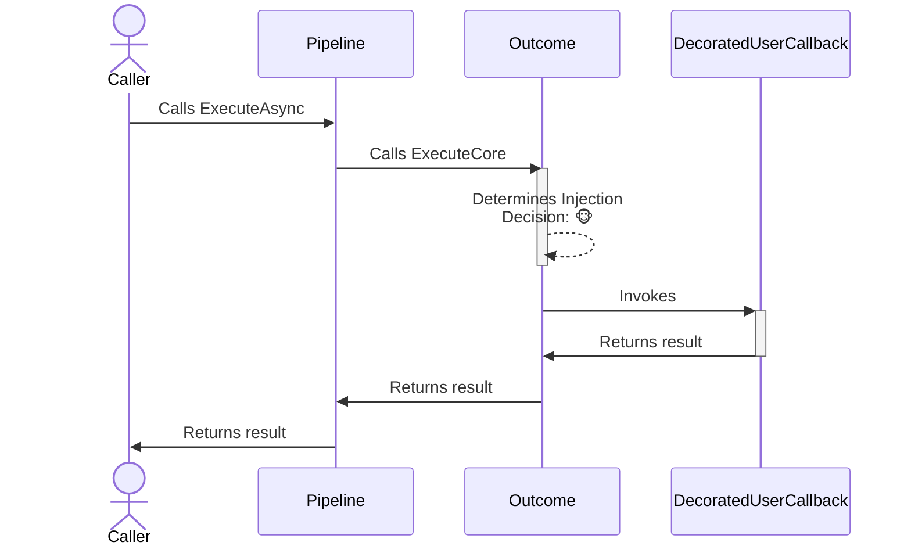
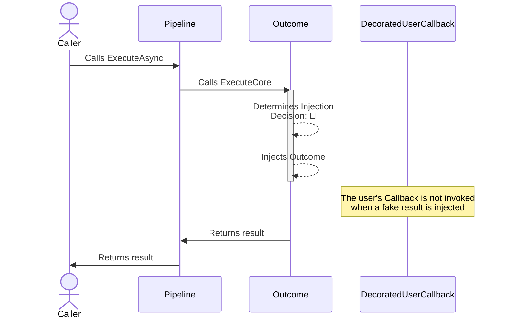

# Outcome chaos strategy

## About

- **Options**:
  - [`ChaosOutcomeStrategyOptions<T>`](xref:Polly.Simmy.Outcomes.ChaosOutcomeStrategyOptions`1)
- **Extensions**: `AddChaosOutcome`
- **Strategy Type**: Reactive

---

The outcome chaos strategy is designed to inject or substitute fake results into system operations. This allows testing how an application behaves when it receives different types of responses, like successful or error results.

## Usage

<!-- snippet: chaos-outcome-usage -->
```cs
// To use OutcomeGenerator<T> to register the results to be injected (equal probability)
var optionsWithResultGenerator = new ChaosOutcomeStrategyOptions<HttpResponseMessage>
{
    OutcomeGenerator = new OutcomeGenerator<HttpResponseMessage>()
        .AddResult(() => new HttpResponseMessage(HttpStatusCode.TooManyRequests))
        .AddResult(() => new HttpResponseMessage(HttpStatusCode.InternalServerError))
    InjectionRate = 0.1
};

// To get notifications when a result is injected
var optionsOnBehaviorInjected = new ChaosOutcomeStrategyOptions<HttpResponseMessage>
{
    OutcomeGenerator = new OutcomeGenerator<HttpResponseMessage>()
        .AddResult(() => new HttpResponseMessage(HttpStatusCode.InternalServerError)),
    InjectionRate = 0.1,
    OnOutcomeInjected = static args =>
    {
        Console.WriteLine($"OnBehaviorInjected, Outcome: {args.Outcome.Result}, Operation: {args.Context.OperationKey}.");
        return default;
    }
};

// Add a result strategy with a ChaosOutcomeStrategyOptions{<TResult>} instance to the pipeline
new ResiliencePipelineBuilder<HttpResponseMessage>().AddChaosOutcome(optionsWithResultGenerator);
new ResiliencePipelineBuilder<HttpResponseMessage>().AddChaosOutcome(optionsOnBehaviorInjected);

// There are also a couple of handy overloads to inject the chaos easily
new ResiliencePipelineBuilder<HttpResponseMessage>().AddChaosOutcome(0.1, () => new HttpResponseMessage(HttpStatusCode.TooManyRequests));
```
<!-- endSnippet -->

Example execution:

<!-- snippet: chaos-outcome-execution -->
```cs
var pipeline = new ResiliencePipelineBuilder<HttpResponseMessage>()
    .AddRetry(new RetryStrategyOptions<HttpResponseMessage>
    {
        ShouldHandle = static args => args.Outcome switch
        {
            { Result.StatusCode: HttpStatusCode.InternalServerError } => PredicateResult.True(),
            _ => PredicateResult.False()
        },
        BackoffType = DelayBackoffType.Exponential,
        UseJitter = true,
        MaxRetryAttempts = 4,
        Delay = TimeSpan.FromSeconds(3),
    })
    .AddChaosOutcome(new ChaosOutcomeStrategyOptions<HttpResponseMessage> // Chaos strategies are usually placed as the last ones in the pipeline
    {
        OutcomeGenerator = static args =>
        {
            var response = new HttpResponseMessage(HttpStatusCode.InternalServerError);
            return new ValueTask<Outcome<HttpResponseMessage>?>(Outcome.FromResult(response));
        },
        InjectionRate = 0.1
    })
    .Build();
```
<!-- endSnippet -->

## Defaults

| Property            | Default Value | Description                                             |
|---------------------|---------------|---------------------------------------------------------|
| `OutcomeGenerator`  | `null`        | Function to generate the outcome for a given execution. |
| `OnOutcomeInjected` | `null`        | Action executed when the outcome is injected.           |

## Diagrams

### Normal 🐵 sequence diagram



### Chaos 🙈 sequence diagram



## Generating outcomes

To generate a faulted outcome (result or exception), you need to specify a `OutcomeGenerator` delegate. You have the following options as to how you customize this delegate:

### Use `OutcomeGenerator<T>` class to generate outcomes

The `OutcomeGenerator<T>` is a convenience API that allows you to specify what outcomes are to be injected. Additionally, it also allows assigning weight to each registered outcome.

<!-- snippet: chaos-outcome-generator-class -->
```cs
new ResiliencePipelineBuilder<HttpResponseMessage>()
    .AddChaosOutcome(new ChaosOutcomeStrategyOptions<HttpResponseMessage>
    {
        // Use OutcomeGenerator<T> to register the results to be injected
        OutcomeGenerator = new OutcomeGenerator<HttpResponseMessage>()
            .AddResult(() => new HttpResponseMessage(HttpStatusCode.InternalServerError)) // Result generator
            .AddResult(() => new HttpResponseMessage(HttpStatusCode.TooManyRequests), weight: 50) // Result generator with weight
            .AddResult(context => CreateResultFromContext(context)) // Access the ResilienceContext to create result
    });
```
<!-- endSnippet -->

### Use delegates to generate outcomes

Delegates give you the most flexibility at the expense of slightly more complicated syntax. Delegates also support asynchronous outcome generation, if you ever need that possibility.

<!-- snippet: chaos-outcome-generator-delegate -->
```cs
new ResiliencePipelineBuilder<HttpResponseMessage>()
    .AddChaosOutcome(new ChaosOutcomeStrategyOptions<HttpResponseMessage>
    {
        // The same behavior can be achieved with delegates
        OutcomeGenerator = args =>
        {
            Outcome<HttpResponseMessage>? outcome = Random.Shared.Next(350) switch
            {
                < 100 => Outcome.FromResult(new HttpResponseMessage(HttpStatusCode.InternalServerError)),
                < 150 => Outcome.FromResult(new HttpResponseMessage(HttpStatusCode.TooManyRequests)),
                < 350 => Outcome.FromResult(CreateResultFromContext(args.Context)),
                _ => Outcome.FromResult(new HttpResponseMessage(HttpStatusCode.OK))
            };

            return ValueTask.FromResult(outcome);
        }
    });
```
<!-- endSnippet -->

## Anti-patterns

### Injecting faults (exceptions)

❌ DON'T

Use outcome strategies to inject faults in advanced scenarios which you need to inject outcomes using delegates. This is an opinionated anti-pattern since you can consider an exception as a result/outcome, however, there might be undesired implications when doing so, one of them is the telemetry events, which might end up affecting your metrics as the `ChaosOutcomeStrategy` reports both result and exceptions in the same way, and this could pose a problem for instrumentation purposes since it's clearer looking for fault injected events to be 100% sure where/when exceptions were injected, rather than have them mixed in the same "bag".

Also, you end up losing control of how/when to inject outcomes vs faults since this way does not allow you to control separately when to inject a fault vs an outcome.

<!-- snippet: chaos-outcome-anti-pattern-inject-fault -->
```cs
var pipeline = new ResiliencePipelineBuilder<HttpResponseMessage>()
    .AddChaosOutcome(new ChaosOutcomeStrategyOptions<HttpResponseMessage>
    {
        InjectionRate = 0.5, // same injection rate for both fault and outcome
        OutcomeGenerator = args =>
        {
            Outcome<HttpResponseMessage>? outcome = Random.Shared.Next(350) switch
            {
                < 100 => Outcome.FromResult(new HttpResponseMessage(HttpStatusCode.InternalServerError)),
                < 150 => Outcome.FromResult(new HttpResponseMessage(HttpStatusCode.TooManyRequests)),
                < 250 => Outcome.FromResult(CreateResultFromContext(args.Context)),
                < 350 => Outcome.FromException<HttpResponseMessage>(new HttpRequestException("Chaos request exception.")),
                _ => Outcome.FromResult(new HttpResponseMessage(HttpStatusCode.OK))
            };

            return ValueTask.FromResult(outcome);
        },
        OnOutcomeInjected = static args =>
        {
            // You might have to put some logic here to determine what kind of output was injected. 😕
            if (args.Outcome.Exception != null)
            {
                Console.WriteLine($"OnBehaviorInjected, Exception: {args.Outcome.Exception.Message}, Operation: {args.Context.OperationKey}.");
            }
            else
            {
                Console.WriteLine($"OnBehaviorInjected, Outcome: {args.Outcome.Result}, Operation: {args.Context.OperationKey}.");
            }

            return default;
        }
    })
    .Build();
```
<!-- endSnippet -->

✅ DO

The previous approach is tempting since it looks more succinct, but use the fault chaos instead as the [`ChaosFaultStrategy`](fault.md) correctly tracks telemetry events effectively as faults not just as any other outcome, also by separating them you can control the injection rate and enable/disable them separately which gives you more control when it comes to injecting chaos dynamically and in a controlled manner.

<!-- snippet: chaos-outcome-pattern-inject-fault -->
```cs
var randomThreshold = Random.Shared.Next(350);
var pipeline = new ResiliencePipelineBuilder<HttpResponseMessage>()
    .AddChaosFault(new ChaosFaultStrategyOptions
    {
        InjectionRate = 0.1, // different injection rate for faults
        FaultGenerator = args =>
        {
            Exception? exception = randomThreshold switch
            {
                >= 250 and < 350 => new HttpRequestException("Chaos request exception."),
                _ => null
            };

            return new ValueTask<Exception?>(exception);
        },
        OnFaultInjected = static args =>
        {
            Console.WriteLine($"OnFaultInjected, Exception: {args.Fault.Message}, Operation: {args.Context.OperationKey}.");
            return default;
        }
    })
    .AddChaosOutcome(new ChaosOutcomeStrategyOptions<HttpResponseMessage>
    {
        InjectionRate = 0.5, // different injection rate for outcomes
        OutcomeGenerator = args =>
        {
            Outcome<HttpResponseMessage>? outcome = randomThreshold switch
            {
                < 100 => Outcome.FromResult(new HttpResponseMessage(HttpStatusCode.InternalServerError)),
                < 150 => Outcome.FromResult(new HttpResponseMessage(HttpStatusCode.TooManyRequests)),
                < 250 => Outcome.FromResult(CreateResultFromContext(args.Context)),
                _ => Outcome.FromResult(new HttpResponseMessage(HttpStatusCode.OK))
            };

            return ValueTask.FromResult(outcome);
        },
        OnOutcomeInjected = static args =>
        {
            Console.WriteLine($"OnBehaviorInjected, Outcome: {args.Outcome.Result}, Operation: {args.Context.OperationKey}.");
            return default;
        }
    })
    .Build();
```
<!-- endSnippet -->
