# Outcome chaos strategy

## About

- **Option(s)**:
  - [`ChaosOutcomeStrategyOptions<T>`](xref:Polly.Simmy.Outcomes.ChaosOutcomeStrategyOptions`1)
- **Extension(s)**:
  - `AddChaosOutcome`
- **Exception(s)**: -

---

The outcome **reactive** chaos strategy is designed to inject or substitute fake results into system operations. This allows testing how an application behaves when it receives different types of responses, like successful results, errors, or exceptions.

## Usage

<!-- snippet: chaos-outcome-usage -->
```cs
// To use OutcomeGenerator<T> to register the results and exceptions to be injected (equal probability)
var optionsWithResultGenerator = new ChaosOutcomeStrategyOptions<HttpResponseMessage>
{
    OutcomeGenerator = new OutcomeGenerator<HttpResponseMessage>()
        .AddResult(() => new HttpResponseMessage(HttpStatusCode.TooManyRequests))
        .AddResult(() => new HttpResponseMessage(HttpStatusCode.InternalServerError))
        .AddException(() => new HttpRequestException("Chaos request exception.")),
    InjectionRate = 0.1
};

// To get notifications when a result is injected
var optionsOnBehaviorInjected = new ChaosOutcomeStrategyOptions<HttpResponseMessage>
{
    OutcomeGenerator = new OutcomeGenerator<HttpResponseMessage>()
        .AddResult(() => new HttpResponseMessage(HttpStatusCode.InternalServerError)),
    InjectionRate = 0.1,
    OnOutcomeInjected = static args =>
    {
        Console.WriteLine($"OnBehaviorInjected, Outcome: {args.Outcome.Result}, Operation: {args.Context.OperationKey}.");
        return default;
    }
};

// Add a result strategy with a ChaosOutcomeStrategyOptions{<TResult>} instance to the pipeline
new ResiliencePipelineBuilder<HttpResponseMessage>().AddChaosOutcome(optionsWithResultGenerator);
new ResiliencePipelineBuilder<HttpResponseMessage>().AddChaosOutcome(optionsOnBehaviorInjected);

// There are also a couple of handy overloads to inject the chaos easily
new ResiliencePipelineBuilder<HttpResponseMessage>().AddChaosOutcome(0.1, () => new HttpResponseMessage(HttpStatusCode.TooManyRequests));
```
<!-- endSnippet -->

Example execution:

<!-- snippet: chaos-outcome-execution -->
```cs
var pipeline = new ResiliencePipelineBuilder<HttpResponseMessage>()
    .AddRetry(new RetryStrategyOptions<HttpResponseMessage>
    {
        ShouldHandle = static args => args.Outcome switch
        {
            { Result.StatusCode: HttpStatusCode.InternalServerError } => PredicateResult.True(),
            _ => PredicateResult.False()
        },
        BackoffType = DelayBackoffType.Exponential,
        UseJitter = true,
        MaxRetryAttempts = 4,
        Delay = TimeSpan.FromSeconds(3),
    })
    .AddChaosOutcome(new ChaosOutcomeStrategyOptions<HttpResponseMessage> // Chaos strategies are usually placed as the last ones in the pipeline
    {
        OutcomeGenerator = static args =>
        {
            var response = new HttpResponseMessage(HttpStatusCode.InternalServerError);
            return ValueTask.FromResult<Outcome<HttpResponseMessage>?>(Outcome.FromResult(response));
        },
        InjectionRate = 0.1
    })
    .Build();
```
<!-- endSnippet -->

## Defaults

| Property            | Default Value | Description                                                                                                            |
|---------------------|---------------|------------------------------------------------------------------------------------------------------------------------|
| `OutcomeGenerator`  | `null`        | This required delegate allows you to inject custom outcome by utilizing information that is only available at runtime. |
| `OnOutcomeInjected` | `null`        | If provided then it will be invoked after the outcome injection occurred.                                              |

> [!NOTE]
> Please note this strategy is a reactive chaos strategy, but it does not have a `ShouldHandle` delegate.

## Telemetry

The outcome chaos strategy reports the following telemetry events:

| Event Name        | Event Severity | When?                                                           |
|-------------------|----------------|-----------------------------------------------------------------|
| `Chaos.OnOutcome` | `Information`  | Just before the strategy calls the `OnOutcomeInjected` delegate |

Here are some sample events:

```none
Resilience event occurred. EventName: 'Chaos.OnOutcome', Source: '(null)/(null)/Chaos.Outcome', Operation Key: '', Result: ''

Resilience event occurred. EventName: 'Chaos.OnOutcome', Source: 'MyPipeline/MyPipelineInstance/MyOutcomeStrategy', Operation Key: 'MyOutcomeInjectedOperation', Result: ''
```

> [!NOTE]
> Please note that the `Chaos.OnOutcome` telemetry event will be reported **only if** the outcome chaos strategy injects an outcome object.
>
> So, if the outcome is not injected or injected but the generator delegate throws an exception then there will be no telemetry emitted.
>
> Also remember that the `Result` will be **always empty** for the `Chaos.OnOutcome` telemetry event.

For further information please check out the [telemetry page](../advanced/telemetry.md).

## Diagrams

### Normal 🐵 sequence diagram

```mermaid
sequenceDiagram
    actor C as Caller
    participant P as Pipeline
    participant B as Outcome
    participant D as DecoratedUserCallback

    C->>P: Calls ExecuteAsync
    P->>B: Calls ExecuteCore
    activate B
    B-->>B: Determines Injection<br/>Decision: 🐵
    deactivate B
    B->>+D: Invokes
    D->>-B: Returns result
    B->>P: Returns result
    P->>C: Returns result
```



### Chaos 🙈 sequence diagram


## Generating outcomes

To generate a faulted outcome (result or exception), you need to specify a `OutcomeGenerator` delegate. You have the following options as to how you customize this delegate:

### Use `OutcomeGenerator<T>` class to generate outcomes

The `OutcomeGenerator<T>` is a convenience API that allows you to specify what outcomes (results or exceptions) are to be injected. Additionally, it also allows assigning weight to each registered outcome.

<!-- snippet: chaos-outcome-generator-class -->
```cs
new ResiliencePipelineBuilder<HttpResponseMessage>()
    .AddChaosOutcome(new ChaosOutcomeStrategyOptions<HttpResponseMessage>
    {
        // Use OutcomeGenerator<T> to register the results and exceptions to be injected
        OutcomeGenerator = new OutcomeGenerator<HttpResponseMessage>()
            .AddResult(() => new HttpResponseMessage(HttpStatusCode.InternalServerError)) // Result generator
            .AddResult(() => new HttpResponseMessage(HttpStatusCode.TooManyRequests), weight: 50) // Result generator with weight
            .AddResult(context => new HttpResponseMessage(CreateResultFromContext(context))) // Access the ResilienceContext to create result
            .AddException<HttpRequestException>(), // You can also register exceptions
    });
```
<!-- endSnippet -->

### Use delegates to generate outcomes

Delegates give you the most flexibility at the expense of slightly more complicated syntax. Delegates also support asynchronous outcome generation, if you ever need that possibility.

<!-- snippet: chaos-outcome-generator-delegate -->
```cs
new ResiliencePipelineBuilder<HttpResponseMessage>()
    .AddChaosOutcome(new ChaosOutcomeStrategyOptions<HttpResponseMessage>
    {
        // The same behavior can be achieved with delegates
        OutcomeGenerator = static args =>
        {
            Outcome<HttpResponseMessage>? outcome = Random.Shared.Next(350) switch
            {
                < 100 => Outcome.FromResult(new HttpResponseMessage(HttpStatusCode.InternalServerError)),
                < 150 => Outcome.FromResult(new HttpResponseMessage(HttpStatusCode.TooManyRequests)),
                < 250 => Outcome.FromResult(new HttpResponseMessage(CreateResultFromContext(args.Context))),
                < 350 => Outcome.FromException<HttpResponseMessage>(new TimeoutException()),
                _ => Outcome.FromResult(new HttpResponseMessage(HttpStatusCode.OK))
            };

            return ValueTask.FromResult(outcome);
        }
    });
```
<!-- endSnippet -->

## Anti-patterns

### Injecting faults (exceptions)

❌ DON'T

Use outcome strategies to inject faults in advanced scenarios which you need to inject outcomes using delegates. This is an opinionated anti-pattern since you can consider an exception as a result/outcome, however, there might be undesired implications when doing so. One of these implications is these is to the telemetry events. Events might end up affecting your metrics as the `ChaosOutcomeStrategy` reports both result and exceptions in the same way. This could pose a problem for instrumentation purposes since it's clearer looking for fault injected events to be 100% sure where/when exceptions were injected, rather than have them mixed in the same "bag".

Another problem is that you end up losing control of how/when to inject outcomes vs. faults. This is because the approach does not allow you to separately control when to inject a fault vs. an outcome.

<!-- snippet: chaos-outcome-anti-pattern-generator-inject-fault -->
```cs
var pipeline = new ResiliencePipelineBuilder<HttpResponseMessage>()
    .AddChaosOutcome(new ChaosOutcomeStrategyOptions<HttpResponseMessage>
    {
        InjectionRate = 0.5, // Same injection rate for both fault and outcome
        OutcomeGenerator = static args =>
        {
            Outcome<HttpResponseMessage>? outcome = Random.Shared.Next(350) switch
            {
                < 100 => Outcome.FromResult(new HttpResponseMessage(HttpStatusCode.InternalServerError)),
                < 150 => Outcome.FromResult(new HttpResponseMessage(HttpStatusCode.TooManyRequests)),
                < 250 => Outcome.FromResult(new HttpResponseMessage(CreateResultFromContext(args.Context))),
                < 350 => Outcome.FromException<HttpResponseMessage>(new HttpRequestException("Chaos request exception.")), // ⚠️ Avoid this ⚠️
                _ => Outcome.FromResult(new HttpResponseMessage(HttpStatusCode.OK))
            };

            return ValueTask.FromResult(outcome);
        },
        OnOutcomeInjected = static args =>
        {
            // You might have to put some logic here to determine what kind of output was injected. 😕
            if (args.Outcome.Exception != null)
            {
                Console.WriteLine($"OnBehaviorInjected, Exception: {args.Outcome.Exception.Message}, Operation: {args.Context.OperationKey}.");
            }
            else
            {
                Console.WriteLine($"OnBehaviorInjected, Outcome: {args.Outcome.Result}, Operation: {args.Context.OperationKey}.");
            }

            return default;
        }
    })
    .Build();
```
<!-- endSnippet -->

✅ DO

The previous approach is tempting since it looks like less code, but use fault chaos instead as the [`ChaosFaultStrategy`](fault.md) correctly tracks telemetry events as faults, not just as any other outcome. By separating them, you can control the injection rate and enable/disable them separately which gives you more control when it comes to injecting chaos dynamically and in a controlled manner.

<!-- snippet: chaos-outcome-pattern-generator-inject-fault -->
```cs
var pipeline = new ResiliencePipelineBuilder<HttpResponseMessage>()
    .AddChaosFault(new ChaosFaultStrategyOptions
    {
        InjectionRate = 0.1, // Different injection rate for faults
        EnabledGenerator = static args => ShouldEnableFaults(args.Context), // Different settings might apply to inject faults
        FaultGenerator = static args =>
        {
            Exception? exception = RandomThreshold switch
            {
                >= 250 and < 350 => new HttpRequestException("Chaos request exception."),
                _ => null
            };

            return ValueTask.FromResult(exception);
        },
        OnFaultInjected = static args =>
        {
            Console.WriteLine($"OnFaultInjected, Exception: {args.Fault.Message}, Operation: {args.Context.OperationKey}.");
            return default;
        }
    })
    .AddChaosOutcome(new ChaosOutcomeStrategyOptions<HttpResponseMessage>
    {
        InjectionRate = 0.5, // Different injection rate for outcomes
        EnabledGenerator = static args => ShouldEnableOutcome(args.Context), // Different settings might apply to inject outcomes
        OutcomeGenerator = static args =>
        {
            HttpStatusCode statusCode = RandomThreshold switch
            {
                < 100 => HttpStatusCode.InternalServerError,
                < 150 => HttpStatusCode.TooManyRequests,
                < 250 => CreateResultFromContext(args.Context),
                _ => HttpStatusCode.OK
            };

            return ValueTask.FromResult<Outcome<HttpResponseMessage>?>(Outcome.FromResult(new HttpResponseMessage(statusCode)));
        },
        OnOutcomeInjected = static args =>
        {
            Console.WriteLine($"OnBehaviorInjected, Outcome: {args.Outcome.Result}, Operation: {args.Context.OperationKey}.");
            return default;
        }
    })
    .Build();
```
<!-- endSnippet -->

❌ DON'T

Use outcome strategies to inject only faults, use the [`ChaosFaultStrategy`](fault.md) instead.

<!-- snippet: chaos-outcome-anti-pattern-only-inject-fault -->
```cs
new ResiliencePipelineBuilder<HttpResponseMessage>()
    .AddChaosOutcome(new ChaosOutcomeStrategyOptions<HttpResponseMessage>
    {
        OutcomeGenerator = new OutcomeGenerator<HttpResponseMessage>()
            .AddException<HttpRequestException>(),  // ⚠️ Avoid this ⚠️
    });
```
<!-- endSnippet -->

✅ DO

Use fault strategies to inject the exception.

<!-- snippet: chaos-outcome-pattern-only-inject-fault -->
```cs
new ResiliencePipelineBuilder<HttpResponseMessage>()
    .AddChaosFault(new ChaosFaultStrategyOptions
    {
        FaultGenerator = new FaultGenerator()
            .AddException<HttpRequestException>(),
    });
```
<!-- endSnippet -->

> [!NOTE]
> Even though the outcome strategy is flexible enough to allow you to inject outcomes as well as exceptions without the need to chain a fault strategy in the pipeline, use your judgment when doing so because of the caveats and side effects explained regarding telemetry and injection control.
