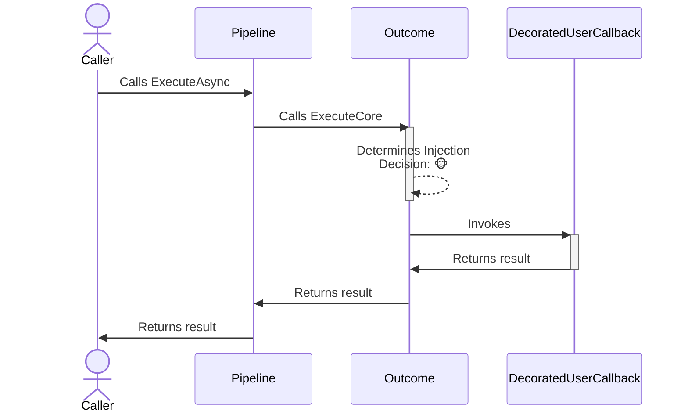
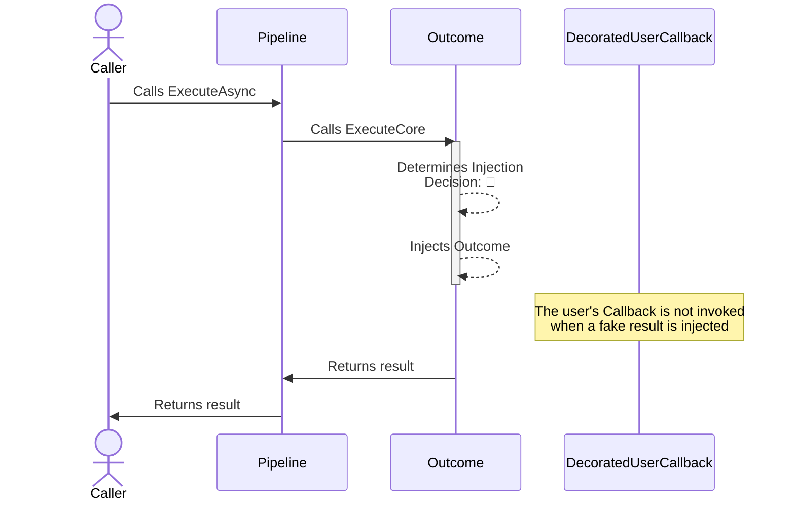

# Outcome monkey strategy

## About

- **Options**:
  - [`OutcomeStrategyOptions`](xref:Polly.Simmy.Outcomes.OutcomeStrategyOptions)
  - [`OutcomeStrategyOptions<T>`](xref:Polly.Simmy.Outcomes.OutcomeStrategyOptions`1)
- **Extensions**: `AddChaosResult`
- **Strategy Type**: Reactive

---

The outcome chaos strategy is designed to inject or substitute fake results into system operations. This allows testing how an application behaves when it receives different types of responses, like successful results, errors, or exceptions.

## Usage

<!-- snippet: chaos-result-usage -->
```cs
// To use a custom function to generate the result to inject.
var optionsWithResultGenerator = new OutcomeStrategyOptions<HttpResponseMessage>
{
    OutcomeGenerator = static args =>
    {
        var response = new HttpResponseMessage(HttpStatusCode.InternalServerError);
        return new ValueTask<Outcome<HttpResponseMessage>?>(Outcome.FromResult(response));
    },
    Enabled = true,
    InjectionRate = 0.1
};

// To get notifications when a result is injected
var optionsOnBehaviorInjected = new OutcomeStrategyOptions<HttpResponseMessage>
{
    OutcomeGenerator = static args =>
    {
        var response = new HttpResponseMessage(HttpStatusCode.InternalServerError);
        return new ValueTask<Outcome<HttpResponseMessage>?>(Outcome.FromResult(response));
    },
    Enabled = true,
    InjectionRate = 0.1,
    OnOutcomeInjected = static args =>
    {
        Console.WriteLine($"OnBehaviorInjected, Outcome: {args.Outcome.Result}, Operation: {args.Context.OperationKey}.");
        return default;
    }
};

// Add a result strategy with a OutcomeStrategyOptions{<TResult>} instance to the pipeline
new ResiliencePipelineBuilder<HttpResponseMessage>().AddChaosResult(optionsWithResultGenerator);
new ResiliencePipelineBuilder<HttpResponseMessage>().AddChaosResult(optionsOnBehaviorInjected);

// There are also a couple of handy overloads to inject the chaos easily.
new ResiliencePipelineBuilder<HttpResponseMessage>().AddChaosResult(0.1, () => new HttpResponseMessage(HttpStatusCode.TooManyRequests));
```
<!-- endSnippet -->

Example execution:

<!-- snippet: chaos-result-execution -->
```cs
var pipeline = new ResiliencePipelineBuilder<HttpResponseMessage>()
    .AddRetry(new RetryStrategyOptions<HttpResponseMessage>
    {
        ShouldHandle = static args => args.Outcome switch
        {
            { Result.StatusCode: HttpStatusCode.InternalServerError } => PredicateResult.True(),
            _ => PredicateResult.False()
        },
        BackoffType = DelayBackoffType.Exponential,
        UseJitter = true,
        MaxRetryAttempts = 4,
        Delay = TimeSpan.FromSeconds(3),
    })
    .AddChaosResult(new OutcomeStrategyOptions<HttpResponseMessage> // Monkey strategies are usually placed as the last ones in the pipeline
    {
        OutcomeGenerator = static args =>
        {
            var response = new HttpResponseMessage(HttpStatusCode.InternalServerError);
            return new ValueTask<Outcome<HttpResponseMessage>?>(Outcome.FromResult(response));
        },
        Enabled = true,
        InjectionRate = 0.1
    })
    .Build();
```
<!-- endSnippet -->

## Defaults

| Property            | Default Value | Description                                             |
|---------------------|---------------|---------------------------------------------------------|
| `OutcomeGenerator`  | `null`        | Function to generate the outcome for a given execution. |
| `OnOutcomeInjected` | `null`        | Action executed when the outcome is injected.           |

## Diagrams

### Normal 🐵 sequence diagram



### Chaos 🙈 sequence diagram


