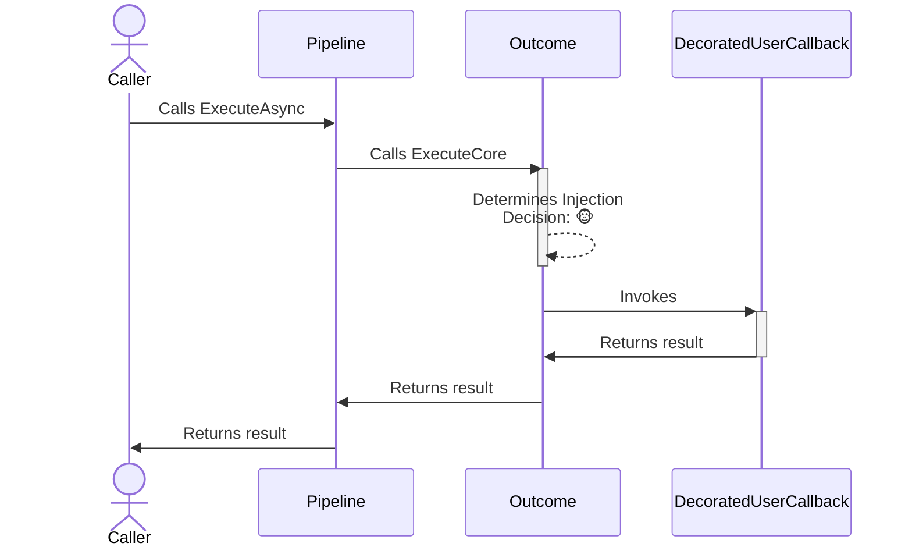
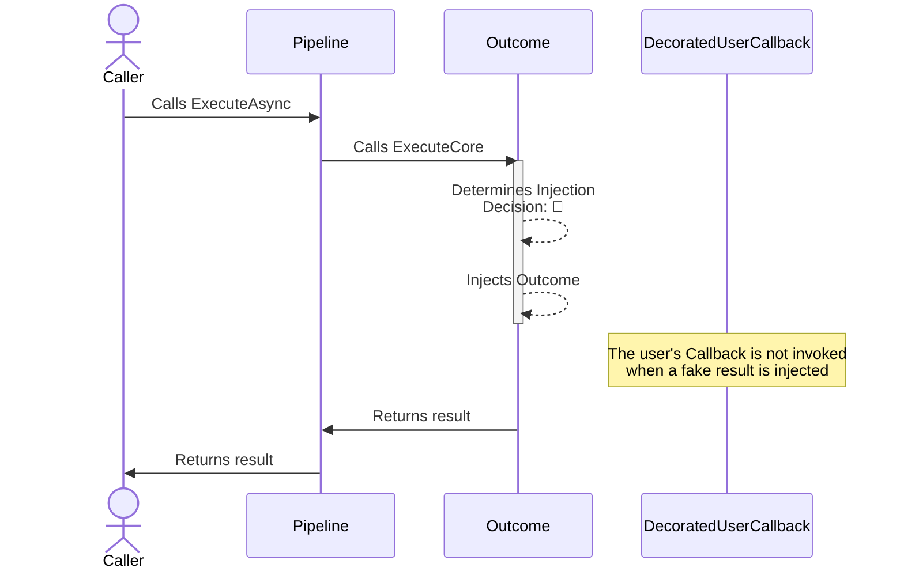

# Outcome monkey strategy

## About

- **Options**:
  - [`OutcomeStrategyOptions`](xref:Polly.Simmy.Outcomes.OutcomeStrategyOptions)
  - [`OutcomeStrategyOptions<T>`](xref:Polly.Simmy.Outcomes.OutcomeStrategyOptions`1)
- **Extensions**: `AddChaosResult`
- **Strategy Type**: Reactive

---

The outcome chaos strategy is designed to inject or substitute fake results into system operations. This allows testing how an application behaves when it receives different types of responses, like successful results, errors, or exceptions.

## Usage

<!-- snippet: chaos-result-usage -->
```cs
// Outcome using the default options.
// See https://www.pollydocs.org/chaos/result#defaults for defaults.
var optionsDefault = new OutcomeStrategyOptions<HttpStatusCode>();

// To use a custom function to generate the result to inject.
var optionsWithResultGenerator = new OutcomeStrategyOptions<HttpStatusCode>
{
    OutcomeGenerator = static args =>
    {
        HttpStatusCode result = args.Context.OperationKey switch
        {
            "A" => HttpStatusCode.TooManyRequests,
            "B" => HttpStatusCode.NotFound,
            _ => HttpStatusCode.OK
        };
        return new ValueTask<Outcome<HttpStatusCode>?>(Outcome.FromResult(result));
    },
    Enabled = true,
    InjectionRate = 0.6
};

// To get notifications when a result is injected
var optionsOnBehaviorInjected = new OutcomeStrategyOptions<HttpStatusCode>
{
    OutcomeGenerator = (_) => new ValueTask<Outcome<HttpStatusCode>?>(Outcome.FromResult(HttpStatusCode.TooManyRequests)),
    Enabled = true,
    InjectionRate = 0.6,
    OnOutcomeInjected = static args =>
    {
        Console.WriteLine($"OnBehaviorInjected, Outcome: {args.Outcome.Result}, Operation: {args.Context.OperationKey}.");
        return default;
    }
};

// Add a result strategy with a OutcomeStrategyOptions{<TResult>} instance to the pipeline
new ResiliencePipelineBuilder<HttpStatusCode>().AddChaosResult(optionsDefault);
new ResiliencePipelineBuilder<HttpStatusCode>().AddChaosResult(optionsWithResultGenerator);

// There are also a couple of handy overloads to inject the chaos easily.
new ResiliencePipelineBuilder<HttpStatusCode>().AddChaosResult(0.6, () => HttpStatusCode.TooManyRequests);
```
<!-- endSnippet -->

Example execution:

<!-- snippet: chaos-result-execution -->
```cs
var pipeline = new ResiliencePipelineBuilder<HttpStatusCode>()
    .AddChaosResult(new OutcomeStrategyOptions<HttpStatusCode> // Monkey strategies are usually placed innermost in the pipelines
    {
        OutcomeGenerator = static args =>
        {
            HttpStatusCode result = args.Context.OperationKey switch
            {
                "A" => HttpStatusCode.TooManyRequests,
                "B" => HttpStatusCode.NotFound,
                _ => HttpStatusCode.OK
            };
            return new ValueTask<Outcome<HttpStatusCode>?>(Outcome.FromResult(result));
        },
        Enabled = true,
        InjectionRate = 0.6
    })
    .AddRetry(new RetryStrategyOptions<HttpStatusCode>
    {
        ShouldHandle = static args => new ValueTask<bool>(args.Outcome.Result == HttpStatusCode.TooManyRequests),
        BackoffType = DelayBackoffType.Exponential,
        UseJitter = true,
        MaxRetryAttempts = 4,
        Delay = TimeSpan.FromSeconds(3),
    })
    .Build();
```
<!-- endSnippet -->

## Defaults

| Property            | Default Value | Description                                             |
|---------------------|---------------|---------------------------------------------------------|
| `OutcomeGenerator`  | `null`        | Function to generate the outcome for a given execution. |
| `OnOutcomeInjected` | `null`        | Action executed when the outcome is injected.           |

## Diagrams

### Normal 🐵 sequence diagram



### Chaos 🙈 sequence diagram


