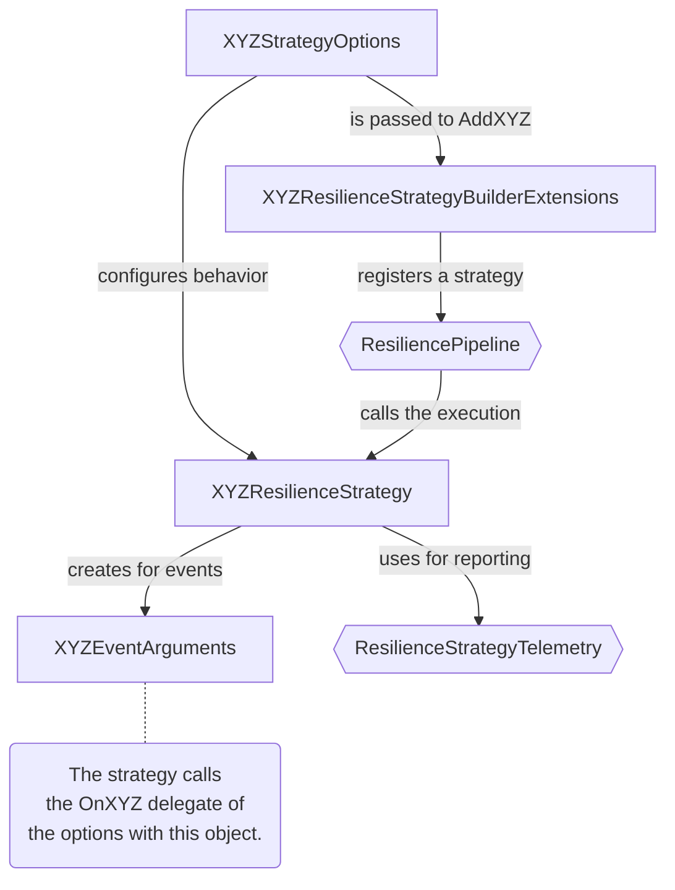

# Extensibility

This article explains how to extend Polly with new [resilience strategies](../strategies/index.md). Polly identifies two types of resilience strategies:

- **Reactive**: These strategies handle specific exceptions that are thrown, or results that are returned, by the callbacks executed through the strategy.
- **Proactive**: Unlike reactive strategies, proactive strategies do not focus on handling errors by the callbacks might throw or return. They can make proactive decisions to cancel or reject the execution of callbacks (e.g., using a rate limiter or a timeout resilience strategy).

This guide will help you create a new illustrative resilience strategy for each type.

## Basics of extensibility

Regardless of whether the strategy is reactive or proactive, every new resilience strategy should include the following components:

- The strategy itself which should inherit from [`ResilienceStrategy`](xref:Polly.ResilienceStrategy)
- Options detailing the strategy's configuration. This should inherit from [`ResilienceStrategyOptions`](xref:Polly.ResilienceStrategyOptions).
- Extensions for `ResiliencePipelineBuilder` or `ResiliencePipelineBuilder<T>` to register the strategy into the pipeline.
- Custom argument types for delegates that contain information about a specific event.

The strategy options contain properties of following types:

- **Common types**: Such as `int`, `bool`, `TimeSpan`, etc.
- **Delegates**: For example when a strategy needs to raise an event, or generate a value. In general, the delegates should by asynchronous.
- **Arguments**: Used by the delegates to pass the information to their consumers.

### Component diagram

This diagram depicts how the built-in types (hexagon shaped) interact with custom built types (rectangle shaped):



## Delegates

Individual resilience strategies make use of several delegate types:

- **Predicates**: Vital for determining whether a resilience strategy should handle the given execution result.
- **Events**: Triggered when significant actions or states occur within the resilience strategy.
- **Generators**: Invoked when the resilience strategy needs specific information or values from the caller.

Recommended signatures for these delegates are:

### Predicates

- `Func<Args<TResult>, ValueTask<bool>>` (Reactive)

### Events

- `Func<Args<TResult>, ValueTask>` (Reactive)
- `Func<Args, ValueTask>` (Proactive)

### Generators

- `Func<Args<TResult>, ValueTask<TValue>>` (Reactive)
- `Func<Args, ValueTask<TValue>>` (Proactive)

These delegates accept either `Args` or `Args<TResult>` arguments, which encapsulate event information. Note that all these delegates are asynchronous and return a `ValueTask`. Learn more about [arguments](#arguments) in the sections below.

> [!NOTE]
> When setting up delegates, consider using the `ResilienceContext.ContinueOnCapturedContext` property if your user code interacts with a synchronization context (such as in asynchronous UI applications like Windows Forms or WPF).

### How to use delegates

Below are some examples illustrating the usage of these delegates:

<!-- snippet: delegate-usage -->
```cs
new ResiliencePipelineBuilder()
    .AddRetry(new RetryStrategyOptions
    {
        // Non-Generic predicate for multiple result types
        ShouldHandle = args => args.Outcome switch
        {
            { Exception: InvalidOperationException } => PredicateResult.True(),
            { Result: string result } when result == "Failure" => PredicateResult.True(),
            { Result: int result } when result == -1 => PredicateResult.True(),
            _ => PredicateResult.False()
        },
    })
    .Build();

new ResiliencePipelineBuilder<string>()
    .AddRetry(new RetryStrategyOptions<string>
    {
        // Generic predicate for a single result type
        ShouldHandle = args => args.Outcome switch
        {
            { Exception: InvalidOperationException } => PredicateResult.True(),
            { Result: { } result } when result == "Failure" => PredicateResult.True(),
            _ => PredicateResult.False()
        },
    })
    .Build();
```
<!-- endSnippet -->

## Arguments

Arguments are used by individual delegate types to flow information to the consumer. Arguments should always have an `Arguments` suffix and include a `Context` property. Using arguments boosts the extensibility and maintainability of the API, as adding new members becomes a non-breaking change.  For proactive strategies, the arguments structure might resemble the following:

<!-- snippet: ext-proactive-args -->
```cs
// Structs for arguments encapsulate details about specific events within the resilience strategy.
// Relevant properties to the event can be exposed. In this event, the actual execution time and the exceeded threshold are included.
public readonly struct OnThresholdExceededArguments
{
    public OnThresholdExceededArguments(ResilienceContext context, TimeSpan threshold, TimeSpan duration)
    {
        Context = context;
        Threshold = threshold;
        Duration = duration;
    }

    public TimeSpan Threshold { get; }

    public TimeSpan Duration { get; }

    // As per convention, all arguments should provide a "Context" property.
    public ResilienceContext Context { get; }
}
```
<!-- endSnippet -->

## Implementing a resilience strategy

To find out more details about implementing a strategy, follow the links below:

- [Proactive strategy](proactive-strategy.md): Explains how to implement a proactive resilience strategy.
- [Reactive strategy](reactive-strategy.md): Explains how to implement a reactive resilience strategy.
