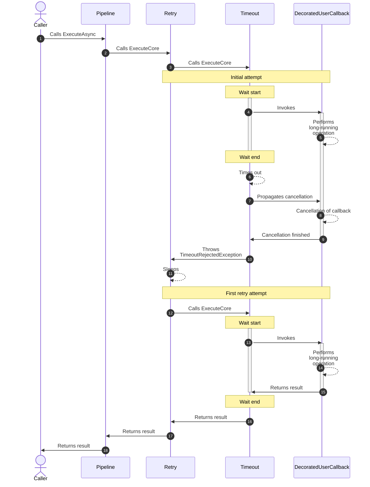
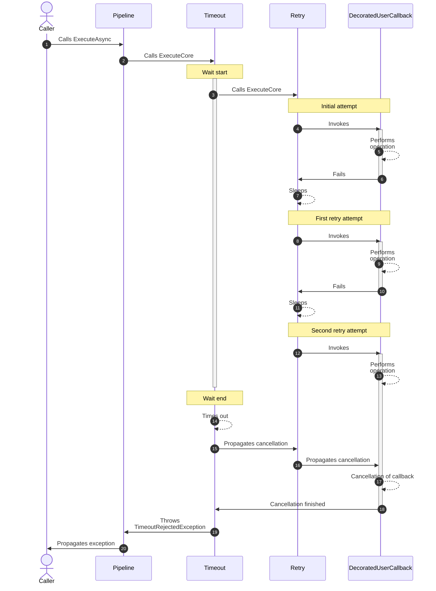
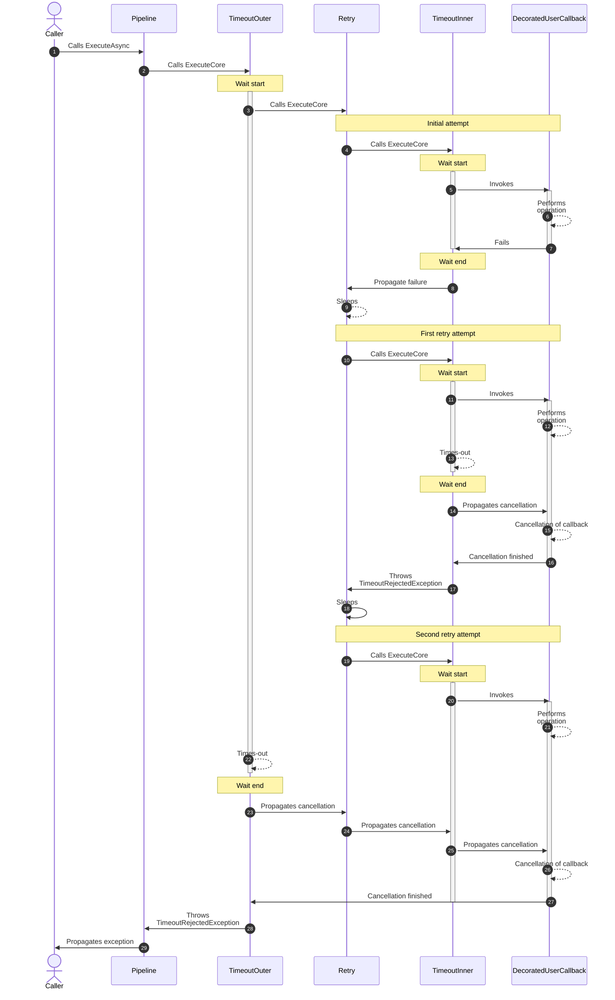

# Resilience pipelines

The `ResiliencePipeline` allows executing arbitrary user-provided callbacks. It is a combination of one or more resilience strategies.

## Usage

The `ResiliencePipeline` allow executing various synchronous and asynchronous user-provided callbacks as seen in the examples below:

<!-- snippet: resilience-pipeline-usage -->
```cs
// Creating a new resilience pipeline
ResiliencePipeline pipeline = new ResiliencePipelineBuilder()
    .AddConcurrencyLimiter(100)
    .Build();

// Executing an asynchronous void callback
await pipeline.ExecuteAsync(
    async token => await MyMethodAsync(token),
    cancellationToken);

// Executing a synchronous void callback
pipeline.Execute(() => MyMethod());

// Executing an asynchronous callback that returns a value
await pipeline.ExecuteAsync(
    async token => await httpClient.GetAsync(endpoint, token),
    cancellationToken);

// Executing an asynchronous callback without allocating a lambda
await pipeline.ExecuteAsync(
    static async (state, token) => await state.httpClient.GetAsync(state.endpoint, token),
    (httpClient, endpoint),  // State provided here
    cancellationToken);

// Executing an asynchronous callback and passing custom data

// 1. Retrieve a context from the shared pool
ResilienceContext context = ResilienceContextPool.Shared.Get(cancellationToken);

// 2. Add custom data to the context
context.Properties.Set(new ResiliencePropertyKey<string>("my-custom-data"), "my-custom-data");

// 3. Execute the callback
await pipeline.ExecuteAsync(static async context =>
{
    // Retrieve custom data from the context
    var customData = context.Properties.GetValue(
        new ResiliencePropertyKey<string>("my-custom-data"),
        "default-value");

    Console.WriteLine("Custom Data: {0}", customData);

    await MyMethodAsync(context.CancellationToken);
},
context);

// 4. Optionally, return the context to the shared pool
ResilienceContextPool.Shared.Return(context);
```
<!-- endSnippet -->

The above samples demonstrate how to use the resilience pipeline within the same scope. Additionally, consider the following:

- Separate the resilience pipeline's definition from its usage. Inject pipelines into the code that will consume them. This [facilitates various unit-testing scenarios](https://github.com/App-vNext/Polly/wiki/Unit-testing-with-Polly---with-examples).
- If your application uses Polly in multiple locations, define all pipelines at startup using [`ResiliencePipelineRegistry`](/docs/resilience-pipeline-registry.md) or using the `AddResiliencePipeline` extension. This is a common approach in .NET Core applications. For example, you could create your own extension method on `IServiceCollection` to configure pipelines consumed elsewhere in your application.

<!-- snippet: resilience-pipeline-di-usage -->
```cs
public static void ConfigureMyPipelines(IServiceCollection services)
{
    services.AddResiliencePipeline("pipeline-A", builder => builder.AddConcurrencyLimiter(100));
    services.AddResiliencePipeline("pipeline-B", builder => builder.AddRetry(new()));

    // Later, resolve the pipeline by name using ResiliencePipelineProvider<string> or ResiliencePipelineRegistry<string>
    var pipelineProvider = services.BuildServiceProvider().GetRequiredService<ResiliencePipelineProvider<string>>();
    pipelineProvider.GetPipeline("pipeline-A").Execute(() => { });
}
```
<!-- endSnippet -->

## Empty resilience pipeline

The empty resilience pipeline is a special construct that lacks any resilience strategies. You can access it through the following ways:

- `ResiliencePipeline.Empty`
- `ResiliencePipeline<T>.Empty`

This is particularly useful in test scenarios where implementing resilience strategies could slow down the test execution or over-complicate test setup.

## Retrieving execution results with `Outcome<T>`

The `ResiliencePipeline` class provides the `ExecuteOutcomeAsync(...)` method, which is designed to never throw exceptions. Instead, it stores either the result or the exception within an `Outcome<T>` struct.

<!-- snippet: resilience-pipeline-outcome -->
```cs
// Acquire a ResilienceContext from the pool
ResilienceContext context = ResilienceContextPool.Shared.Get();

// Execute the pipeline and store the result in an Outcome<bool>
Outcome<bool> outcome = await pipeline.ExecuteOutcomeAsync(
    static async (context, state) =>
    {
        Console.WriteLine("State: {0}", state);

        try
        {
            await MyMethodAsync(context.CancellationToken);

            // Use static utility methods from Outcome to easily create an Outcome<T> instance
            return Outcome.FromResult(true);
        }
        catch (Exception e)
        {
            // Create an Outcome<T> instance that holds the exception
            return Outcome.FromException<bool>(e);
        }
    },
    context,
    "my-state");

// Return the acquired ResilienceContext to the pool
ResilienceContextPool.Shared.Return(context);

// Evaluate the outcome
if (outcome.Exception is not null)
{
    Console.WriteLine("Execution Failed: {0}", outcome.Exception.Message);
}
else
{
    Console.WriteLine("Execution Result: {0}", outcome.Result);
}
```
<!-- endSnippet -->

Use `ExecuteOutcomeAsync(...)` in high-performance scenarios where you wish to avoid re-throwing exceptions. Keep in mind that Polly's resilience strategies also make use of the `Outcome` struct to prevent unnecessary exception throwing.

### Context vs State

In the previous example the `ExecuteOutcomeAsync` was called with `"my-state"` state object. You might wonder what's the point of the `state`, or can't we just use the `context`?

The `state` object was introduced to be able to pass a parameter to the user callback without using a [closure](https://stackoverflow.com/a/428624/1064169).

- It allows you to access any object of the `ExecuteOutcomeAsync`'s caller method without any extra memory allocation
- It also enables you to use static anonymous methods

So, it is a performance optimization tool. Of course you can pass more complex object than just a simple string like `(instance: this, request)`.

While the `state` object is accessible only inside the user callback, you can use the `context` in many places.
For example in case of Retry the `context` is accessible:

- inside the `ShouldHandle` delegate;
- inside the `OnRetry` delegate;
- inside the `DelayGenerator` delegate;
- through the `Outcome` property.

As a rule of thumb:

- Use the `state` object to pass a parameter to your decorated method;
- Use the `context` object to exchange information between delegates of an instance of `XYZOptions` or between invocation attempts (in the case of retry or hedging strategies).

## Diagrams

### Sequence diagram for a pipeline with retry and timeout

Let's create the following pipeline:

- the inner strategy is a timeout,
- the outer is a retry which is timeout-aware.

<!-- snippet: resilience-pipeline-diagram-retry-timeout -->
```cs
ResiliencePipeline pipeline = new ResiliencePipelineBuilder()
    .AddRetry(new() { ShouldHandle = new PredicateBuilder().Handle<TimeoutRejectedException>() }) // outer
    .AddTimeout(TimeSpan.FromSeconds(1)) // inner
    .Build();
```
<!-- endSnippet -->

Let's suppose that the first request takes too long but the second is fast enough.



### Sequence diagram for a pipeline with timeout and retry

Let's create the following pipeline:

- the inner strategy is a retry,
- the outer is a timeout which is overarching all retry attempts.

<!-- snippet: resilience-pipeline-diagram-timeout-retry -->
```cs
ResiliencePipeline pipeline = new ResiliencePipelineBuilder()
    .AddTimeout(TimeSpan.FromSeconds(10)) // outer
    .AddRetry(new()) // inner
    .Build();
```
<!-- endSnippet -->

Let's suppose that the first and the second requests are failing. The third request is not awaited since the overarching timeout elapsed.



### Sequence diagram for a pipeline with timeout, retry and timeout

Let's create the following pipeline:

- the inner most strategy is a timeout (per attempt),
- the middle one is a retry which is timeout-aware,
- the outer most is a timeout which is overarching all retry attempts.

<!-- snippet: resilience-pipeline-diagram-timeout-retry-timeout -->
```cs
ResiliencePipeline pipeline = new ResiliencePipelineBuilder()
    .AddTimeout(TimeSpan.FromSeconds(10)) // outer most
    .AddRetry(new() { ShouldHandle = new PredicateBuilder().Handle<TimeoutRejectedException>() })
    .AddTimeout(TimeSpan.FromSeconds(1)) // inner most
    .Build();
```
<!-- endSnippet -->

Let's suppose that the first request fails and the second takes too long. The third request is not awaited since the overarching timeout elapsed.


