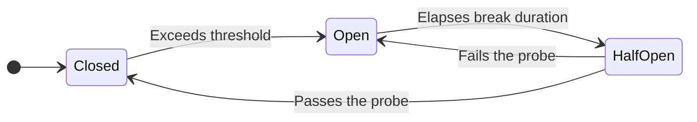
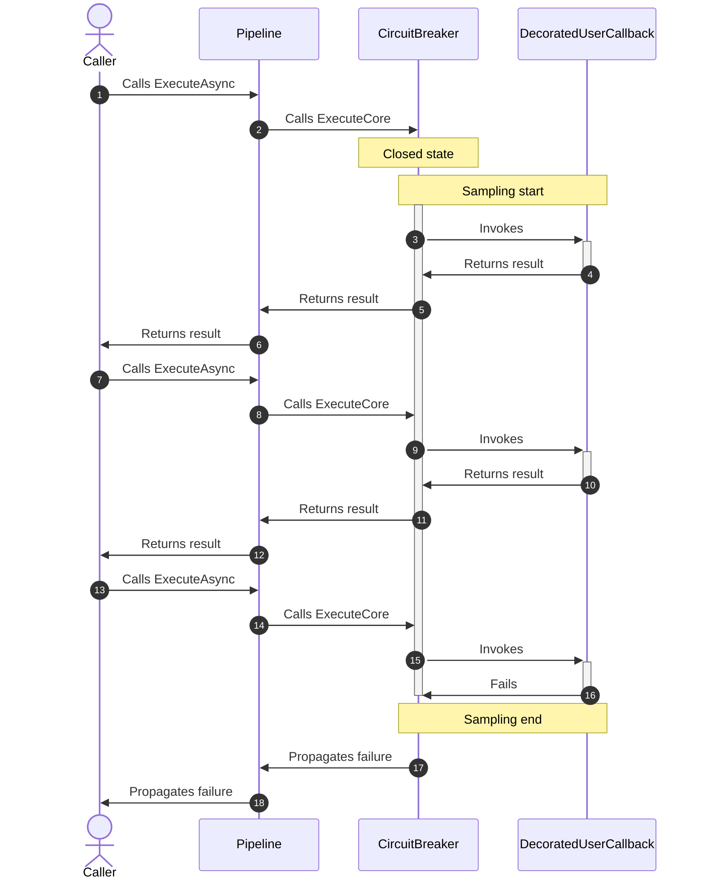
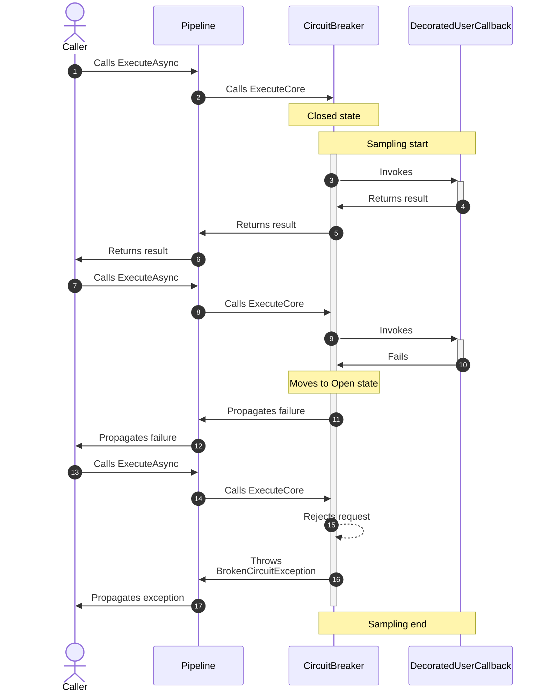
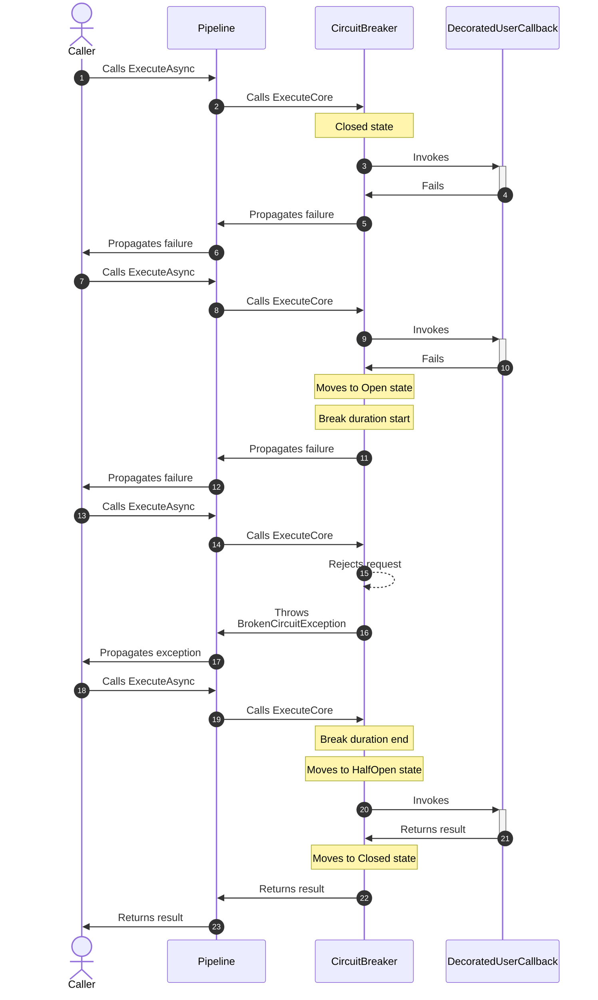
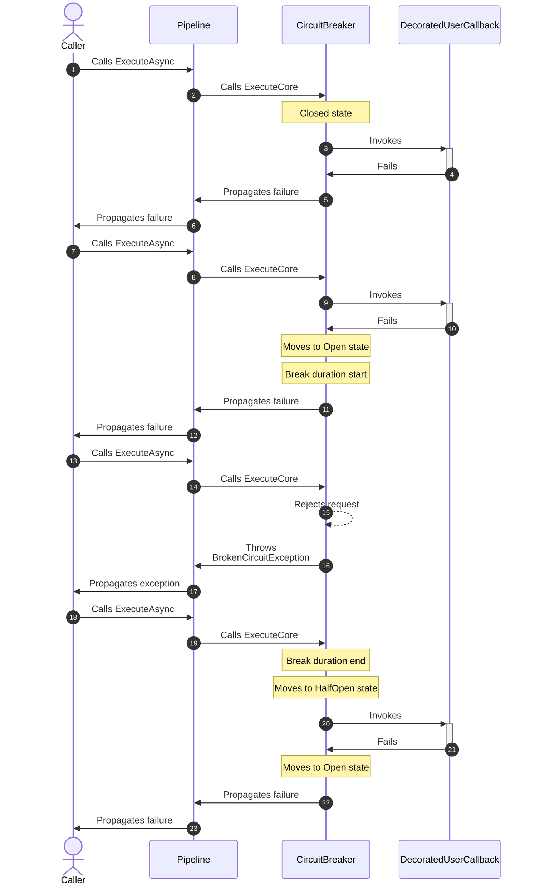
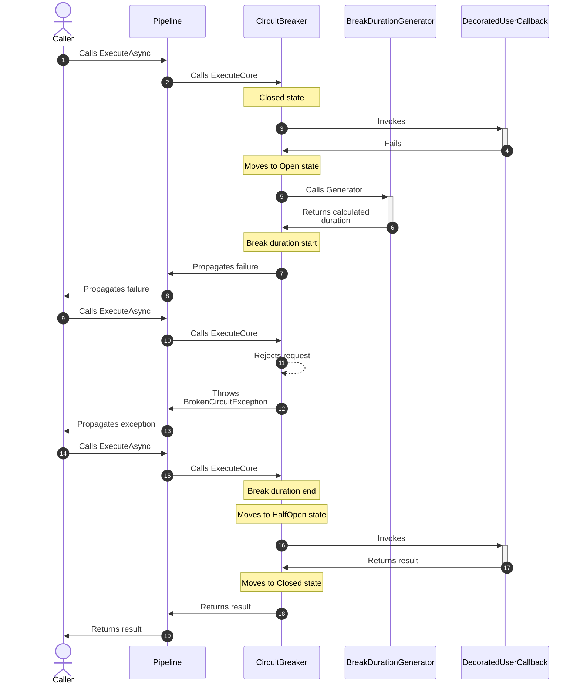

# Circuit breaker resilience strategy

## About

- **Options**:
  - [`CircuitBreakerStrategyOptions`](xref:Polly.CircuitBreaker.CircuitBreakerStrategyOptions)
  - [`CircuitBreakerStrategyOptions<T>`](xref:Polly.CircuitBreaker.CircuitBreakerStrategyOptions)
- **Extensions**: `AddCircuitBreaker`
- **Strategy Type**: Reactive
- **Exceptions**:
  - `BrokenCircuitException`: Thrown when a circuit is broken and the action could not be executed.
  - `IsolatedCircuitException`: Thrown when a circuit is isolated (held open) by manual override.

---

> [!NOTE]
> Be aware that the Circuit Breaker strategy [rethrows all exceptions](https://github.com/App-vNext/Polly/wiki/Circuit-Breaker#exception-handling), including those that are handled. A Circuit Breaker's role is to monitor faults and break the circuit when a certain threshold is reached; it does not manage retries. Combine the Circuit Breaker with a Retry strategy if needed.

## Usage

<!-- snippet: circuit-breaker -->
```cs
// Circuit breaker with default options.
// See https://www.pollydocs.org/strategies/circuit-breaker#defaults for defaults.
var optionsDefaults = new CircuitBreakerStrategyOptions();

// Circuit breaker with customized options:
// The circuit will break if more than 50% of actions result in handled exceptions,
// within any 10-second sampling duration, and at least 8 actions are processed.
var optionsComplex = new CircuitBreakerStrategyOptions
{
    FailureRatio = 0.5,
    SamplingDuration = TimeSpan.FromSeconds(10),
    MinimumThroughput = 8,
    BreakDuration = TimeSpan.FromSeconds(30),
    ShouldHandle = new PredicateBuilder().Handle<SomeExceptionType>()
};

// Circuit breaker using BreakDurationGenerator:
// The break duration is dynamically determined based on the properties of BreakDurationGeneratorArguments.
var optionsBreakDurationGenerator = new CircuitBreakerStrategyOptions
{
    FailureRatio = 0.5,
    SamplingDuration = TimeSpan.FromSeconds(10),
    MinimumThroughput = 8,
    BreakDurationGenerator = static args => new ValueTask<TimeSpan>(TimeSpan.FromMinutes(args.FailureCount)),
};

// Handle specific failed results for HttpResponseMessage:
var optionsShouldHandle = new CircuitBreakerStrategyOptions<HttpResponseMessage>
{
    ShouldHandle = new PredicateBuilder<HttpResponseMessage>()
        .Handle<SomeExceptionType>()
        .HandleResult(response => response.StatusCode == HttpStatusCode.InternalServerError)
};

// Monitor the circuit state, useful for health reporting:
var stateProvider = new CircuitBreakerStateProvider();
var optionsStateProvider = new CircuitBreakerStrategyOptions<HttpResponseMessage>
{
    StateProvider = stateProvider
};

var circuitState = stateProvider.CircuitState;

/*
CircuitState.Closed - Normal operation; actions are executed.
CircuitState.Open - Circuit is open; actions are blocked.
CircuitState.HalfOpen - Recovery state after break duration expires; actions are permitted.
CircuitState.Isolated - Circuit is manually held open; actions are blocked.
*/

// Manually control the Circuit Breaker state:
var manualControl = new CircuitBreakerManualControl();
var optionsManualControl = new CircuitBreakerStrategyOptions
{
    ManualControl = manualControl
};

// Manually isolate a circuit, e.g., to isolate a downstream service.
await manualControl.IsolateAsync();

// Manually close the circuit to allow actions to be executed again.
await manualControl.CloseAsync();

// Add a circuit breaker strategy with a CircuitBreakerStrategyOptions{<TResult>} instance to the pipeline
new ResiliencePipelineBuilder().AddCircuitBreaker(optionsDefaults);
new ResiliencePipelineBuilder<HttpResponseMessage>().AddCircuitBreaker(optionsStateProvider);
```
<!-- endSnippet -->

## Defaults

| Property                 | Default Value                                                              | Description                                                                                |
| -----------------------  | -------------------------------------------------------------------------- | ------------------------------------------------------------------------------------------ |
| `ShouldHandle`           | Predicate that handles all exceptions except `OperationCanceledException`. | Specifies which results and exceptions are managed by the circuit breaker strategy.        |
| `FailureRatio`           | 0.1                                                                        | The ratio of failures to successes that will cause the circuit to break/open.              |
| `MinimumThroughput`      | 100                                                                        | The minimum number of actions that must occur in the circuit within a specific time slice. |
| `SamplingDuration`       | 30 seconds                                                                 | The time period over which failure ratios are calculated.                                  |
| `BreakDuration`          | 5 seconds                                                                  | The time period for which the circuit will remain broken/open before attempting to reset.  |
| `BreakDurationGenerator` | `null`                                                                     | Enables adaptive adjustment of break duration based on the current state of the circuit.   |
| `OnClosed`               | `null`                                                                     | Event triggered when the circuit transitions to the `Closed` state.                        |
| `OnOpened`               | `null`                                                                     | Event triggered when the circuit transitions to the `Opened` state.                        |
| `OnHalfOpened`           | `null`                                                                     | Event triggered when the circuit transitions to the `HalfOpened` state.                    |
| `ManualControl`          | `null`                                                                     | Allows for manual control to isolate or close the circuit.                                 |
| `StateProvider`          | `null`                                                                     | Enables the retrieval of the current state of the circuit.                                 |

## Diagrams

### State diagram



Whenever someone says _the circuit breaks_ that means the Circuit Breaker transitions from the `Closed` state to the `Open` state.

### Simple

Let's suppose we have a circuit breaker strategy wit the following configuration:

- `SamplingDuration`: `2 seconds`;
- `MinimumThroughput`: `2`;
- `FailureRatio` : `0.5`.

#### Simple: happy path sequence diagram

The circuit will not break because the actual failure ratio (0.33) will be below the threshold (0.5) after the 3rd call.



#### Simple: unhappy path sequence diagram

The circuit will break because the actual failure ratio meets the threshold (0.5) after the 2nd call.



### Complex

Let's suppose we have a circuit breaker strategy with the following configuration:

- `SamplingDuration`: `2 seconds`;
- `MinimumThroughput`: `2`;
- `FailureRatio`: `0.5`;
- `BreakDuration`:`1 second`.

#### Complex: happy path sequence diagram

The circuit will break and later it will transition into the `HalfOpen` state. The probe will then succeed, so the circuit breaker will go back to the normal (`Closed`) state.



#### Complex: unhappy path sequence diagram

The circuit will break and later it will transition into the `HalfOpen` state. The probe will then fail, so the circuit breaker will become broken again (the `Open` state).



#### Complex: dynamic break duration sequence diagram

This sequence diagram illustrates the behavior of a circuit breaker using a `BreakDurationGenerator`. The generator dynamically calculates the break duration based on specific criteria, such as the number of failures:



## Resources

- [Making the Netflix API More Resilient](https://techblog.netflix.com/2011/12/making-netflix-api-more-resilient.html)
- [Circuit Breaker by Martin Fowler](https://martinfowler.com/bliki/CircuitBreaker.html)
- [Circuit Breaker Pattern by Microsoft](https://msdn.microsoft.com/en-us/library/dn589784.aspx)
- [Original Circuit Breaking Article](https://web.archive.org/web/20160106203951/http://thatextramile.be/blog/2008/05/the-circuit-breaker)

## Anti-patterns

Over the years, many developers have used Polly in various ways. Some of these
recurring patterns may not be ideal. The sections below highlight anti-patterns to avoid.

### Using different sleep duration between retry attempts based on Circuit Breaker state

Imagine that we have an inner Circuit Breaker and an outer Retry strategies.

We would like to define the retry in a way that the sleep duration calculation is taking into account the Circuit Breaker's state.

❌ DON'T

Use a closure to branch based on circuit breaker state:

<!-- snippet: circuit-breaker-anti-pattern-circuit-aware-retry -->
```cs
var stateProvider = new CircuitBreakerStateProvider();
var circuitBreaker = new ResiliencePipelineBuilder()
    .AddCircuitBreaker(new()
    {
        ShouldHandle = new PredicateBuilder().Handle<HttpRequestException>(),
        BreakDuration = TimeSpan.FromSeconds(5),
        StateProvider = stateProvider
    })
    .Build();

var retry = new ResiliencePipelineBuilder()
    .AddRetry(new()
    {
        ShouldHandle = new PredicateBuilder()
            .Handle<HttpRequestException>()
            .Handle<BrokenCircuitException>(),
        DelayGenerator = args =>
        {
            TimeSpan? delay = TimeSpan.FromSeconds(1);
            if (stateProvider.CircuitState == CircuitState.Open)
            {
                delay = TimeSpan.FromSeconds(5);
            }

            return ValueTask.FromResult(delay);
        }
    })
    .Build();
```
<!-- endSnippet -->

**Reasoning**:

- By default, each strategy is independent and has no any reference to other strategies.
- We use the (`stateProvider`) to access the Circuit Breaker's state. However, this approach is not optimal as the retry strategy's `DelayGenerator` varies based on state.
- This solution is delicate because the break duration and the sleep duration aren't linked.
- If a future code maintainer modifies the `circuitBreaker`'s `BreakDuration`, they might overlook adjusting the sleep duration.

✅ DO

Use `Context` to pass information between strategies:

<!-- snippet: circuit-breaker-pattern-circuit-aware-retry -->
```cs
var circuitBreaker = new ResiliencePipelineBuilder()
    .AddCircuitBreaker(new()
    {
        ShouldHandle = new PredicateBuilder().Handle<HttpRequestException>(),
        BreakDuration = TimeSpan.FromSeconds(5),
        OnOpened = static args =>
        {
            args.Context.Properties.Set(SleepDurationKey, args.BreakDuration);
            return ValueTask.CompletedTask;
        },
        OnClosed = args =>
        {
            args.Context.Properties.Set(SleepDurationKey, null);
            return ValueTask.CompletedTask;
        }
    })
    .Build();

var retry = new ResiliencePipelineBuilder()
    .AddRetry(new()
    {
        ShouldHandle = new PredicateBuilder()
            .Handle<HttpRequestException>()
            .Handle<BrokenCircuitException>(),
        DelayGenerator = static args =>
        {
            _ = args.Context.Properties.TryGetValue(SleepDurationKey, out var delay);
            delay ??= TimeSpan.FromSeconds(1);
            return ValueTask.FromResult(delay);
        }
    })
    .Build();
```
<!-- endSnippet -->

**Reasoning**:

- Both strategies are less coupled in this approach since they rely on the context and the `sleepDurationKey` components.
- The Circuit Breaker shares the `BreakDuration` through the context when it breaks. When it transitions back to Closed, the sharing is revoked.
- The Retry strategy fetches the sleep duration dynamically without knowing any specific knowledge about the Circuit Breaker.
- If adjustments are needed for the `BreakDuration`, they can be made in one place.

### Wrapping each endpoint with a circuit breaker

Imagine that you have to call N number of services via `HttpClient`s.
You want to decorate all downstream calls with the service-aware Circuit Breaker.

❌ DON'T

Use a collection of Circuit Breakers and explicitly call `ExecuteAsync()`:

<!-- snippet: circuit-breaker-anti-pattern-cb-per-endpoint -->
```cs
// Defined in a common place
var uriToCbMappings = new Dictionary<Uri, ResiliencePipeline>
{
    [new Uri("https://downstream1.com")] = GetCircuitBreaker(),
    // ...
    [new Uri("https://downstreamN.com")] = GetCircuitBreaker()
};

// Used in the downstream 1 client
var downstream1Uri = new Uri("https://downstream1.com");
await uriToCbMappings[downstream1Uri].ExecuteAsync(CallXYZOnDownstream1, CancellationToken.None);
```
<!-- endSnippet -->

**Reasoning**:

- Whenever you use an `HttpClient`, you must have a reference to the `uriToCbMappings` dictionary.
- It's your responsibility to decorate each network call with the corresponding circuit breaker.

✅ DO

Use named `HttpClient`s and then call `AddResilienceHandler` extension that is included in the [`Microsoft.Extensions.Http.Resilience`](https://www.nuget.org/packages/Microsoft.Extensions.Http.Resilience) package.

<!-- snippet: circuit-breaker-pattern-cb-per-endpoint -->
```cs
services
  .AddHttpClient("my-client")
  .AddResilienceHandler("circuit-breaker", builder =>
  {
      builder.AddCircuitBreaker(new());
  })
  .SelectPipelineByAuthority(); // This call ensures that circuit breaker is cached by each URL authority
```
<!-- endSnippet -->

And then use it:

<!-- snippet: circuit-breaker-pattern-cb-per-endpoint-usage -->
```cs
HttpClient client = httpClientFactory.CreateClient("my-client");

await client.GetAsync(new Uri("https://downstream1.com/some-path"));
```
<!-- endSnippet -->

**Reasoning**:

- The `HttpClient` integrates with Circuit Breaker during startup by using the `AddResilienceHandler` extension.
- There's no need to call `ExecuteAsync()` directly. The `DelegatingHandler` handles it automatically.
- By using the `SelectPipelineByAuthority` extension method, the resilience handler caches and assigns resilience pipeline to each authority (scheme + host + port) that is extracted from HTTP request message.

### Reducing thrown exceptions

In case of Circuit Breaker when it is either in the `Open` or `Isolated` state new requests are rejected immediately.

That means the strategy will throw either a `BrokenCircuitException` or an `IsolatedCircuitException` respectively.

❌ DON'T

Use guard expression to call `Execute{Async}` only if the circuit is not broken:

<!-- snippet: circuit-breaker-anti-pattern-reduce-thrown-exceptions -->
```cs
var stateProvider = new CircuitBreakerStateProvider();
var circuitBreaker = new ResiliencePipelineBuilder()
    .AddCircuitBreaker(new()
    {
        ShouldHandle = new PredicateBuilder().Handle<HttpRequestException>(),
        BreakDuration = TimeSpan.FromSeconds(0.5),
        StateProvider = stateProvider
    })
    .Build();

if (stateProvider.CircuitState
    is not CircuitState.Open
    and not CircuitState.Isolated)
{
    var response = await circuitBreaker.ExecuteAsync(static async ct =>
    {
        return await IssueRequest();
    }, CancellationToken.None);

    // Your code goes here to process response
}
```
<!-- endSnippet -->

**Reasoning**:

- The problem with this approach is that the circuit breaker will never transition into the `HalfOpen` state.
- The circuit breaker does not act as an active object. In other words the state transition does not happen automatically in the background.
- The circuit transition into the `HalfOpen` state when the `Execute{Async}` method is called and the `BreakDuration` elapsed.

✅ DO

Use `ExecuteOutcomeAsync` to avoid throwing exception:

<!-- snippet: circuit-breaker-pattern-reduce-thrown-exceptions -->
```cs
var context = ResilienceContextPool.Shared.Get();
var circuitBreaker = new ResiliencePipelineBuilder()
    .AddCircuitBreaker(new()
    {
        ShouldHandle = new PredicateBuilder().Handle<HttpRequestException>(),
        BreakDuration = TimeSpan.FromSeconds(0.5),
    })
    .Build();

Outcome<HttpResponseMessage> outcome = await circuitBreaker.ExecuteOutcomeAsync(static async (ctx, state) =>
{
    var response = await IssueRequest();
    return Outcome.FromResult(response);
}, context, "state");

ResilienceContextPool.Shared.Return(context);

if (outcome.Exception is BrokenCircuitException)
{
    // The execution was stopped by the circuit breaker
}
else
{
    HttpResponseMessage response = outcome.Result!;
    // Your code goes here to process the response
}
```
<!-- endSnippet -->

**Reasoning**:

- The `ExecuteOutcomeAsync` is a low-allocation API which does not throw exceptions; rather it captures them inside an `Outcome` data structure.
- Since you are calling one of the `Execute` methods, that's why the circuit breaker can transition into the `HalfOpen` state.
