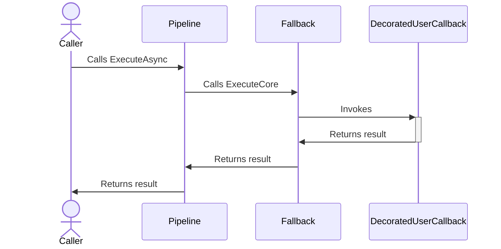
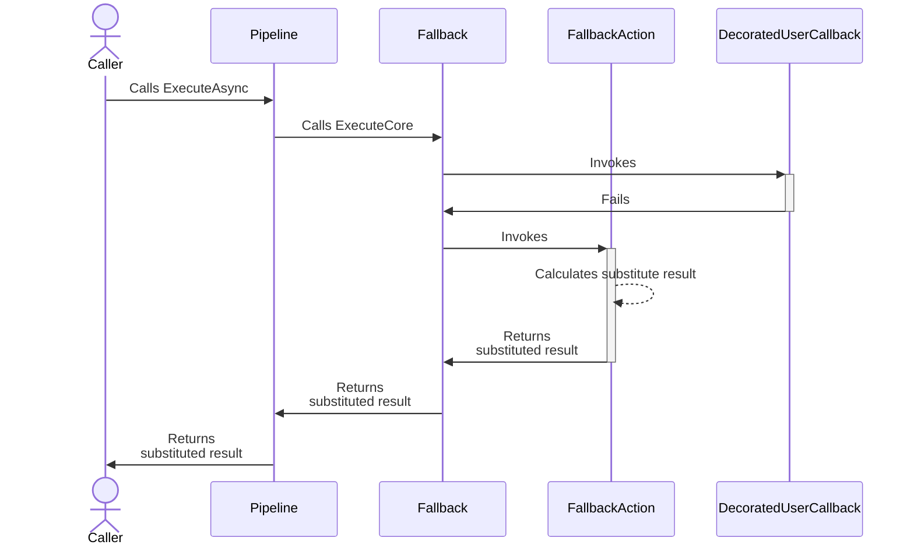

# Fallback resilience strategy

## About

- **Option(s)**:
  - [`FallbackStrategyOptions<T>`](xref:Polly.Fallback.FallbackStrategyOptions`1)
- **Extension(s)**:
  - `AddFallback`
- **Exception(s)**: -

---

The fallback **reactive** resilience strategy provides a substitute if the execution of the callback fails. Failure can be either an `Exception` or a result object indicating unsuccessful processing. Typically this strategy is used as a last resort, meaning that if all other strategies failed to overcome the transient failure you could still provide a fallback value to the caller.

> [!NOTE]
> In this document the *fallback*, *substitute*, and *surrogate* terms are used interchangeably.

## Usage

<!-- snippet: fallback -->
```cs
// A fallback/substitute value if an operation fails.
var optionsSubstitute = new FallbackStrategyOptions<UserAvatar>
{
    ShouldHandle = new PredicateBuilder<UserAvatar>()
        .Handle<SomeExceptionType>()
        .HandleResult(r => r is null),
    FallbackAction = static args => Outcome.FromResultAsValueTask(UserAvatar.Blank)
};

// Use a dynamically generated value if an operation fails.
var optionsFallbackAction = new FallbackStrategyOptions<UserAvatar>
{
    ShouldHandle = new PredicateBuilder<UserAvatar>()
        .Handle<SomeExceptionType>()
        .HandleResult(r => r is null),
    FallbackAction = static args =>
    {
        var avatar = UserAvatar.GetRandomAvatar();
        return Outcome.FromResultAsValueTask(avatar);
    }
};

// Use a default or dynamically generated value, and execute an additional action if the fallback is triggered.
var optionsOnFallback = new FallbackStrategyOptions<UserAvatar>
{
    ShouldHandle = new PredicateBuilder<UserAvatar>()
        .Handle<SomeExceptionType>()
        .HandleResult(r => r is null),
    FallbackAction = static args =>
    {
        var avatar = UserAvatar.GetRandomAvatar();
        return Outcome.FromResultAsValueTask(UserAvatar.Blank);
    },
    OnFallback = static args =>
    {
        // Add extra logic to be executed when the fallback is triggered, such as logging.
        return default; // Returns an empty ValueTask
    }
};

// Add a fallback strategy with a FallbackStrategyOptions<TResult> instance to the pipeline
new ResiliencePipelineBuilder<UserAvatar>().AddFallback(optionsOnFallback);
```
<!-- endSnippet -->

## Defaults

| Property         | Default Value                                           | Description                                                                                                                                              |
|------------------|---------------------------------------------------------|----------------------------------------------------------------------------------------------------------------------------------------------------------|
| `ShouldHandle`   | Any exceptions other than `OperationCanceledException`. | Defines a predicate to determine what results and/or exceptions are handled by the fallback strategy.                                                    |
| `FallbackAction` | `Null`, **Required**                                    | This delegate allows you to **dynamically** calculate the surrogate value by utilizing information that is only available at runtime (like the outcome). |
| `OnFallback`     | `null`                                                  | If provided then it will be invoked before the strategy calculates the fallback value.                                                                   |

## Diagrams

### Happy path sequence diagram



### Unhappy path sequence diagram



## Patterns

### Fallback after retries

When designing resilient systems, a common pattern is to use a fallback after multiple failed retry attempts. This approach is especially relevant when a fallback strategy can provide a sensible default value.

<!-- snippet: fallback-pattern-after-retries -->
```cs
// Define a common predicates re-used by both fallback and retries
var predicateBuilder = new PredicateBuilder<HttpResponseMessage>()
    .Handle<HttpRequestException>()
    .HandleResult(r => r.StatusCode == HttpStatusCode.InternalServerError);

var pipeline = new ResiliencePipelineBuilder<HttpResponseMessage>()
    .AddFallback(new()
    {
        ShouldHandle = predicateBuilder,
        FallbackAction = args =>
        {
            // Try to resolve the fallback response
            HttpResponseMessage fallbackResponse = ResolveFallbackResponse(args.Outcome);

            return Outcome.FromResultAsValueTask(fallbackResponse);
        }
    })
    .AddRetry(new()
    {
        ShouldHandle = predicateBuilder,
        MaxRetryAttempts = 3,
    })
    .Build();

// Demonstrative execution that always produces invalid result
pipeline.Execute(() => new HttpResponseMessage(HttpStatusCode.InternalServerError));
```
<!-- endSnippet -->

Here's a breakdown of the behavior when the callback produces either an `HttpStatusCode.InternalServerError` or an `HttpRequestException`:

- The fallback strategy initiates by executing the provided callback, then immediately passes the execution to the retry strategy.
- The retry strategy starts execution, makes 3 retry attempts and yields the outcome that represents an error.
- The fallback strategy resumes execution, assesses the outcome generated by the callback, and if necessary, supplies the fallback value.
- The fallback strategy completes its execution.

> [!NOTE]
> The preceding example also demonstrates how to re-use `ResiliencePipelineBuilder<HttpResponseMessage>` across multiple strategies.

## Anti-patterns

Over the years, many developers have used Polly in various ways. Some of these
recurring patterns may not be ideal. The sections below highlight anti-patterns to avoid.

### Using fallback to replace thrown exception

❌ DON'T

Throw custom exceptions from the `OnFallback` delegate:

<!-- snippet: fallback-anti-pattern-replace-exception -->
```cs
var fallback = new ResiliencePipelineBuilder<HttpResponseMessage>()
    .AddFallback(new()
    {
        ShouldHandle = new PredicateBuilder<HttpResponseMessage>().Handle<HttpRequestException>(),
        FallbackAction = args => Outcome.FromResultAsValueTask(new HttpResponseMessage()),
        OnFallback = args => throw new CustomNetworkException("Replace thrown exception", args.Outcome.Exception!)
    })
    .Build();
```
<!-- endSnippet -->

**Reasoning**:

Throwing an exception from a user-defined delegate can disrupt the normal control flow.

✅ DO

Use `ExecuteOutcomeAsync` and then evaluate the `Exception`:

<!-- snippet: fallback-pattern-replace-exception -->
```cs
var outcome = await WhateverPipeline.ExecuteOutcomeAsync(Action, context, "state");
if (outcome.Exception is HttpRequestException requestException)
{
    throw new CustomNetworkException("Replace thrown exception", requestException);
}
```
<!-- endSnippet -->

**Reasoning**:

This method lets you execute the strategy or pipeline smoothly, without unexpected interruptions. If you repeatedly find yourself writing this exception "remapping" logic, consider marking the method you wish to decorate as `private` and expose the "remapping" logic publicly.

<!-- snippet: fallback-pattern-replace-exception-ext -->
```cs
public static async ValueTask<HttpResponseMessage> Action()
{
    var context = ResilienceContextPool.Shared.Get();
    var outcome = await WhateverPipeline.ExecuteOutcomeAsync<HttpResponseMessage, string>(
        async (ctx, state) =>
        {
            var result = await ActionCore();
            return Outcome.FromResult(result);
        }, context, "state");

    if (outcome.Exception is HttpRequestException requestException)
    {
        throw new CustomNetworkException("Replace thrown exception", requestException);
    }

    ResilienceContextPool.Shared.Return(context);
    return outcome.Result!;
}

private static ValueTask<HttpResponseMessage> ActionCore()
{
    // The core logic
    return ValueTask.FromResult(new HttpResponseMessage());
}
```
<!-- endSnippet -->

### Using retry for fallback

Suppose you have a primary and a secondary endpoint. If the primary fails, you want to call the secondary.

❌ DON'T

Use retry for fallback:

<!-- snippet: fallback-anti-pattern-retry-for-fallback -->
```cs
var fallback = new ResiliencePipelineBuilder<HttpResponseMessage>()
    .AddRetry(new()
    {
        ShouldHandle = new PredicateBuilder<HttpResponseMessage>()
            .HandleResult(res => res.StatusCode == HttpStatusCode.RequestTimeout),
        MaxRetryAttempts = 1,
        OnRetry = async args =>
        {
            args.Context.Properties.Set(fallbackKey, await CallSecondary(args.Context.CancellationToken));
        }
    })
    .Build();

var context = ResilienceContextPool.Shared.Get();
var outcome = await fallback.ExecuteOutcomeAsync<HttpResponseMessage, string>(
    async (ctx, state) =>
    {
        var result = await CallPrimary(ctx.CancellationToken);
        return Outcome.FromResult(result);
    }, context, "none");

var result = outcome.Result is not null
    ? outcome.Result
    : context.Properties.GetValue(fallbackKey, default);

ResilienceContextPool.Shared.Return(context);

return result;
```
<!-- endSnippet -->

**Reasoning**:

A retry strategy by default executes the same operation up to `N` times, where `N` equals the initial attempt plus `MaxRetryAttempts`. In this case, that means **2** times. Here, the fallback is introduced as a side effect rather than a replacement.

✅ DO

Use fallback to call the secondary:

<!-- snippet: fallback-pattern-retry-for-fallback -->
```cs
var fallback = new ResiliencePipelineBuilder<HttpResponseMessage>()
    .AddFallback(new()
    {
        ShouldHandle = new PredicateBuilder<HttpResponseMessage>()
            .HandleResult(res => res.StatusCode == HttpStatusCode.RequestTimeout),
        FallbackAction = async args => Outcome.FromResult(await CallSecondary(args.Context.CancellationToken))
    })
    .Build();

return await fallback.ExecuteAsync(CallPrimary, CancellationToken.None);
```
<!-- endSnippet -->

**Reasoning**:

- The target code is executed only once.
- The fallback value is returned directly, eliminating the need for additional code like `Context` or `ExecuteOutcomeAsync()`.

### Nesting `ExecuteAsync` calls

Combining multiple strategies can be achieved in various ways. However, deeply nesting `ExecuteAsync` calls can lead to what's commonly referred to as *`Execute` Hell*.

> [!NOTE]
> While this isn't strictly tied to the Fallback mechanism, it's frequently observed when Fallback is the outermost layer.

❌ DON'T

Nest `ExecuteAsync` calls:

<!-- snippet: fallback-anti-pattern-nesting-execute -->
```cs
var result = await fallback.ExecuteAsync(async (CancellationToken outerCT) =>
{
    return await timeout.ExecuteAsync(static async (CancellationToken innerCT) =>
    {
        return await CallExternalSystem(innerCT);
    }, outerCT);
}, CancellationToken.None);

return result;
```
<!-- endSnippet -->

**Reasoning**:

This is akin to JavaScript's [callback hell](http://callbackhell.com/) or *[the pyramid of doom](https://en.wikipedia.org/wiki/Pyramid_of_doom_(programming))*. It's easy to mistakenly reference the wrong `CancellationToken` parameter.

✅ DO

Use `ResiliencePipelineBuilder` to chain strategies:

<!-- snippet: fallback-pattern-nesting-execute -->
```cs
var pipeline = new ResiliencePipelineBuilder<HttpResponseMessage>()
    .AddPipeline(timeout)
    .AddPipeline(fallback)
    .Build();

return await pipeline.ExecuteAsync(CallExternalSystem, CancellationToken.None);
```
<!-- endSnippet -->

**Reasoning**:

In this approach, we leverage the escalation mechanism provided by Polly rather than creating our own through nesting. `CancellationToken` values are automatically propagated between the strategies for you.
