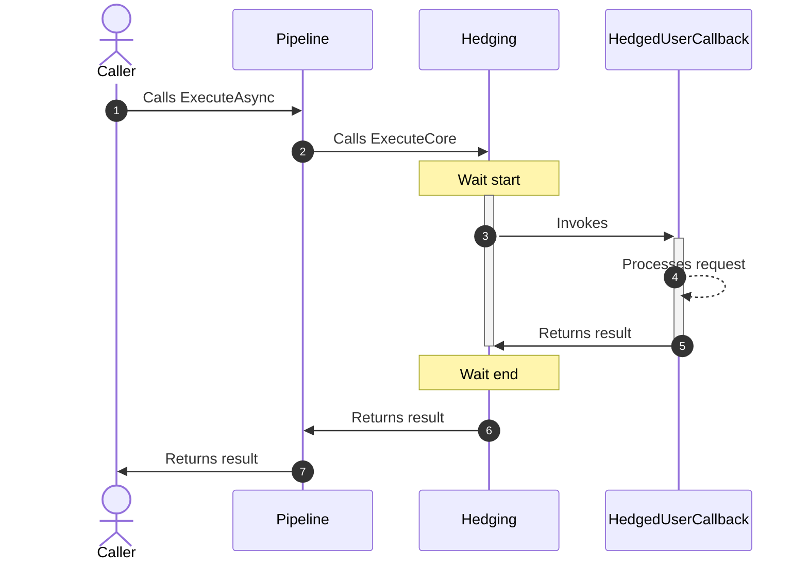
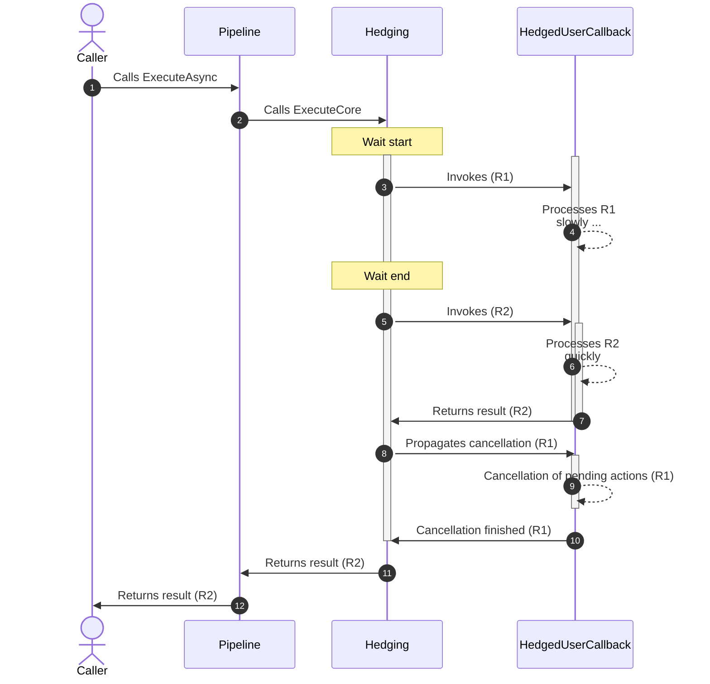
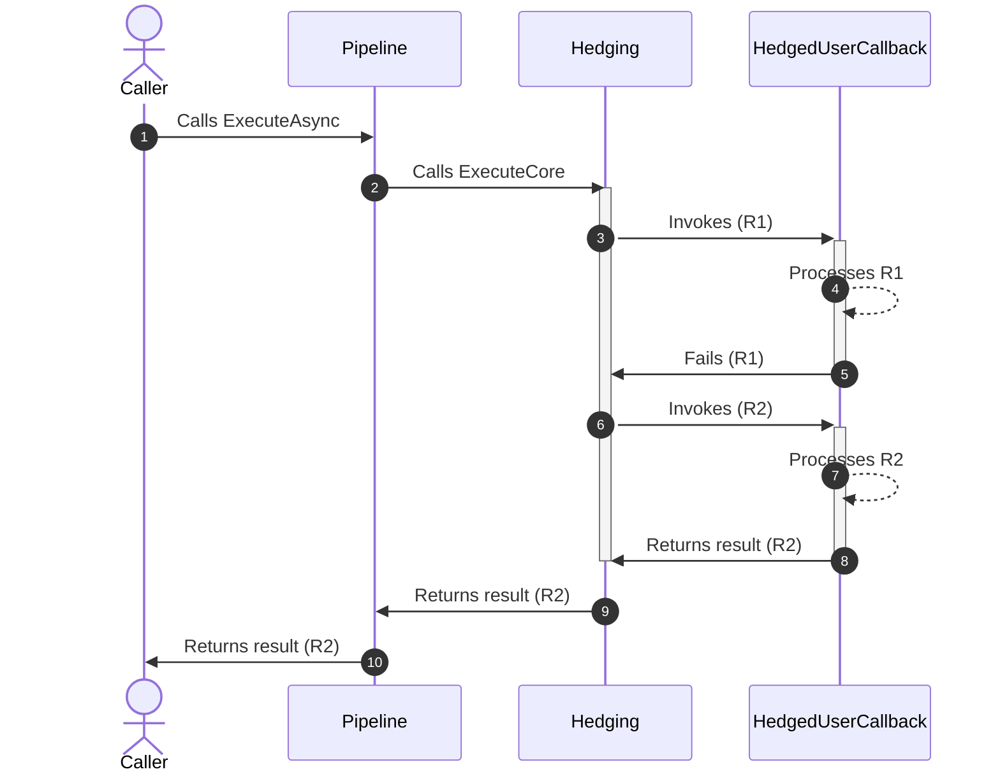
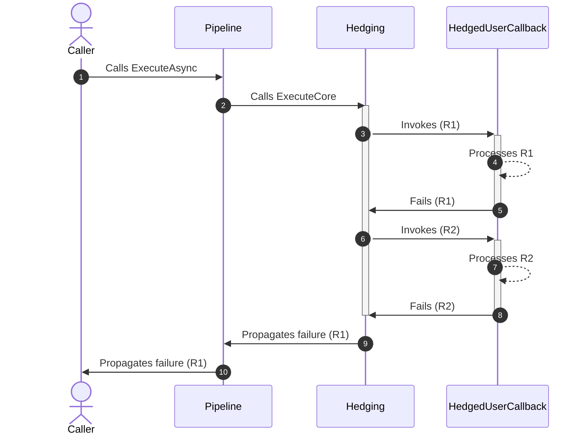
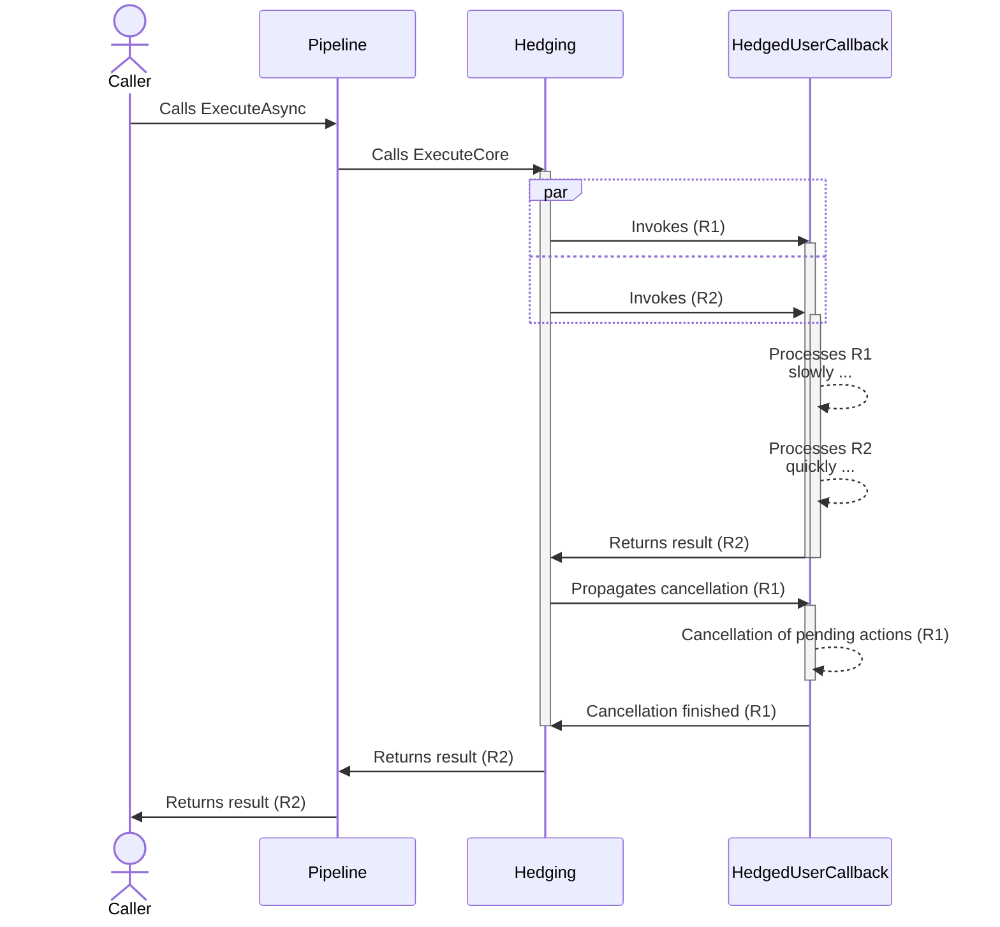
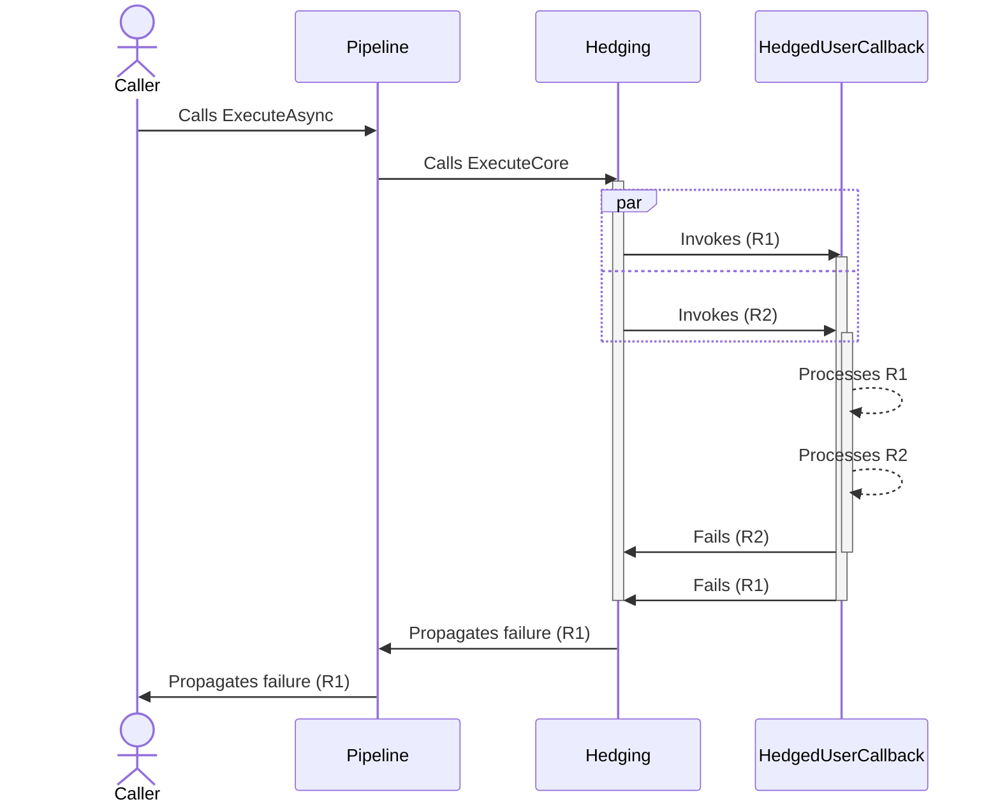
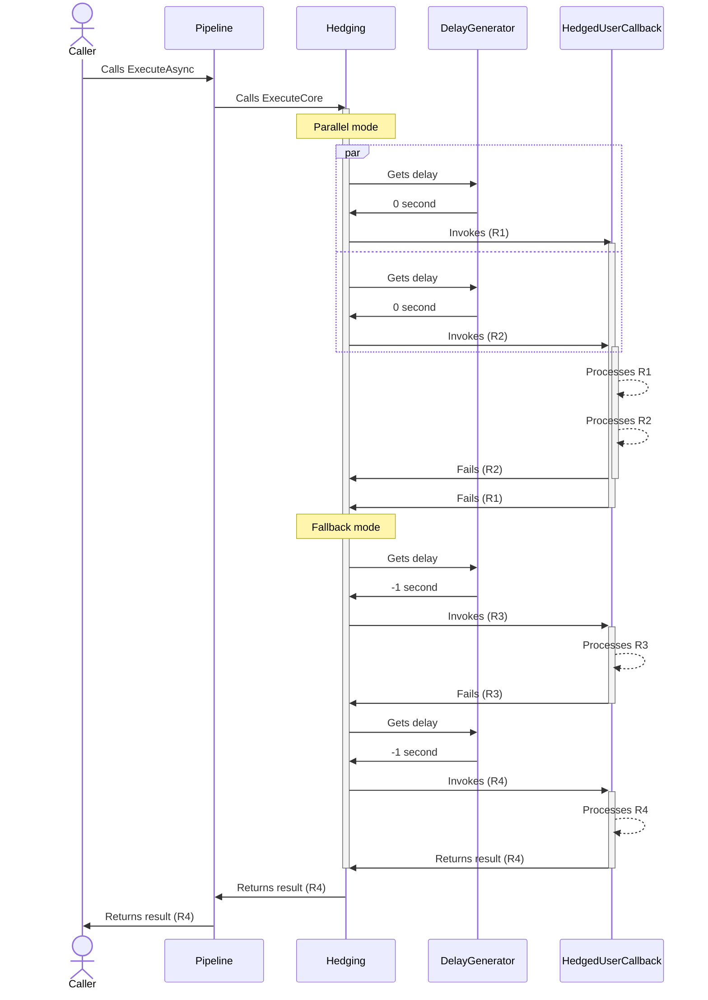
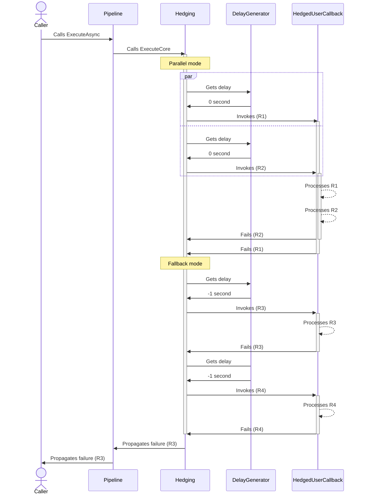
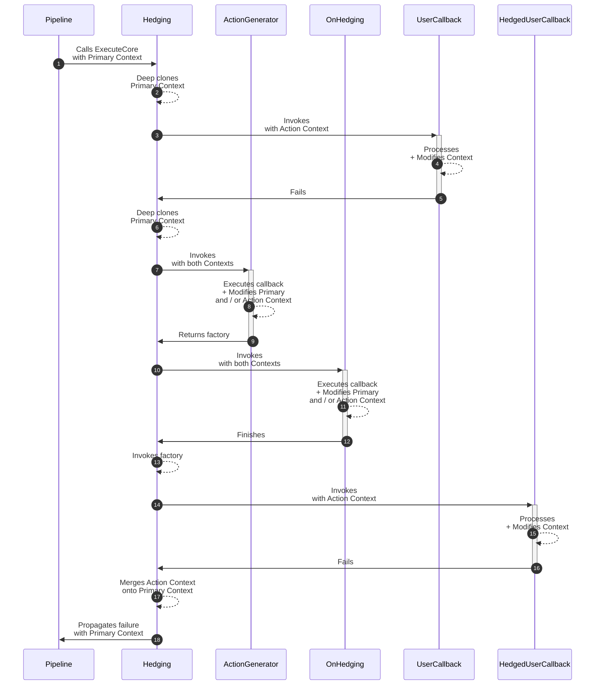
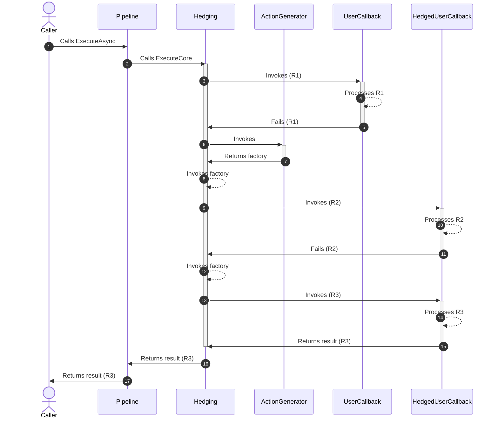

# Hedging resilience strategy

## About

- **Option(s)**:
  - [`HedgingStrategyOptions<T>`](xref:Polly.Hedging.HedgingStrategyOptions`1)
- **Extension(s)**:
  - `AddHedging`
- **Exception(s)**: -

---

The hedging **reactive** strategy enables the re-execution of the callback if the previous execution takes too long. This approach gives you the option to either run the original callback again or specify a new callback for subsequent *hedged* attempts. Implementing a hedging strategy can boost the overall responsiveness of the system. However, it's essential to note that this improvement comes at the cost of increased resource utilization. If low latency is not a critical requirement, you may find the [retry strategy](retry.md) more appropriate.

This strategy also supports multiple [concurrency modes](#concurrency-modes) to flexibly tailor the behavior for your own needs.

> [!NOTE]
> Please do not start any background work when executing actions using the hedging strategy. This strategy can spawn multiple parallel tasks, and as a result multiple background tasks can be started.

## Usage

<!-- snippet: hedging -->
```cs
// Hedging with default options.
// See https://www.pollydocs.org/strategies/hedging#defaults for defaults.
var optionsDefaults = new HedgingStrategyOptions<HttpResponseMessage>();

// A customized hedging strategy that retries up to 3 times if the execution
// takes longer than 1 second or if it fails due to an exception or returns an HTTP 500 Internal Server Error.
var optionsComplex = new HedgingStrategyOptions<HttpResponseMessage>
{
    ShouldHandle = new PredicateBuilder<HttpResponseMessage>()
        .Handle<SomeExceptionType>()
        .HandleResult(response => response.StatusCode == HttpStatusCode.InternalServerError),
    MaxHedgedAttempts = 3,
    Delay = TimeSpan.FromSeconds(1),
    ActionGenerator = static args =>
    {
        Console.WriteLine("Preparing to execute hedged action.");

        // Return a delegate function to invoke the original action with the action context.
        // Optionally, you can also create a completely new action to be executed.
        return () => args.Callback(args.ActionContext);
    }
};

// Subscribe to hedging events.
var optionsOnHedging = new HedgingStrategyOptions<HttpResponseMessage>
{
    OnHedging = static args =>
    {
        Console.WriteLine($"OnHedging: Attempt number {args.AttemptNumber}");
        return default;
    }
};

// Add a hedging strategy with a HedgingStrategyOptions<TResult> instance to the pipeline
new ResiliencePipelineBuilder<HttpResponseMessage>().AddHedging(optionsDefaults);
```
<!-- endSnippet -->

## Defaults

| Property            | Default Value                                                      | Description                                                                                                                                                    |
|---------------------|--------------------------------------------------------------------|----------------------------------------------------------------------------------------------------------------------------------------------------------------|
| `ShouldHandle`      | Any exceptions other than `OperationCanceledException`.            | Defines a predicate to determine what results and/or exceptions are handled by the hedging strategy.                                                           |
| `MaxHedgedAttempts` | 1                                                                  | The maximum number of hedged actions to use, in addition to the original action.                                                                               |
| `Delay`             | 2 seconds                                                          | The maximum waiting time before spawning a new hedged action.                                                                                                  |
| `ActionGenerator`   | It returns the original callback that was passed to this strategy. | This delegate allows you to **dynamically** calculate the hedged action by utilizing information that is only available at runtime (like the attempt number).  |
| `DelayGenerator`    | `null`                                                             | This optional delegate allows you to **dynamically** calculate the delay by utilizing information that is only available at runtime (like the attempt number). |
| `OnHedging`         | `null`                                                             | If provided then it will be invoked before the strategy performs the hedged action.                                                                            |

You can use the following special values for `Delay` or in `DelayGenerator`:

- `0 seconds` - the hedging strategy immediately creates a total of `MaxHedgedAttempts` and completes when the fastest acceptable result is available.
- `-1 millisecond` - this value indicates that the strategy does not create a new hedged task before the previous one completes. This enables scenarios where having multiple concurrent hedged tasks can cause side effects.

> [!NOTE]
> If both `Delay` and `DelayGenerator` are specified then `Delay` will be ignored.

## Telemetry

The hedging strategy reports the following telemetry events:

| Event Name         | Event Severity            | When?                                                                |
|--------------------|---------------------------|----------------------------------------------------------------------|
| `ExecutionAttempt` | `Information` / `Warning` | Just after the original/hedged action completes with success/failure |
| `OnHedging`        | `Warning`                 | Just before the strategy calls the `OnHedging` delegate              |

Here are some sample events:

The reported `Execution Attempt` telemetry events' severity depends on the action's outcome:

- If it succeeded then the severity is `Information`
- It it failed then the severity is `Warning`

```none
Resilience event occurred. EventName: 'OnHedging', Source: 'MyPipeline/MyPipelineInstance/Hedging', Operation Key: 'MyHedgingOperation', Result: ''

Execution attempt. Source: 'MyPipeline/MyPipelineInstance/Hedging', Operation Key: 'MyHedgingOperation', Result: '1', Handled: 'False', Attempt: '0', Execution Time: '1505.3839'

Execution attempt. Source: 'MyPipeline/MyPipelineInstance/Hedging', Operation Key: 'MyHedgingOperation', Result: 'Exception of type 'CustomException' was thrown.', Handled: 'True', Attempt: '1', Execution Time: '1525.2899'
    CustomException: Exception of type 'CustomException' was thrown.
        at Program.<>c.<<Main>b__0_2>d.MoveNext()
        ...
        at Polly.ResiliencePipeline.<>c__8`1.<<ExecuteAsync>b__8_0>d.MoveNext() in /_/src/Polly.Core/ResiliencePipeline.AsyncT.cs:line 95
```

> [!NOTE]
> Please note that the `OnHedging` telemetry event will be reported **only if** the hedging strategy performs any hedged actions.
>
> On the other hand the `Execution attempt` event will be **always** reported regardless whether the strategy has to perform hedging.
>
> Also remember that `Attempt: '0'` relates to the original execution attempt.

For further information please check out the [telemetry page](https://www.pollydocs.org/advanced/telemetry).

## Concurrency modes

In the sections below, explore the different concurrency modes available in the hedging strategy. The behavior is primarily controlled by the `Delay` property value.

### Latency mode

When the `Delay` property is set to a value greater than zero, the hedging strategy operates in latency mode. In this mode, additional executions are triggered when the initial ones take too long to complete. By default, the `Delay` is set to 2 seconds.

- The primary execution is initiated.
- If the initial execution either fails or takes longer than the `Delay` to complete, a new execution is initiated.
- If the first two executions fail or exceed the `Delay` (calculated from the last initiated execution), another execution is triggered.
- **Happy path**: The final result is the result of fastest successful execution.
- **Unhappy path**: If all executions fail, the final result will be the primary execution's failure.

#### Latency: happy path sequence diagram

The hedging strategy does not trigger because the response arrives faster than the threshold.



#### Latency: unhappy path sequence diagram

The hedging strategy triggers because the response arrives slower than the threshold.



> [!NOTE]
> Notice that the hedging waits until all additional pending actions are cancelled before returning the accepted result. Therefore it's important for the hedged actions to respect the cancellation token passed to the execution. If the cancellation token is not correctly respected, the hedging is unnecessarily delayed.

### Fallback mode

In fallback mode, the `Delay` value should be less than `TimeSpan.Zero`. This mode allows only a single execution to proceed at a given time.

- An execution is initiated, and the strategy waits for its completion.
- If the initial execution fails, new one is initiated.
- **Happy path**: The final result will be the first successful execution.
- **Unhappy path**: If all executions fail, the final result will be the primary execution's failure.

#### Fallback: happy path sequence diagram

The hedging strategy triggers because the first attempt fails. It succeeds because the retry attempts do not exceed the `MaxHedgedAttempts`.



#### Fallback: unhappy path sequence diagram

The hedging strategy triggers because the first attempt fails. It fails because all retry attempts failed as well.



### Parallel mode

The hedging strategy operates in parallel mode when the `Delay` property is set to `TimeSpan.Zero`. In this mode, all executions are initiated simultaneously, and the strategy waits for the fastest completion.

> [!IMPORTANT]
> Use this mode only when absolutely necessary, as it consumes the most resources, particularly when the hedging strategy uses remote resources such as remote HTTP services.

- All executions are initiated simultaneously, adhering to the `MaxHedgedAttempts` limit.
- **Happy path**: The final result will be the fastest successful execution.
- **Unhappy path**: If all executions fail, the final result will be the primary execution's failure

#### Parallel: happy path sequence diagram

The hedging strategy triggers because the `Delay` is set to zero. It succeeds because one of the requests succeeds.



> [!NOTE]
> Notice that the hedging waits until all additional pending actions are cancelled before returning the accepted result. Therefore it's important for the hedged actions to respect the cancellation token passed to the execution. If the cancellation token is not correctly respected, the hedging is unnecessarily delayed.

#### Parallel: unhappy path sequence diagram

The hedging strategy triggers because the `Delay` is set to zero. It fails because all requests fail.



### Dynamic mode

In dynamic mode, you have the flexibility to control how the hedging strategy behaves during each execution. This control is achieved through the `DelayGenerator` property.

> [!NOTE]
> The `Delay` property is disregarded when `DelayGenerator` is set.

Example scenario:

- First, initiate the first two executions in parallel mode.
- Subsequently, switch to fallback mode for additional executions.

To configure hedging according to the above scenario, use the following code:

<!-- snippet: hedging-dynamic-mode -->
```cs
new ResiliencePipelineBuilder<HttpResponseMessage>()
    .AddHedging(new()
    {
        MaxHedgedAttempts = 3,
        DelayGenerator = args =>
        {
            var delay = args.AttemptNumber switch
            {
                0 or 1 => TimeSpan.Zero, // Parallel mode
                _ => TimeSpan.FromSeconds(-1) // switch to Fallback mode
            };

            return new ValueTask<TimeSpan>(delay);
        }
    });
```
<!-- endSnippet -->

With this configuration, the hedging strategy:

- Initiates a maximum of `4` executions. This includes initial action and an additional 3 attempts.
- Allows the first two executions to proceed in parallel, while the third and fourth executions follow the fallback mode.

#### Dynamic: happy path sequence diagram

The hedging strategy triggers and switches between modes due to our `DelayGenerator`. It succeeds because the last request succeeds.



#### Dynamic: unhappy path sequence diagram

The hedging strategy triggers and switches between modes due our `DelayGenerator`. It fails because all requests fail.



## Hedging and resilience context

The hedging strategy supports the concurrent execution and cancellation of multiple hedged actions. To safeguard against concurrency issues when these actions access the same `ResilienceContext`, the hedging strategy ensures that each hedged action has its own unique `ResilienceContext`. The hedging strategy distinguishes between two types of contexts:

- **Primary context**: The original resilience context that the hedging strategy receives.
- **Action context**: A deep copy of the primary context with a distinct cancellation token for a single hedged action.

Here's the flow:

- The strategy gets the primary context and preserves it for deep-cloning.
- After the strategy has an accepted result from a hedged action, the resilience context from the action is merged back into the primary context.
- All ongoing hedged actions are cancelled and discarded. The hedging strategy awaits the propagation of cancellation.

### Merging action context into the primary context

After merging, the primary context contains:

- New properties created during the action context's execution.
- Existing properties updated or soft-deleted (i.e. setting the value to `null`) during execution.

### Hedging callbacks

Some insights about the hedging callback behavior in relation to hedging contexts:

- `ActionGenerator`: This callback provides arguments with `PrimaryContext` and `ActionContext` properties. Use `PrimaryContext` to get values that remain consistent throughout the hedging strategy execution. Use `ActionContext` to save values specific to a single hedged action execution.
- `OnHedging`: This callback, like the previous one, provides arguments with `PrimaryContext` and `ActionContext` properties and is invoked after `ActionGenerator`. Any changes to both `PrimaryContext` and `ActionContext` are preserved and visible here.

> [!NOTE]
> The hedging strategy ensures that both `ActionGenerator` and `OnHedging` are never executed concurrently. Any modifications to the contexts are thread-safe in these callbacks.

### Sequence diagram about contexts and callbacks

For the sake of conciseness the `Caller` is not depicted on the diagram.



## Action generator

The hedging options include an `ActionGenerator` property, allowing you to customize the actions executed during hedging. By default, the `ActionGenerator` returns the original callback passed to the strategy. The original callback also includes any logic introduced by subsequent resilience strategies. For more advanced scenarios, the `ActionGenerator` can be used to return entirely new hedged actions, as demonstrated in the example below:

<!-- snippet: hedging-action-generator -->
```cs
new ResiliencePipelineBuilder<HttpResponseMessage>()
    .AddHedging(new()
    {
        ActionGenerator = args =>
        {
            // You can access data from the original (primary) context here
            var customData = args.PrimaryContext.Properties.GetValue(customDataKey, "default-custom-data");

            Console.WriteLine($"Hedging, Attempt: {args.AttemptNumber}, Custom Data: {customData}");

            // Here, we can access the original callback and return it or return a completely new action
            var callback = args.Callback;

            // A function that returns a ValueTask<Outcome<HttpResponseMessage>> is required.
            return async () =>
            {
                try
                {
                    // A dedicated ActionContext is provided for each hedged action.
                    // It comes with a separate CancellationToken created specifically for this hedged attempt,
                    // which can be cancelled later if needed.
                    //
                    // Note that the "MyRemoteCallAsync" call won't have any additional resilience applied.
                    // You are responsible for wrapping it with any additional resilience pipeline.
                    var response = await MyRemoteCallAsync(args.ActionContext.CancellationToken);

                    return Outcome.FromResult(response);
                }
                catch (Exception e)
                {
                    // Note: All exceptions should be caught and converted to Outcome.
                    return Outcome.FromException<HttpResponseMessage>(e);
                }
            };
        }
    });
```
<!-- endSnippet -->

### Action generator: sequence diagram



### Parameterized callbacks and action generator

When you have control over the callbacks that the resilience pipeline receives, you can parameterize them. This flexibility allows for reusing the callbacks within an action generator.

A common use case is with [`DelegatingHandler`](https://learn.microsoft.com/aspnet/web-api/overview/advanced/http-message-handlers). Here, you can parameterize the `HttpRequestMessage`:

<!-- snippet: hedging-handler -->
```cs
internal class HedgingHandler : DelegatingHandler
{
    private readonly ResiliencePipeline<HttpResponseMessage> _pipeline;

    public HedgingHandler(ResiliencePipeline<HttpResponseMessage> pipeline)
    {
        _pipeline = pipeline;
    }

    protected override async Task<HttpResponseMessage> SendAsync(HttpRequestMessage request, CancellationToken cancellationToken)
    {
        var context = ResilienceContextPool.Shared.Get(cancellationToken);

        // Store the incoming request in the context
        context.Properties.Set(ResilienceKeys.RequestMessage, request);

        try
        {
            return await _pipeline.ExecuteAsync(async cxt =>
            {
                // Allow the pipeline to use request message that was stored in the context.
                // This allows replacing the request message with a new one in the resilience pipeline.
                request = cxt.Properties.GetValue(ResilienceKeys.RequestMessage, request);

                return await base.SendAsync(request, cxt.CancellationToken);
            },
            context);
        }
        finally
        {
            ResilienceContextPool.Shared.Return(context);
        }
    }
}
```
<!-- endSnippet -->

Where `ResilienceKeys` is defined as:

<!-- snippet: hedging-resilience-keys -->
```cs
internal static class ResilienceKeys
{
    public static readonly ResiliencePropertyKey<HttpRequestMessage> RequestMessage = new("MyFeature.RequestMessage");
}
```
<!-- endSnippet -->

In your `ActionGenerator`, you can easily provide your own `HttpRequestMessage` to `ActionContext`, and the original callback will use it:

<!-- snippet: hedging-parametrized-action-generator -->
```cs
new ResiliencePipelineBuilder<HttpResponseMessage>()
    .AddHedging(new()
    {
        ActionGenerator = args =>
        {
            if (!args.PrimaryContext.Properties.TryGetValue(ResilienceKeys.RequestMessage, out var request))
            {
                throw new InvalidOperationException("The request message must be provided.");
            }

            // Prepare a new request message for the callback, potentially involving:
            //
            // - Cloning the request message
            // - Providing alternate endpoint URLs
            request = PrepareRequest(request);

            // Override the request message in the action context
            args.ActionContext.Properties.Set(ResilienceKeys.RequestMessage, request);

            // Then, execute the original callback
            return () => args.Callback(args.ActionContext);
        }
    });
```
<!-- endSnippet -->
