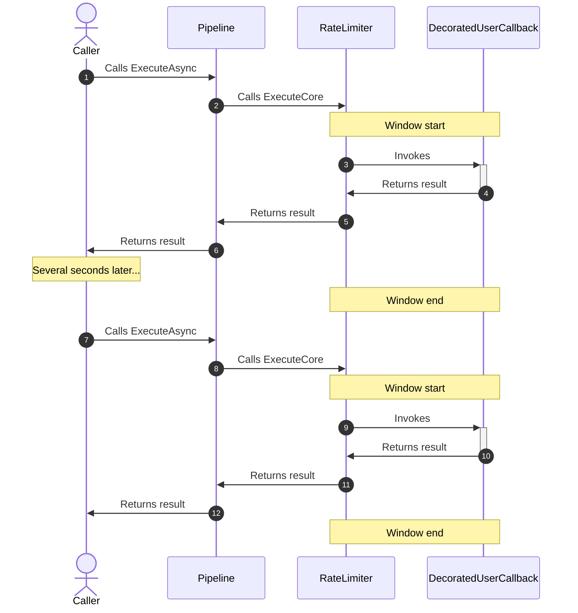
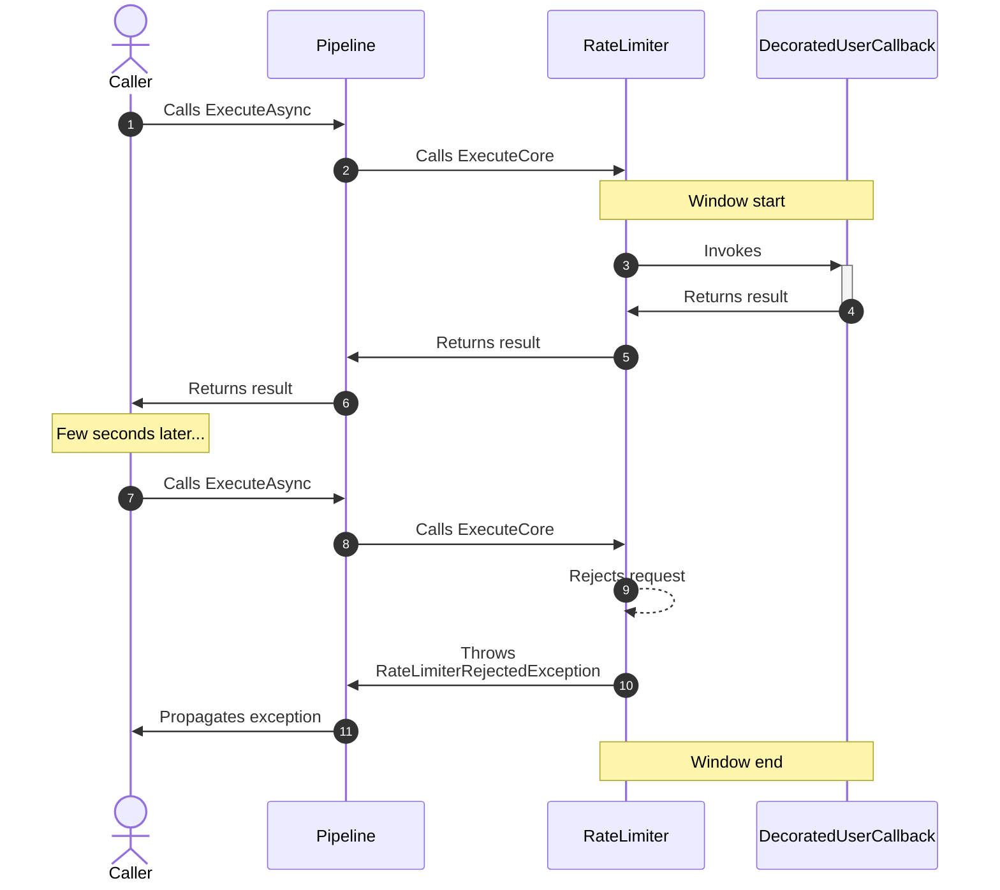
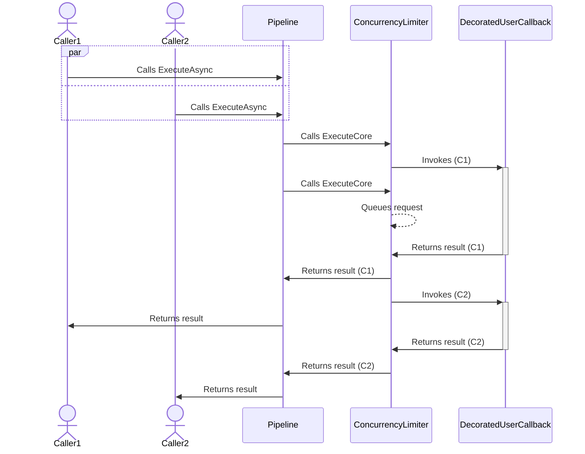
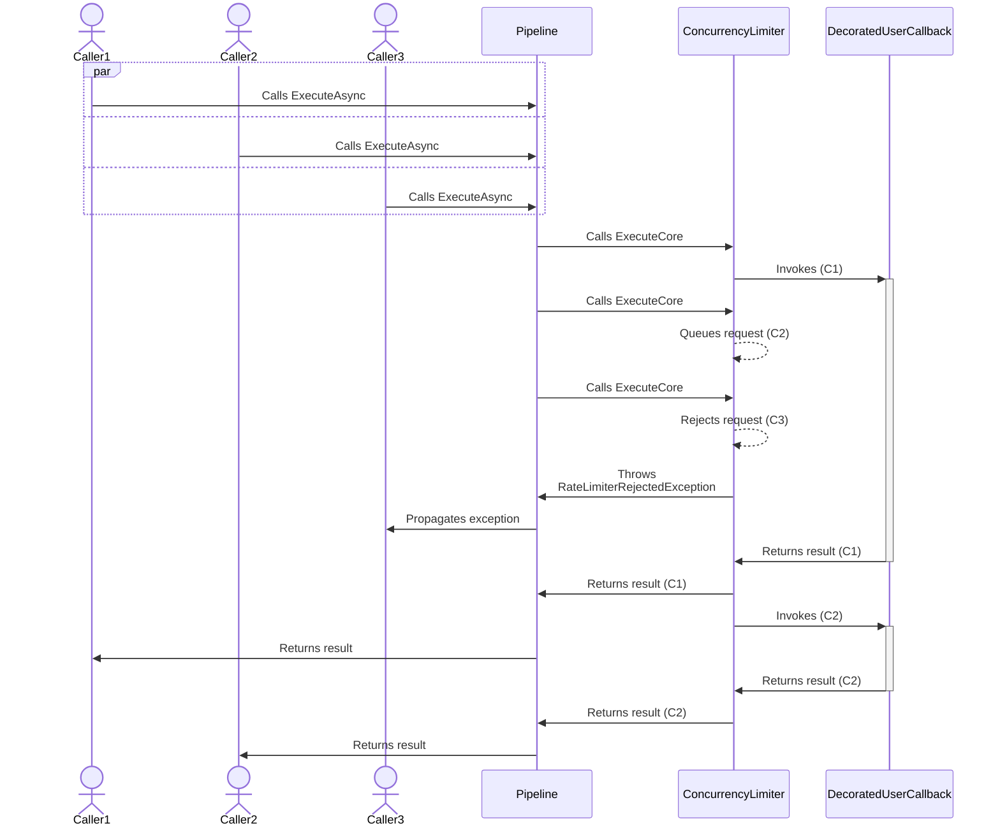

# Rate limiter resilience strategy

## About

- **Option(s)**:
  - [`RateLimiterStrategyOptions`](xref:Polly.RateLimiting.RateLimiterStrategyOptions)
- **Extension(s)**:
  - `AddRateLimiter`,
  - `AddConcurrencyLimiter`
- **Exception(s)**:
  - [`RateLimiterRejectedException`](xref:Polly.RateLimiting.RateLimiterRejectedException): Thrown when a rate limiter rejects an execution.

> [!NOTE]
> The rate limiter strategy resides inside the [Polly.RateLimiting](https://www.nuget.org/packages/Polly.RateLimiting) package, not in ([Polly.Core](https://www.nuget.org/packages/Polly.Core)) like other strategies.

---

The rate limiter **proactive** resilience strategy controls the number of operations that can pass through it. This strategy is a thin layer over the API provided by the [`System.Threading.RateLimiting`](https://www.nuget.org/packages/System.Threading.RateLimiting) package. This strategy can be used in two flavors: to control inbound load via a rate limiter and to control outbound load via a concurrency limiter.

Further reading:

- [Announcing rate limiting for .NET](https://devblogs.microsoft.com/dotnet/announcing-rate-limiting-for-dotnet/)
- [Rate limiting API documentation](https://learn.microsoft.com/dotnet/api/system.threading.ratelimiting)

## Usage

<!-- snippet: rate-limiter -->
```cs
// Add rate limiter with default options.
// See https://www.pollydocs.org/strategies/rate-limiter#defaults for defaults.
new ResiliencePipelineBuilder()
    .AddRateLimiter(new RateLimiterStrategyOptions());

// Create a rate limiter to allow a maximum of 100 concurrent executions and a queue of 50.
new ResiliencePipelineBuilder()
    .AddConcurrencyLimiter(100, 50);

// Create a rate limiter that allows 100 executions per minute.
new ResiliencePipelineBuilder()
    .AddRateLimiter(new SlidingWindowRateLimiter(
        new SlidingWindowRateLimiterOptions
        {
            PermitLimit = 100,
            Window = TimeSpan.FromMinutes(1)
        }));
```
<!-- endSnippet -->

Example execution:

<!-- snippet: rate-limiter-execution -->
```cs
var pipeline = new ResiliencePipelineBuilder().AddConcurrencyLimiter(100, 50).Build();

try
{
    // Execute an asynchronous text search operation.
    var result = await pipeline.ExecuteAsync(
        token => TextSearchAsync(query, token),
        cancellationToken);
}
catch (RateLimiterRejectedException ex)
{
    // Handle RateLimiterRejectedException,
    // that can optionally contain information about when to retry.
    if (ex.RetryAfter is TimeSpan retryAfter)
    {
        Console.WriteLine($"Retry After: {retryAfter}");
    }
}
```
<!-- endSnippet -->

### Failure handling

At the first glance it might not be obvious what is the difference between these two techniques:

<!-- snippet: rate-limiter-with-onrejected -->
```cs
var withOnRejected = new ResiliencePipelineBuilder()
    .AddRateLimiter(new RateLimiterStrategyOptions
    {
        DefaultRateLimiterOptions = new ConcurrencyLimiterOptions
        {
            PermitLimit = 10
        },
        OnRejected = args =>
        {
            Console.WriteLine("Rate limit has been exceeded");
            return default;
        }
    }).Build();
```
<!-- endSnippet -->

<!-- snippet: rate-limiter-without-onrejected -->
```cs
var withoutOnRejected = new ResiliencePipelineBuilder()
    .AddRateLimiter(new RateLimiterStrategyOptions
    {
        DefaultRateLimiterOptions = new ConcurrencyLimiterOptions
        {
            PermitLimit = 10
        }
    }).Build();

try
{
    await withoutOnRejected.ExecuteAsync(async ct => await TextSearchAsync(query, ct), CancellationToken.None);
}
catch (RateLimiterRejectedException)
{
    Console.WriteLine("Rate limit has been exceeded");
}
```
<!-- endSnippet -->

The `OnRejected` user-provided delegate is called just before the strategy throws the `RateLimiterRejectedException`. This delegate receives a parameter which allows you to access the `Context` object as well as the `Lease`:

- `Context` can be accessed via some `Execute{Async}` overloads.
- `Lease` can be useful in advanced scenarios.

So, what is the purpose of the `OnRejected`?

The `OnRejected` delegate can be useful when you define a resilience pipeline which consists of multiple strategies. For example, you have a rate limiter as the inner strategy and a retry as the outer strategy. If the retry is defined to handle `RateLimiterRejectedException`, that means the `Execute{Async}` may or may not throw that exception depending on future attempts. So, if you want to get notification about the fact that the rate limit has been exceeded, you have to provide a delegate to the `OnRejected` property.

The `RateLimiterRejectedException` has a `RetryAfter` and a `TelemetrySource` property. If the `RetryAfter` optional `TimeSpan` is provided then this indicates that your requests are throttled and you should retry them no sooner than the value given.

> [!NOTE]
> Please note that the `RetryAfter` information is not available inside the `OnRejected` callback.

 The `TelemetrySource` property is a [`ResilienceTelemetrySource`](xref:Polly.Telemetry.ResilienceTelemetrySource) which allows you retrieve information like the executed pipeline and the executed strategy. These can be really handy whenever you have multiple limiter strategies in your pipeline (for example a rate and a concurrency limiter) and you want to know which strategy threw the `RateLimiterRejectedException`.

## Defaults

| Property                    | Default Value                                        | Description                                                                                                 |
|-----------------------------|------------------------------------------------------|-------------------------------------------------------------------------------------------------------------|
| `RateLimiter`               | `null`                                               | **Dynamically** creates a `RateLimitLease` for executions.                                                  |
| `DefaultRateLimiterOptions` | `PermitLimit` set to 1000 and `QueueLimit` set to 0. | If `RateLimiter` is not provided then this options object will be used for the default concurrency limiter. |
| `OnRejected`                | `null`                                               | If provided then it will be invoked after the limiter rejected an execution.                                |

## Telemetry

The rate limiter strategy reports the following telemetry events:

| Event Name              | Event Severity | When?                                                    |
|-------------------------|----------------|----------------------------------------------------------|
| `OnRateLimiterRejected` | `Error`        | Just before the strategy calls the `OnRejected` delegate |

Here are some sample events:

```none
Resilience event occurred. EventName: 'OnRateLimiterRejected', Source: '(null)/(null)/RateLimiter', Operation Key: '', Result: ''
Resilience event occurred. EventName: 'OnRateLimiterRejected', Source: 'MyPipeline/MyPipelineInstance/MyRateLimiterStrategy', Operation Key: 'MyRateLimitedOperation', Result: ''
```

> [!NOTE]
> Please note that the `OnRateLimiterRejected` telemetry event will be reported **only if** the rate limiter strategy rejects the provided callback execution.
>
> Also remember that the `Result` will be **always empty** for the `OnRateLimiterRejected` telemetry event.

For further information please check out the [telemetry page](../advanced/telemetry.md).

## Diagrams

### Rate Limiter

Let's suppose we have a rate limiter strategy with `PermitLimit` : `1` and `Window` : `10 seconds`.

### Rate Limiter: happy path sequence diagram



#### Rate limiter: unhappy path sequence diagram



### Concurrency Limiter

Let's suppose we have a concurrency limiter strategy with `PermitLimit` : `1` and `QueueLimit` : `1`.

#### Concurrency limiter: happy path sequence diagram



#### Concurrency Limiter: unhappy path sequence diagram



## Disposal of rate limiters

The `RateLimiter` is a disposable resource. When you explicitly create a `RateLimiter` instance, it's good practice to dispose of it once it's no longer needed. This is usually not an issue when manually creating resilience pipelines using the `ResiliencePipelineBuilder`. However, when dynamic reloads are enabled, failing to dispose of discarded rate limiters can lead to excessive resource consumption. Fortunately, Polly provides a way to dispose of discarded rate limiters, as demonstrated in the example below:

<!-- snippet: rate-limiter-disposal -->
```cs
services
    .AddResiliencePipeline("my-pipeline", (builder, context) =>
    {
        var options = context.GetOptions<ConcurrencyLimiterOptions>("my-concurrency-options");

        // This call enables dynamic reloading of the pipeline
        // when the named ConcurrencyLimiterOptions change.
        context.EnableReloads<ConcurrencyLimiterOptions>("my-concurrency-options");

        var limiter = new ConcurrencyLimiter(options);

        builder.AddRateLimiter(limiter);

        // Dispose of the limiter when the pipeline is disposed.
        context.OnPipelineDisposed(() => limiter.Dispose());
    });
```
<!-- endSnippet -->

The above example uses the `AddResiliencePipeline(...)` extension method to configure the pipeline. However, a similar approach can be taken when directly using the `ResiliencePipelineRegistry<T>`.

## Partitioned rate limiter

For advanced use-cases, the partitioned rate limiter is also available. The following example illustrates how to retrieve a partition key from `ResilienceContext` using the `GetPartitionKey` method:

<!-- snippet: rate-limiter-partitioned -->
```cs
var partitionedLimiter = PartitionedRateLimiter.Create<ResilienceContext, string>(context =>
{
    // Extract the partition key.
    string partitionKey = GetPartitionKey(context);

    return RateLimitPartition.GetConcurrencyLimiter(
        partitionKey,
        key => new ConcurrencyLimiterOptions
        {
            PermitLimit = 100
        });
});

new ResiliencePipelineBuilder()
    .AddRateLimiter(new RateLimiterStrategyOptions
    {
        // Provide a custom rate limiter delegate.
        RateLimiter = args =>
        {
            return partitionedLimiter.AcquireAsync(args.Context, 1, args.Context.CancellationToken);
        }
    });
```
<!-- endSnippet -->

It is also possible to create a rate limiter strategy using [multiple chained rate limiters](https://learn.microsoft.com/aspnet/core/performance/rate-limit#create-chained-limiters)
to combine multiple rate-limiters with different configurations as shown below.

For example, we can configure a rate limit of 100 requests per minute that also includes a rate limit of 10 requests per second.
The rate limit is partitioned by a key which could, for example, be the user ID associated with an authenticated HTTP request to
apply the rate limits to each user of the system individually.

<!-- snippet: rate-limiter-chained -->
```cs
// Use the user's ID as the partition key.
var partitionKey = "user-id";

var firstSlidingWindow = PartitionedRateLimiter.Create<ResilienceContext, string>((context) =>
{
    return RateLimitPartition.GetSlidingWindowLimiter(partitionKey, (partitionKey) => new()
    {
        PermitLimit = 100,
        Window = TimeSpan.FromMinutes(1),
    });
});

var secondSlidingWindow = PartitionedRateLimiter.Create<ResilienceContext, string>((context) =>
{
    return RateLimitPartition.GetSlidingWindowLimiter(partitionKey, (partitionKey) => new()
    {
        PermitLimit = 10,
        Window = TimeSpan.FromSeconds(1),
    });
});

// Create a rate limiter that combines the two sliding windows.
var chainedRateLimiter = PartitionedRateLimiter.CreateChained(firstSlidingWindow, secondSlidingWindow);

// Create the pipeline using the rate limiter that chains the windows together.
new ResiliencePipelineBuilder()
    .AddRateLimiter(new RateLimiterStrategyOptions
    {
        RateLimiter = (context) => chainedRateLimiter.AcquireAsync(context.Context),
    })
    .Build();
```
<!-- endSnippet -->
