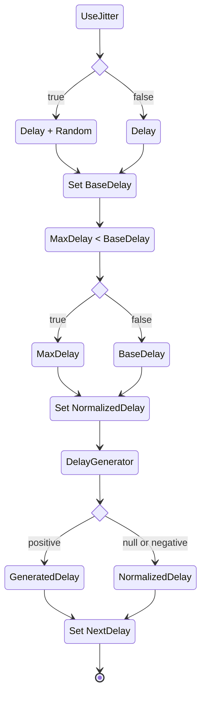
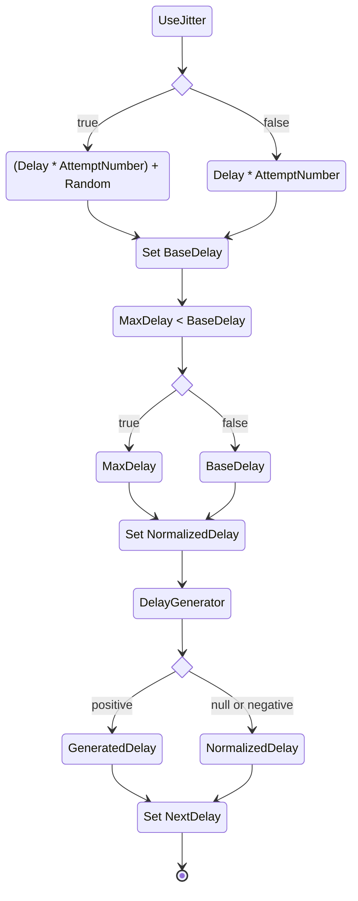
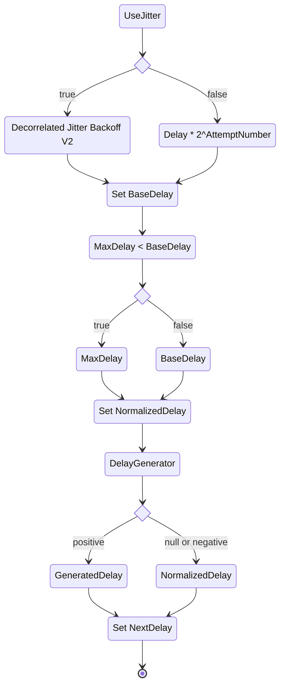
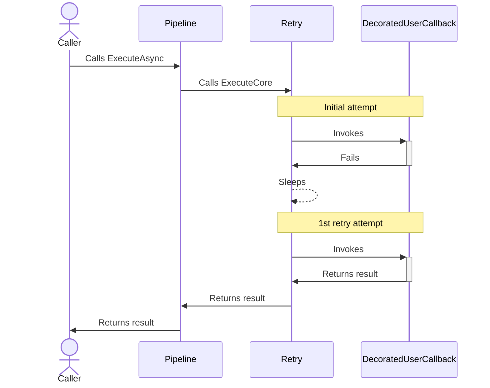
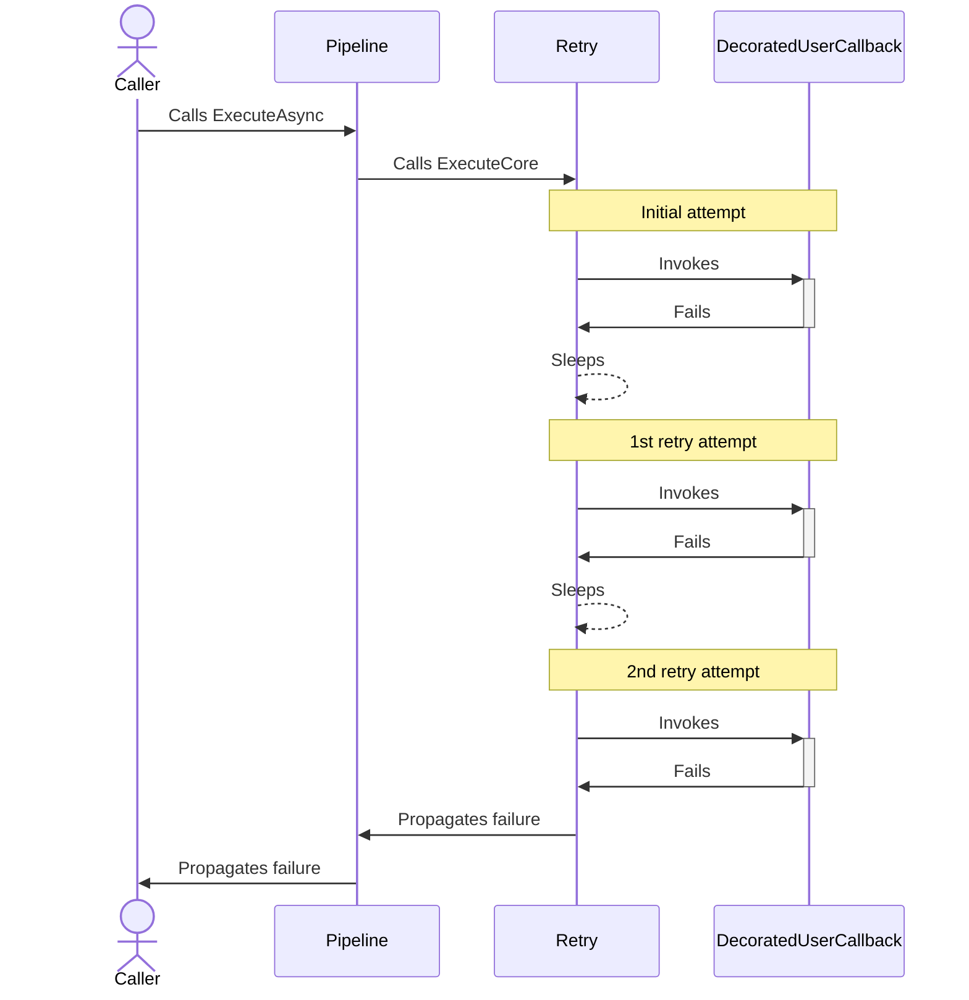

# Retry resilience strategy

## About

- **Options**:
  - [`RetryStrategyOptions`](xref:Polly.Retry.RetryStrategyOptions)
  - [`RetryStrategyOptions<T>`](xref:Polly.Retry.RetryStrategyOptions`1)
- **Extensions**: `AddRetry`
- **Strategy Type**: Reactive

---

## Usage

<!-- snippet: Retry -->
```cs
// Retry using the default options.
// See https://www.pollydocs.org/strategies/retry#defaults for defaults.
var optionsDefaults = new RetryStrategyOptions();

// For instant retries with no delay
var optionsNoDelay = new RetryStrategyOptions
{
    Delay = TimeSpan.Zero
};

// For advanced control over the retry behavior, including the number of attempts,
// delay between retries, and the types of exceptions to handle.
var optionsComplex = new RetryStrategyOptions
{
    ShouldHandle = new PredicateBuilder().Handle<SomeExceptionType>(),
    BackoffType = DelayBackoffType.Exponential,
    UseJitter = true,  // Adds a random factor to the delay
    MaxRetryAttempts = 4,
    Delay = TimeSpan.FromSeconds(3),
};

// To use a custom function to generate the delay for retries
var optionsDelayGenerator = new RetryStrategyOptions
{
    MaxRetryAttempts = 2,
    DelayGenerator = static args =>
    {
        var delay = args.AttemptNumber switch
        {
            0 => TimeSpan.Zero,
            1 => TimeSpan.FromSeconds(1),
            _ => TimeSpan.FromSeconds(5)
        };

        // This example uses a synchronous delay generator,
        // but the API also supports asynchronous implementations.
        return new ValueTask<TimeSpan?>(delay);
    }
};

// To extract the delay from the result object
var optionsExtractDelay = new RetryStrategyOptions<HttpResponseMessage>
{
    DelayGenerator = static args =>
    {
        if (args.Outcome.Result is HttpResponseMessage responseMessage &&
            TryGetDelay(responseMessage, out TimeSpan delay))
        {
            return new ValueTask<TimeSpan?>(delay);
        }

        // Returning null means the retry strategy will use its internal delay for this attempt.
        return new ValueTask<TimeSpan?>((TimeSpan?)null);
    }
};

// To get notifications when a retry is performed
var optionsOnRetry = new RetryStrategyOptions
{
    MaxRetryAttempts = 2,
    OnRetry = static args =>
    {
        Console.WriteLine("OnRetry, Attempt: {0}", args.AttemptNumber);

        // Event handlers can be asynchronous; here, we return an empty ValueTask.
        return default;
    }
};

// To keep retrying indefinitely or until success use int.MaxValue.
var optionsIndefiniteRetry = new RetryStrategyOptions
{
    MaxRetryAttempts = int.MaxValue,
};

// Add a retry strategy with a RetryStrategyOptions{<TResult>} instance to the pipeline
new ResiliencePipelineBuilder().AddRetry(optionsDefaults);
new ResiliencePipelineBuilder<HttpResponseMessage>().AddRetry(optionsExtractDelay);
```
<!-- endSnippet -->

## Defaults

| Property           | Default Value                                                              | Description                                                                              |
|--------------------|----------------------------------------------------------------------------|------------------------------------------------------------------------------------------|
| `ShouldHandle`     | Predicate that handles all exceptions except `OperationCanceledException`. | Predicate that determines what results and exceptions are handled by the retry strategy. |
| `MaxRetryAttempts` | 3                                                                          | The maximum number of retries to use, in addition to the original call.                  |
| `Delay`            | 2 seconds                                                                  | The base delay between retries.                                                          |
| `BackoffType`      | Constant                                                                   | The type of the back-off used to generate the retry delay.                               |
| `UseJitter`        | False                                                                      | Allows adding jitter to retry delays.                                                    |
| `DelayGenerator`   | `null`                                                                     | Used for generating custom delays for retries.                                           |
| `OnRetry`          | `null`                                                                     | Action executed when retry occurs.                                                       |
| `MaxDelay`         | `null`                                                                     | Caps the calculated retry delay to a specified maximum duration.                         |

## Calculation of the next delay

If the `ShouldHandle` predicate returns `true` and the next attempt number is not greater than `MaxRetryAttempts` then the retry strategy calculates the next delay.

There are many properties that may contribute to this calculation:

- `BackoffType`: Specifies which calculation algorithm should run.
- `Delay`: If only this property is specified then it will be used as-is. If others are also specified then this will be used as a *base delay*.
- `DelayGenerator`: If specified, overrides other property-based calculations, **except** if it returns `null` or a negative `TimeSpan`, in which case the other property-based calculations are used.
- `MaxDelay`: If specified, caps the delay if the calculated delay is greater than this value, **except** if `DelayGenerator` is used, where no capping is applied.
- `UseJitter`: If enabled, adds a random value between -25% and +25% of the calculated `Delay`, **except** if `BackoffType` is `Exponential`, where a `DecorrelatedJitterBackoffV2` formula is used for jitter calculation.
  - That formula is based on [Polly.Contrib.WaitAndRetry](https://github.com/Polly-Contrib/Polly.Contrib.WaitAndRetry).

> [!IMPORTANT]
> The summarized description below is an implementation detail. It may change in the future without notice.

The `BackoffType` property's data type is the [`DelayBackoffType`](xref:Polly.DelayBackoffType) enumeration. This primarily controls how the calculation is done.

### Constant



#### Constant examples

The delays column contains an example series of five values to depict the patterns.

| Settings                                                   | Delays in milliseconds           |
|------------------------------------------------------------|----------------------------------|
| `Delay`: `1sec`                                            | [ 1000, 1000, 1000, 1000, 1000 ] |
| `Delay`: `1sec`, `UseJitter`: `true`                       | [ 986, 912, 842, 972, 1007 ]     |
| `Delay`: `1sec`, `UseJitter`: `true`, `MaxDelay`: `1100ms` | [ 1100, 978, 1100, 1041, 916 ]   |

### Linear



#### Linear examples

The delays column contains an example series of five values to depict the patterns.

> [!NOTE]
> Because the jitter calculation is based on the newly calculated delay, the new delay could be less than the previous value.

| Settings                                                   | Delays in milliseconds           |
|------------------------------------------------------------|----------------------------------|
| `Delay`: `1sec`                                            | [ 1000, 2000, 3000, 4000, 5000 ] |
| `Delay`: `1sec`, `UseJitter`: `true`                       | [ 1129, 2147, 2334, 4894, 4102 ] |
| `Delay`: `1sec`, `UseJitter`: `true`, `MaxDelay`: `4500ms` | [ 907, 2199, 2869, 4500, 4500 ]  |

### Exponential



#### Exponential examples

The delays column contains an example series of five values to depict the patterns.

> [!NOTE]
> Because the jitter calculation is based on the newly calculated delay, the new delay could be less than the previous value.

| Settings                                                    | Delays in milliseconds            |
|-------------------------------------------------------------|-----------------------------------|
| `Delay`: `1sec`                                             | [ 1000, 2000, 4000, 8000, 16000 ] |
| `Delay`: `1sec`, `UseJitter`: `true`                        | [ 393, 1453, 4235, 5369, 16849 ]  |
| `Delay`: `1sec`, `UseJitter`: `true`, `MaxDelay`: `15000ms` | [ 477, 793, 2227, 5651, 15000 ]   |

---

> [!TIP]
> For more details please check out the [`RetryHelper`](https://github.com/App-vNext/Polly/blob/main/src/Polly.Core/Retry/RetryHelper.cs)
> and the [`RetryResilienceStrategy`](https://github.com/App-vNext/Polly/blob/main/src/Polly.Core/Retry/RetryResilienceStrategy.cs) classes.

## Diagrams

Let's suppose we have a retry strategy with `MaxRetryAttempts`: `2`.

### Happy path sequence diagram



### Unhappy path sequence diagram



## Patterns

### Limiting the maximum delay

In some cases, you might want to set a limit on the calculated delay. This is beneficial when multiple retries are anticipated, and you wish to prevent excessive wait times between these retries.

Consider the following example of a long-running background job:

<!-- snippet: retry-pattern-max-delay -->
```cs
ResiliencePipeline pipeline = new ResiliencePipelineBuilder()
    .AddRetry(new()
    {
        Delay = TimeSpan.FromSeconds(2),
        MaxRetryAttempts = int.MaxValue,
        BackoffType = DelayBackoffType.Exponential,

        // Initially, we aim for an exponential backoff, but after a certain number of retries, we set a maximum delay of 15 minutes.
        MaxDelay = TimeSpan.FromMinutes(15),
        UseJitter = true
    })
    .Build();

// Background processing
while (!cancellationToken.IsCancellationRequested)
{
    await pipeline.ExecuteAsync(async token =>
    {
        // In the event of a prolonged service outage, we can afford to wait for a successful retry since this is a background task.
        await SynchronizeDataAsync(token);
    },
    cancellationToken);

    await Task.Delay(TimeSpan.FromMinutes(30)); // The sync runs every 30 minutes.
}
```
<!-- endSnippet -->

## Anti-patterns

Over the years, many developers have used Polly in various ways. Some of these
recurring patterns may not be ideal. The sections below highlight anti-patterns to avoid.

### Overusing builder methods

❌ DON'T

Overuse `Handle/HandleResult`:

<!-- snippet: retry-anti-pattern-overusing-builder -->
```cs
var retry = new ResiliencePipelineBuilder()
    .AddRetry(new()
    {
        ShouldHandle = new PredicateBuilder()
        .Handle<HttpRequestException>()
        .Handle<BrokenCircuitException>()
        .Handle<TimeoutRejectedException>()
        .Handle<SocketException>()
        .Handle<RateLimitRejectedException>(),
        MaxRetryAttempts = 3,
    })
    .Build();
```
<!-- endSnippet -->

**Reasoning**:

Using multiple `Handle/HandleResult` methods is redundant. Instead of specifying to retry if the decorated code throws a certain exception repeatedly, it's more efficient to state that retries should occur if any of the retryable exceptions are thrown.

✅ DO

Use collections and simple predicate functions:

<!-- snippet: retry-pattern-overusing-builder -->
```cs
ImmutableArray<Type> networkExceptions = new[]
{
    typeof(SocketException),
    typeof(HttpRequestException),
}.ToImmutableArray();

ImmutableArray<Type> strategyExceptions = new[]
{
    typeof(TimeoutRejectedException),
    typeof(BrokenCircuitException),
    typeof(RateLimitRejectedException),
}.ToImmutableArray();

ImmutableArray<Type> retryableExceptions = networkExceptions
    .Union(strategyExceptions)
    .ToImmutableArray();

var retry = new ResiliencePipelineBuilder()
    .AddRetry(new()
    {
        ShouldHandle = ex => new ValueTask<bool>(retryableExceptions.Contains(ex.GetType())),
        MaxRetryAttempts = 3,
    })
    .Build();
```
<!-- endSnippet -->

**Reasoning**:

Grouping exceptions simplifies the configuration and improves reusability. For example, the `networkExceptions` array can be reused in various strategies such as retry, circuit breaker, and more.

### Using retry for periodic execution

❌ DON'T

Use a retry strategy to run indefinitely at a specified interval:

<!-- snippet: retry-anti-pattern-periodic-execution -->
```cs
var retry = new ResiliencePipelineBuilder()
    .AddRetry(new()
    {
        ShouldHandle = _ => ValueTask.FromResult(true),
        Delay = TimeSpan.FromHours(24),
    })
    .Build();
```
<!-- endSnippet -->

**Reasoning**:

The waiting period can be either blocking or non-blocking, based on the defined strategy/pipeline. Even when used not used in a blocking manner, it unnecessarily consumes memory that can't be reclaimed by the garbage collector.

✅ DO

Use a suitable tool to schedule recurring tasks, such as [*Quartz.Net*](https://www.quartz-scheduler.net/), [*Hangfire*](https://www.hangfire.io/), or others.

**Reasoning**:

- Polly was not designed to support this scenario; its primary purpose is to help manage **brief** transient failures.
- Specialized job scheduling tools are more memory-efficient and can be set up to withstand machine failures by using persistent storage.

### Combining multiple sleep duration strategies

❌ DON'T

Mix increasing values with constant ones:

<!-- snippet: retry-anti-pattern-sleeping-strategies -->
```cs
var retry = new ResiliencePipelineBuilder()
    .AddRetry(new()
    {
        DelayGenerator = args =>
        {
            var delay = args.AttemptNumber switch
            {
                <= 5 => TimeSpan.FromSeconds(Math.Pow(2, args.AttemptNumber)),
                _ => TimeSpan.FromMinutes(3)
            };
            return new ValueTask<TimeSpan?>(delay);
        }
    })
    .Build();
```
<!-- endSnippet -->

**Reasoning:**

Using this approach essentially turns the logic into a state machine. Although this offers a concise way to express sleep durations, it has several disadvantages:

- It doesn't support reusability (for instance, you can't use only the quick retries).
- The sleep duration logic is closely tied to the `AttemptNumber`.
- Testing becomes more challenging.

✅ DO

Use two distinct retry strategy options and combine them:

<!-- snippet: retry-pattern-sleeping-strategies -->
```cs
var slowRetries = new RetryStrategyOptions
{
    MaxRetryAttempts = 5,
    Delay = TimeSpan.FromMinutes(3),
    BackoffType = DelayBackoffType.Constant
};

var quickRetries = new RetryStrategyOptions
{
    MaxRetryAttempts = 5,
    Delay = TimeSpan.FromSeconds(1),
    UseJitter = true,
    BackoffType = DelayBackoffType.Exponential
};

var retry = new ResiliencePipelineBuilder()
    .AddRetry(slowRetries)
    .AddRetry(quickRetries)
    .Build();
```
<!-- endSnippet -->

**Reasoning**:

- While this method may appear more verbose than the first, it offers greater flexibility.
- Retry strategies can be arranged in any order (either slower first and then quicker, or the other way around).
- Different triggers can be defined for the retry strategies, allowing for switches between them based on exceptions or results. The order isn't fixed, so quick and slow retries can alternate.

### Branching retry logic based on request URL

Suppose you have an `HttpClient` and you want to add a retry only for specific endpoints.

❌ DON'T

Use `ResiliencePipeline.Empty` and the `?:` operator:

<!-- snippet: retry-anti-pattern-branching-by-url -->
```cs
var retry =
    IsRetryable(request.RequestUri)
        ? new ResiliencePipelineBuilder<HttpResponseMessage>().AddRetry(new()).Build()
        : ResiliencePipeline<HttpResponseMessage>.Empty;
```
<!-- endSnippet -->

**Reasoning**:

The triggering conditions and logic are spread across different sections. This design is not ideal for extensibility since adding more conditions can make the code less readable.

✅ DO

Use the `ShouldHandle` clause to define the triggering logic:

<!-- snippet: retry-pattern-branching-by-url -->
```cs
var retry = new ResiliencePipelineBuilder<HttpResponseMessage>()
    .AddRetry(new()
    {
        ShouldHandle = _ => ValueTask.FromResult(IsRetryable(request.RequestUri))
    })
    .Build();
```
<!-- endSnippet -->

**Reasoning**:

- The conditions for triggering are consolidated in a familiar and easily accessible location.
- You don't need to specify actions for scenarios when the strategy shouldn't be triggered.

### Calling a method before/after each retry attempt

❌ DON'T

Call a specific method before `Execute`/`ExecuteAsync`:

<!-- snippet: retry-anti-pattern-calling-method-before -->
```cs
var retry = new ResiliencePipelineBuilder()
    .AddRetry(new()
    {
        OnRetry = args =>
        {
            BeforeEachAttempt();
            return ValueTask.CompletedTask;
        },
    })
    .Build();

BeforeEachAttempt();
await retry.ExecuteAsync(DoSomething);
```
<!-- endSnippet -->

**Reasoning**:

- The `OnRetry` function is triggered before each **retry** attempt, but it doesn't activate before the initial attempt since it's not considered a retry.
- Using this method across various parts can lead to accidentally omitting the `BeforeEachAttempt` call before every `Execute`.
- Even though the naming here is straightforward, in real-world scenarios, your method might not start with 'Before', leading to potential misuse by calling it after the `Execute`.

✅ DO

Group the two method calls:

<!-- snippet: retry-pattern-calling-method-before -->
```cs
var retry = new ResiliencePipelineBuilder()
    .AddRetry(new())
    .Build();

await retry.ExecuteAsync(ct =>
{
    BeforeEachAttempt();
    return DoSomething(ct);
});
```
<!-- endSnippet -->

**Reasoning**:

If `DoSomething` and `BeforeEachAttempt` are interdependent, group them or declare a simple wrapper to invoke them in the correct sequence.

### Having a single strategy for multiple failures

Suppose we have an `HttpClient` that issues a request and then we try to parse a large JSON response.

❌ DON'T

Use a single strategy for everything:

<!-- snippet: retry-anti-pattern-multiple-failures -->
```cs
var builder = new ResiliencePipelineBuilder()
    .AddRetry(new()
    {
        ShouldHandle = new PredicateBuilder().Handle<HttpRequestException>(),
        MaxRetryAttempts = 3
    });

builder.AddTimeout(TimeSpan.FromMinutes(1));

var pipeline = builder.Build();
await pipeline.ExecuteAsync(static async (httpClient, ct) =>
{
    var stream = await httpClient.GetStreamAsync(new Uri("endpoint"), ct);
    var foo = await JsonSerializer.DeserializeAsync<Foo>(stream, cancellationToken: ct);
},
httpClient);
```
<!-- endSnippet -->

**Reasoning**:

Previously, it was suggested that you should combine `X` and `Y` only if they are part of the same failure domain. In simpler terms, a pipeline should address only one type of failure.

✅ DO

Define a strategy for each failure domain:

<!-- snippet: retry-pattern-multiple-failures -->
```cs
var retry = new ResiliencePipelineBuilder()
    .AddRetry(new()
    {
        ShouldHandle = new PredicateBuilder().Handle<HttpRequestException>(),
        MaxRetryAttempts = 3
    })
    .Build();

var stream = await retry.ExecuteAsync(
    static async (httpClient, ct) =>
        await httpClient.GetStreamAsync(new Uri("endpoint"), ct),
    httpClient);

var timeout = new ResiliencePipelineBuilder<Foo>()
    .AddTimeout(TimeSpan.FromMinutes(1))
    .Build();

var foo = await timeout.ExecuteAsync((ct) => JsonSerializer.DeserializeAsync<Foo>(stream, cancellationToken: ct));
```
<!-- endSnippet -->

**Reasoning**:

The failure domain of a network call is different from that of deserialization. Using dedicated strategies makes the application more resilient to various transient failures.

### Cancelling retry for specific exceptions

If you encounter a `TimeoutException`, you may not want to retry the operation.

❌ DON'T

Embed cancellation logic within `OnRetry`:

<!-- snippet: retry-anti-pattern-cancelling-retry -->
```cs
var ctsKey = new ResiliencePropertyKey<CancellationTokenSource>("cts");
var retry = new ResiliencePipelineBuilder()
    .AddRetry(new()
    {
        OnRetry = async args =>
        {
            if (args.Outcome.Exception is TimeoutException)
            {
                if (args.Context.Properties.TryGetValue(ctsKey, out var cts))
                {
                    await cts.CancelAsync();
                }
            }
        }
    })
    .Build();
```
<!-- endSnippet -->

**Reasoning**:

Conditions for triggering retries should be located in `ShouldHandle`. Bypassing the strategy from within a user-defined delegate—either through an `Exception` or a `CancellationToken`—unnecessarily complicates the control flow.

✅ DO

Set the condition for retry within `ShouldHandle`:

<!-- snippet: retry-pattern-cancelling-retry -->
```cs
var retry = new ResiliencePipelineBuilder()
    .AddRetry(new()
    {
        ShouldHandle = args => ValueTask.FromResult(args.Outcome.Exception is not TimeoutException)
    })
    .Build();
```
<!-- endSnippet -->

**Reasoning**:

As previously mentioned, always use the designated area to define retry conditions. Re-frame your original exit conditions to specify when a retry should be initiated.
