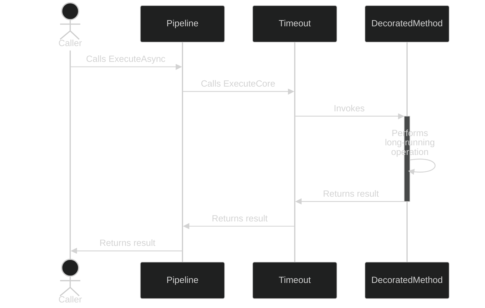
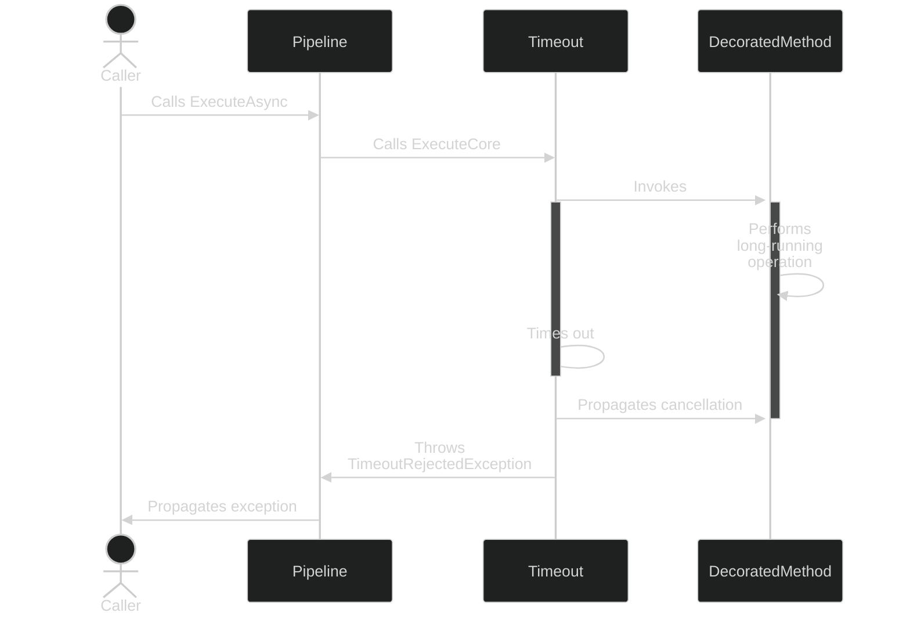

# Timeout resilience strategy

## About

- **Options**: [`TimeoutStrategyOptions`](xref:Polly.Timeout.TimeoutStrategyOptions)
- **Extensions**: `AddTimeout`
- **Strategy Type**: Proactive
- **Exceptions**:
  - `TimeoutRejectedException`: Thrown when a delegate executed through a timeout strategy does not complete before the timeout.

---

## Usage

<!-- snippet: timeout -->
```cs
// Add timeout using the default options.
// See https://www.pollydocs.org/strategies/timeout#defaults for defaults.
new ResiliencePipelineBuilder()
    .AddTimeout(new TimeoutStrategyOptions());

// To add a timeout with a custom TimeSpan duration
new ResiliencePipelineBuilder()
    .AddTimeout(TimeSpan.FromSeconds(3));

// To add a timeout using a custom timeout generator function
new ResiliencePipelineBuilder()
    .AddTimeout(new TimeoutStrategyOptions
    {
        TimeoutGenerator = args =>
        {
            // Note: the timeout generator supports asynchronous operations
            return new ValueTask<TimeSpan>(TimeSpan.FromSeconds(123));
        }
    });

// To add a timeout and listen for timeout events
new ResiliencePipelineBuilder()
    .AddTimeout(new TimeoutStrategyOptions
    {
        TimeoutGenerator = args =>
        {
            // Note: the timeout generator supports asynchronous operations
            return new ValueTask<TimeSpan>(TimeSpan.FromSeconds(123));
        },
        OnTimeout = args =>
        {
            Console.WriteLine($"{args.Context.OperationKey}: Execution timed out after {args.Timeout.TotalSeconds} seconds.");
            return default;
        }
    });
```
<!-- endSnippet -->

Example execution:

<!-- snippet: timeout-execution -->
```cs
var pipeline = new ResiliencePipelineBuilder()
    .AddTimeout(TimeSpan.FromSeconds(3))
    .Build();

HttpResponseMessage httpResponse = await pipeline.ExecuteAsync(
      async ct =>
      {
          // Execute a delegate that takes a CancellationToken as an input parameter.
          return await httpClient.GetAsync(endpoint, ct);
      },
      cancellationToken);
```
<!-- endSnippet -->

## Defaults

| Property           | Default Value | Description                                  |
| ------------------ | ------------- | -------------------------------------------- |
| `Timeout`          | 30 seconds    | The default timeout used by the strategy.    |
| `TimeoutGenerator` | `null`        | Generates the timeout for a given execution. |
| `OnTimeout`        | `null`        | Event that is raised when timeout occurs.    |

## Diagrams

### Happy path sequence diagram



### Unhappy path sequence diagram


