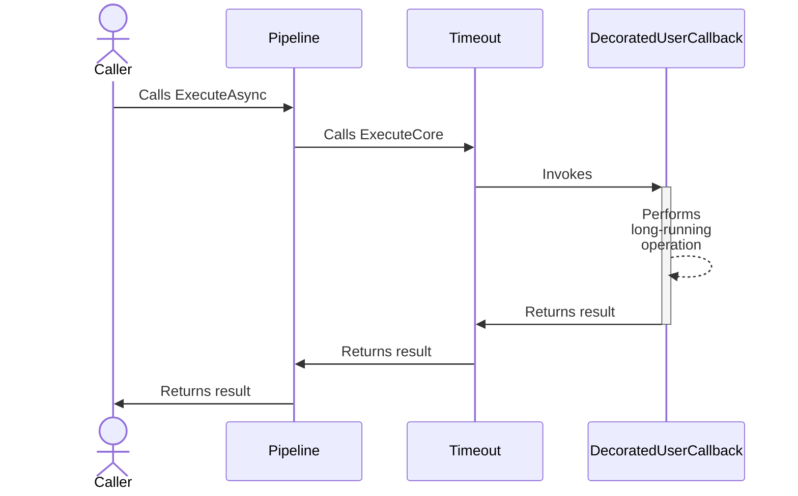
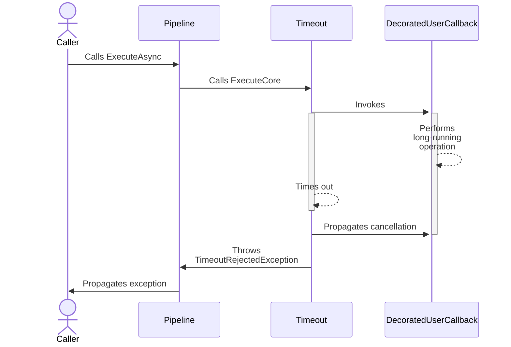

# Timeout resilience strategy

## About

- **Options**: [`TimeoutStrategyOptions`](xref:Polly.Timeout.TimeoutStrategyOptions)
- **Extensions**: `AddTimeout`
- **Strategy Type**: Proactive
- **Exceptions**:
  - `TimeoutRejectedException`: Thrown when a delegate executed through a timeout strategy does not complete before the timeout.

---

The timeout resilience strategy cancels the execution if it does not complete within the specified timeout period. If the execution is canceled by the timeout strategy, it throws a `TimeoutRejectedException`. The timeout strategy operates by wrapping the incoming cancellation token with a new one. Should the original token be canceled, the timeout strategy will transparently honor the original cancellation token without throwing a `TimeoutRejectedException`.

> [!IMPORTANT]
> It is crucial that the user's callback respects the cancellation token. If it does not, the callback will continue executing even after a cancellation request, thereby ignoring the cancellation.

## Usage

<!-- snippet: timeout -->
```cs
// To add a timeout with a custom TimeSpan duration
new ResiliencePipelineBuilder().AddTimeout(TimeSpan.FromSeconds(3));

// Timeout using the default options.
// See https://www.pollydocs.org/strategies/timeout#defaults for defaults.
var optionsDefaults = new TimeoutStrategyOptions();

// To add a timeout using a custom timeout generator function
var optionsTimeoutGenerator = new TimeoutStrategyOptions
{
    TimeoutGenerator = static args =>
    {
        // Note: the timeout generator supports asynchronous operations
        return new ValueTask<TimeSpan>(TimeSpan.FromSeconds(123));
    }
};

// To add a timeout and listen for timeout events
var optionsOnTimeout = new TimeoutStrategyOptions
{
    TimeoutGenerator = static args =>
    {
        // Note: the timeout generator supports asynchronous operations
        return new ValueTask<TimeSpan>(TimeSpan.FromSeconds(123));
    },
    OnTimeout = static args =>
    {
        Console.WriteLine($"{args.Context.OperationKey}: Execution timed out after {args.Timeout.TotalSeconds} seconds.");
        return default;
    }
};

// Add a timeout strategy with a TimeoutStrategyOptions instance to the pipeline
new ResiliencePipelineBuilder().AddTimeout(optionsDefaults);
```
<!-- endSnippet -->

Example execution:

<!-- snippet: timeout-execution -->
```cs
var pipeline = new ResiliencePipelineBuilder()
    .AddTimeout(TimeSpan.FromSeconds(3))
    .Build();

HttpResponseMessage httpResponse = await pipeline.ExecuteAsync(
      async ct =>
      {
          // Execute a delegate that takes a CancellationToken as an input parameter.
          return await httpClient.GetAsync(endpoint, ct);
      },
      cancellationToken);
```
<!-- endSnippet -->

## Defaults

| Property           | Default Value | Description                                  |
| ------------------ | ------------- | -------------------------------------------- |
| `Timeout`          | 30 seconds    | The default timeout used by the strategy.    |
| `TimeoutGenerator` | `null`        | Generates the timeout for a given execution. |
| `OnTimeout`        | `null`        | Event that is raised when timeout occurs.    |

## Diagrams

### Happy path sequence diagram



### Unhappy path sequence diagram



## Anti-patterns

Over the years, many developers have used Polly in various ways. Some of these
recurring patterns may not be ideal. The sections below highlight anti-patterns to avoid.

### Ignoring Cancellation Token

❌ DON'T

Ignore the cancellation token provided by the resilience pipeline:

<!-- snippet: timeout-anti-pattern-cancellation-token -->
```cs
var pipeline = new ResiliencePipelineBuilder()
    .AddTimeout(TimeSpan.FromSeconds(1))
    .Build();

await pipeline.ExecuteAsync(
    async innerToken => await Task.Delay(TimeSpan.FromSeconds(3), outerToken), // The delay call should use innerToken
    outerToken);
```
<!-- endSnippet -->

**Reasoning**:

The provided callback ignores the `innerToken` passed from the pipeline and instead uses the `outerToken`. For this reason, the cancelled `innerToken` is ignored, and the callback is not cancelled within 1 second.

✅ DO

Respect the cancellation token provided by the pipeline:

<!-- snippet: timeout-pattern-cancellation-token -->
```cs
var pipeline = new ResiliencePipelineBuilder()
    .AddTimeout(TimeSpan.FromSeconds(1))
    .Build();

await pipeline.ExecuteAsync(
    static async innerToken => await Task.Delay(TimeSpan.FromSeconds(3), innerToken),
    outerToken);
```
<!-- endSnippet -->

**Reasoning**:

The provided callback respects the `innerToken` provided by the pipeline, and as a result, the callback is correctly cancelled by the timeout strategy after 1 second plus `TimeoutRejectedException` is thrown.
